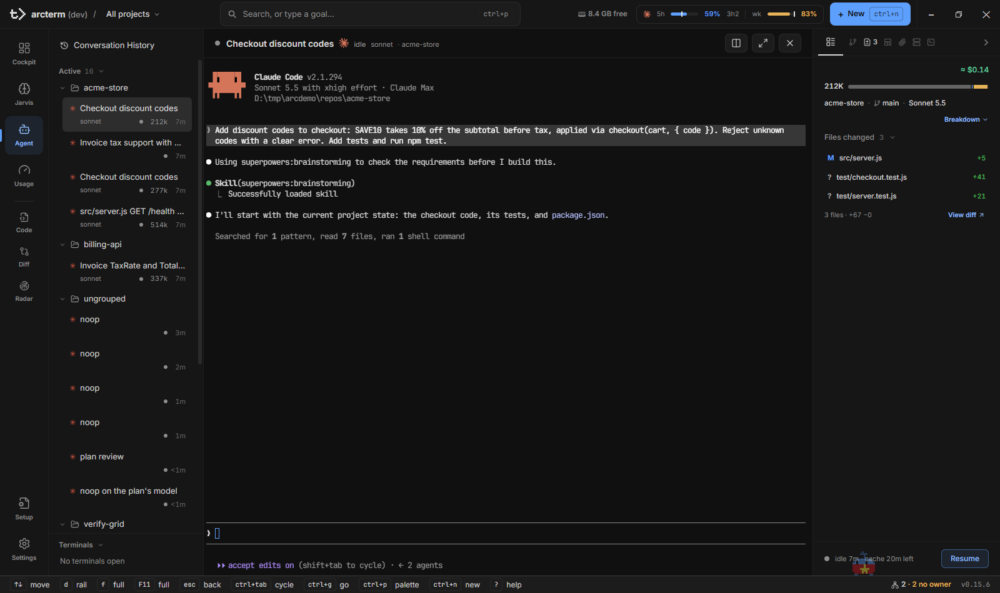
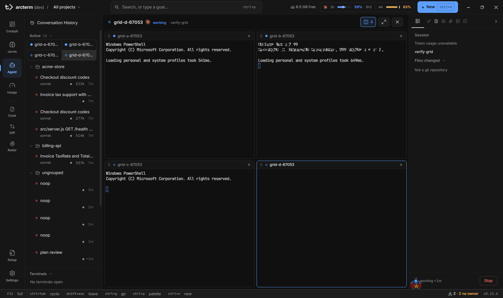
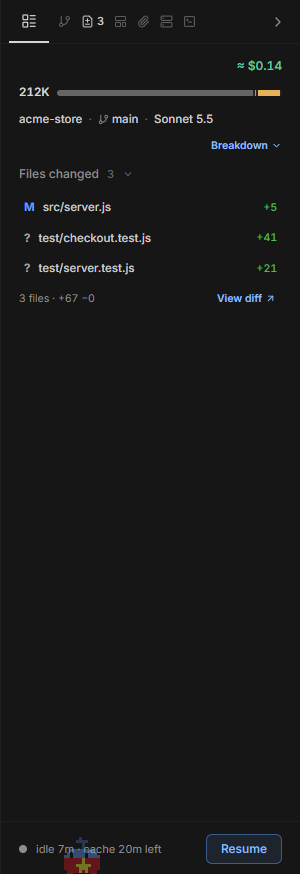

# Agent

**Agent** là nơi bạn làm việc trực tiếp với từng agent: terminal thật của agent (Claude Code, Codex, OpenCode, Pi hoặc Antigravity) nằm ở giữa, danh sách agent và các cuộc hội thoại cũ nằm bên trái, thông tin về phiên làm việc (context, token, file đã đổi, server…) nằm bên phải. Đây không phải bản tường thuật transcript mà là chính TUI của agent, nên bạn gõ, bấm phím và trả lời câu hỏi y như khi chạy nó trong một cửa sổ terminal riêng.

Cockpit cho bạn cái nhìn tổng quan ([Cockpit](cockpit.md)); Agent là nơi bạn đi sâu vào một agent. Các trang liên quan: [Orchestrator](orchestrator.md) (run, worker, lead), [Diff](diff.md) (review thay đổi), [Code](code.md), [Usage](usage.md), [Setup](setup.md) và [Phím tắt](../keyboard-shortcuts.md).

> `Ctrl` trong trang này là phím chuẩn trên Windows; trên macOS các phím của app dùng `Cmd` thay `Ctrl` (`Cmd+N`, `Cmd+Enter`…). `Ctrl+Tab` và `Ctrl+C` luôn là Control.

## Bố cục

```
┌─────────────────┬──────────────────────────────────────────────┬──────────────────┐
│ Sidebar (248px) │ Header: tên · harness · trạng thái · model    │ Rail chi tiết    │
│                 │         · context · project      [Split][⤢][×]│ (tab Overview,   │
│ Conversation    ├──────────────────────────────────────────────┤  Files, File)    │
│ History         │                                              │                  │
│ Active          │      Terminal của agent (hoặc lưới 2x2)       │ Status / Needs   │
│  └ project ▸    │                                              │ you / Subagents  │
│ Conversations   │                                              │ Files changed    │
│ Terminals       │                                              │ Servers …        │
└─────────────────┴──────────────────────────────────────────────┴──────────────────┘
```



Surface Agent là surface duy nhất arcterm **giữ nguyên trong nền** khi bạn chuyển đi nơi khác, nên terminal đang chạy không bị dựng lại hay vẽ lại; các surface còn lại bị gỡ khỏi màn hình mỗi khi bạn chuyển đi.

## Mở Agent

- Bấm **Agent** trên nav rail, hoặc `Ctrl+3`, hoặc `Ctrl+G` rồi `a`.
- Từ Cockpit: `t` hoặc `Enter` trên một thẻ, hoặc nút terminal của thẻ.
- Từ bất kỳ đâu: `Ctrl+P`, gõ tên agent, `Enter`.

Khi chưa có terminal nào, trung tâm hiện màn **No terminal running** với nút **Launch new terminal** (mở hộp thoại **New agent**), nút **Conversation History**, và danh sách **Recent sessions** (bấm một dòng để resume nó).

Nếu bạn đang chọn một project ở app bar mà agent đang xem thuộc project khác, dưới header có dòng `Showing <project của agent> · project is <project đã chọn>` với nút **Show the project** để quay lại project đã chọn.

## Khởi chạy agent mới

### Mở hộp thoại

| Cách | Kết quả |
|---|---|
| `Ctrl+N` | Hộp thoại **New agent** (mở ở hàng agent) |
| `Ctrl+Shift+R` | Hộp thoại **New run** (mở ở hàng run) |
| Nút **+ New** ở app bar | Mở theo lựa chọn lần trước |
| `Ctrl+P` → **Start** → *New agent…* | Như `Ctrl+N` |
| Nút **Split** ở header → **New agent…** | Như `Ctrl+N` |
| `Ctrl+Shift+N` | Mở ngay một agent Pi trong thư mục của agent đang focus (không thì project đầu tiên), không qua hộp thoại |

Cùng một hộp thoại dùng cho agent, terminal và run: cột **Start** bên trái chia hai nhóm, **Agent** (các harness, kèm **Terminal**) và **Run** (**Quick run**, **Orchestrate**). Phần Run — mục tiêu, plan file, số worker, model — được mô tả ở [Orchestrator](orchestrator.md).


### Làm thế nào

1. Nhấn `Ctrl+N`. Focus nằm sẵn ở cột **Start**.
2. Chọn thứ cần mở: nhấn phím số `1`–`9` hoặc dùng `↑` / `↓`. Harness chưa cài CLI thì không có hàng; **Terminal** luôn có.
3. `Tab` sang cột **Project**: gõ chữ để lọc theo tên, hoặc nhấn số `1`–`9` để chọn project. Project dùng gần nhất nằm đầu danh sách (*last used first*).
4. `Tab` tiếp sang **Task** (không bắt buộc): nội dung này được gửi làm prompt đầu tiên. Để trống thì chỉ mở phiên.
5. Nhấn `Ctrl+Enter` (hoặc `Enter` khi đang ở cột Start / Project / ô một dòng, hoặc bấm **Launch agent**).

Agent mới xuất hiện trong sidebar và được chọn (arcterm chuyển sang surface Agent nếu bạn đang ở surface khác); con trỏ gõ phím nằm sẵn trong terminal của nó, gõ được ngay mà không cần bấm vào.

Chưa có project nào? Cột **Project** hiện *No projects yet* và nút **Register a project**; bạn cũng có thể dùng **New project** ở bộ chọn project (xem [Cockpit](cockpit.md#bộ-chọn-project)).

### Chọn harness

| Hàng | Lệnh khởi động | Flag có sẵn trong menu **Flag** |
|---|---|---|
| **Claude Code** | `claude` | `--dangerously-skip-permissions`, `--verbose`, `--continue`, `--print`, `--ide`, `--debug`, `--no-color` |
| **Codex** | `codex` | `--full-auto`, `--dangerously-bypass-approvals`, `--quiet`, `--search`, `--json` |
| **OpenCode** | `opencode` | `--auto`, `--pure`, `-c` |
| **Pi** | `pi` | — |
| **Antigravity** | `agy` | `--dangerously-skip-permissions`, `--continue`, `--sandbox` |
| **Terminal** | shell mặc định | — (không có task, không có flag) |

Hàng nào có CLI chưa cài sẽ bị ẩn, và số phím tắt dồn theo các hàng còn lại. arcterm bọc các CLI này chứ không thay thế chúng: bạn cần cài và đăng nhập CLI mình định dùng. Danh sách harness đã cài và nút cập nhật nằm ở **Settings → About** ([Settings](settings.md)).

### Task, Command, Flag, worktree

- **Task** — prompt đầu tiên (với Antigravity nó được gửi qua `-i`). Terminal không có task.
- **Command** — lệnh khởi động, sửa tay được. Mỗi harness nhớ lệnh bạn đã sửa cho tới khi bạn khởi chạy.
- **Flag** — bấm **+ Flag** chọn các cờ ở bảng trên; mỗi cờ đã bật hiện thành một chip có nút `×` ngay trong ô Command. Ô **Remember these flags for the next agent** giữ các cờ cho lần sau.
- **Isolated git worktree** — bật thì agent chạy trong một git worktree riêng thay vì thư mục project, **on branch** `<tên>`. Dòng giải thích bên dưới nói rõ điều sẽ xảy ra: tạo nhánh mới `<nhánh>-agent` từ nhánh hiện tại, hay checkout nhánh có sẵn vào worktree, hay tạo nhánh mới từ HEAD. Có cho mọi harness trừ Terminal.
- Nếu RAM trống không đủ chứa thêm một agent, hộp thoại cảnh báo (`X GB free of Y GB. Another agent (~Z GB) may make the machine lag.`) nhưng vẫn cho khởi chạy.

Chân hộp thoại có một dòng cho biết điều sẽ xảy ra (`Starts in <thư mục> · on <nhánh>`) hoặc điều còn thiếu (`Pick a project`).

### Phím trong hộp thoại

| Phím | Tác dụng |
|---|---|
| `1`–`9` | Chọn hàng thứ n của cột đang focus (Start hoặc Project) |
| `↑` / `↓` | Di chuyển trong cột |
| Gõ chữ | Ở cột Project: lọc theo tên (`Backspace` rút ngắn) |
| `Tab` / `Shift+Tab` | Start → Project → từng ô → Cancel → nút chính, rồi quay vòng |
| `Enter` | Khởi chạy, từ một cột hoặc ô một dòng (trong ô Task thì xuống dòng) |
| `Ctrl+Enter` | Khởi chạy từ bất cứ đâu trong hộp thoại |
| `Esc` | Đóng menu / danh sách nhánh / bộ lọc đang mở trước, rồi mới đóng hộp thoại |

Đóng hộp thoại (kể cả bấm ra ngoài) **giữ lại** những gì bạn đã gõ; lần mở sau hiện `· draft restored` kèm nút **Clear**. Nội dung chỉ giữ trong bộ nhớ, mất khi tắt app.

## Terminal ở giữa

Header phía trên terminal là một hàng gọn:

- chấm trạng thái, **tên**, logo harness, **trạng thái** (`working`, `idle`, `asking`), **model**, **context** đã dùng (số token, đổi màu khi đầy), rồi `· <project>`. Agent gắn với initiative thì có thêm liên kết tới initiative trong [Jarvis](jarvis.md); lead của run ghi `orchestrator run <id>`; worker ghi `↑ <tên lead>` (bấm để tới lead).
- bên phải: nút màu cam **Spec review** / **Plan review** khi agent đang xin duyệt (xem [bên dưới](#duyệt-tài-liệu-do-agent-yêu-cầu)); nút chuyển **Terminal | Canvas | Review** khi agent có canvas hoặc Doc review; nút **Split**; nút **Done · N tok — Close** khi agent trông như đã xong; nút **Redraw**; nút **Float**; nút toàn màn hình; nút `×` đóng.

Chuột phải vào header: **Interrupt turn**, **Fullscreen terminal** / **Exit fullscreen**, **Float window** / **Leave float**, **Redraw terminal**, **Show details** / **Hide details**, **Close agent**.

Bấm vào terminal để gõ cho agent. Nhấn `Shift+Esc` để trả focus về sidebar (khi đó `j`/`k`, `d`, `f`… lại là phím điều khiển). Ngoài ra:

| Việc | Cách làm |
|---|---|
| Toàn màn hình terminal | `f` hoặc `F11` (`F11` dùng được cả khi đang gõ trong terminal); `Esc` thoát toàn màn hình |
| Thu cửa sổ thành ô nổi (Float) | Nút **Float** trên header hoặc `Shift+F`: cửa sổ thu lại chỉ còn terminal của agent đang chọn và một thanh tiêu đề ghi tên, trạng thái, model và context của agent (header của agent ẩn đi); nó luôn nằm trên các app khác ngay khi bật (nút ghim trên thanh tắt điều đó). Thoát bằng nút trên thanh, `Shift+F`, hoặc thoát toàn màn hình; cửa sổ trở lại kích thước cũ, lần Float sau mở lại đúng chỗ lần trước. Nút **Minimize** trên thanh (hoặc nút minimize của cửa sổ, nút vàng trên macOS) thu cửa sổ lại thành con Sprout bay trên mọi app ở góc màn hình: bấm Sprout để mở chat Jarvis, kéo để dời chỗ, **Terminal** hoặc bấm đúp để mở lại cửa sổ Float |
| Terminal bị vỡ chữ, chồng dòng hoặc lệch cột | Nút **Redraw** trên header (hoặc **Redraw terminal** trong menu chuột phải): vẽ lại terminal và cho agent tự vẽ lại toàn màn hình ở đúng kích thước, phiên vẫn chạy tiếp, không mất gì |
| Ngắt lượt đang chạy | **Interrupt turn** trong menu header, hoặc `Esc` trong terminal, hoặc nút **Stop** ở chân rail |
| Chuyển sang agent kế tiếp | `Ctrl+Tab`, dùng được cả khi con trỏ đang ở trong terminal; gõ phím theo sang terminal của agent mới |
| Chuyển sang agent kế tiếp **đang hỏi** | `Ctrl+Shift+Tab` (đi tiến, chỉ qua các agent đang hỏi) |
| Mở file/đường dẫn in ra trong terminal | `Ctrl+click` trên đường dẫn: mở ở tab **File** của rail; trong một terminal thường thì mở ở [Code](code.md) |
| Dán ảnh / thả file | Dán ảnh hoặc thả file lên terminal: đường dẫn được gõ vào prompt của agent; xem mục Uploads ở rail. Kéo từ tab [Files](#tab-files) của rail thì gõ `@đường/dẫn` |

Hình ảnh trong terminal (Sixel, iTerm inline image, như `imgcat`, `chafa`) được vẽ tại chỗ.

## Sidebar

Cột trái 248 px, từ trên xuống: nút **Conversation History**, rồi hai mục cuộn được **Active** và **Conversations**, và mục **Terminals** ghim ở đáy. Bộ chọn project ở app bar lọc cả ba mục theo project.

### Active — các agent đang chạy

Agent được gom thành **thư mục theo project**; bấm tên thư mục để gấp/mở. Chọn một project ở app bar thì thư mục biến mất, danh sách phẳng, và một dòng `N in other projects · M asking` cho biết agent ở project khác (bấm để xem tất cả project).

Mỗi hàng agent: biểu tượng harness và **tên** ở dòng trên; dòng dưới là model, nhánh git (chỉ khi khác `main`), chip subagent, rồi các dấu hiệu:

| Dấu hiệu | Nghĩa |
|---|---|
| Chấm nhấp nháy | Đang làm; chấm xám: đã xong |
| `asking` (cam) | Đang hỏi bạn |
| `review` | Đang xin duyệt Spec/Plan/Doc; bấm để mở review |
| Số trong vòng tròn màu accent | Số lượt đã xong mà bạn chưa đọc (`9+` là tối đa). Tên đậm. Chỉ tính agent cấp trên, không tính worker của run |
| Chip `1/3` (cam) | Agent dừng ở một phần trong mạch trình bày nhiều phần ("Phần 1/3") và đang chờ bạn trả lời; giữ cho tới khi bạn trả lời |
| **✓ Close** | Lượt cuối của agent kết thúc bằng một git commit và bạn đã đọc; bấm để đóng (có hỏi xác nhận). Chỉ với agent Claude không thuộc run |
| Token và tuổi | Tổng token của phiên và thời gian từ lần hoạt động cuối |

Thao tác trên hàng:

- Bấm: chọn agent và hiện terminal của nó. Bấm hai lần vào hàng lead hoặc hàng có subagent: gấp/mở worker hoặc subagent.
- Chuột phải: **Rename** (sửa tại chỗ, `Enter` lưu, `Esc` hủy), **Duplicate** (mở tab mới chạy lại cùng agent ở cùng thư mục), **Open in split**, **Copy name**, **Close agent**.
- Kéo hàng thả lên một ô terminal để chia lưới (xem [Lưới terminal](#lưới-terminal-2x2)).
- Chip **N subagents** gấp/mở subagent của agent; bấm một subagent để xem phần bên trong của nó thay cho terminal cha (`Esc` hoặc "back to <agent>" để quay lại).

### Worker nằm dưới lead

Run orchestrator được vẽ như một nhóm: hàng của **lead** (biểu tượng sơ đồ) có dòng dưới gồm chip `N workers` (gấp/mở), tiến độ (vd. `3/7 done`) và một thanh mảnh chia theo từng task. Bên dưới là các **worker** theo task: tên task, trạng thái, câu hỏi nếu có; task đã xong gấp vào dòng `N done`, task chưa chạy vào `N queued`. Run đã land ghi **✓ landed**. Bấm một worker để xem terminal của nó; worker đã xong mở transcript chỉ-đọc của nó.

Một run mà lead đã đóng nhưng worker còn tab hiện thành một hàng *run* riêng (chuột phải: **Open run**, **Close run**). Run do một agent khởi động bằng `wsh runs start` giữ chỗ của nó trong cây; header của lead (hay của agent run Quick) có link `↰ <session>` về agent đó, mở terminal khi agent còn sống và transcript khi đã kết thúc ("↰ a closed session" khi không tìm được nữa). Chiều ngược lại, header của agent đã khởi động run có link `↳` tới run đó: một run thì là goal của nó và mở run sheet, nhiều run thì là `N runs, k active` và mở menu chọn run, run còn chạy lên trước. Chi tiết run: [Orchestrator](orchestrator.md).

### Conversations — các cuộc hội thoại đã kết thúc

Mỗi hàng một dòng: biểu tượng harness, tiêu đề (prompt đầu tiên), số token và tuổi; dòng thứ hai chỉ xuất hiện khi giúp phân biệt (nhánh khác `main`, hoặc giờ bắt đầu khi hai hàng trùng tiêu đề). Một run đã kết thúc là **một** hàng, có tổng token của mọi phiên và thanh các task.

- Gom theo thư mục project (project có hội thoại mới nhất lên trước); mỗi thư mục hiện 10 hàng, **Show more** cho thêm 10 nữa (ghi rõ còn bao nhiêu), **Show less** gấp lại.
- Chỉ liệt kê các project bạn đã thêm vào arcterm. Hội thoại ở thư mục khác chỉ có trong **Conversation History**; dòng `N in projects not added · History` ở cuối mục đếm chúng và mở History.
- Chấm cam nhỏ: hội thoại đó còn câu hỏi chưa trả lời.
- Bấm một hàng để đọc transcript ở giữa, nơi có nút **Resume →**. Chuột phải: **Resume** (khi resume được), **Copy title**, **Delete session** (xem bên dưới).

### Terminals

Các shell thường (không phải agent), gom theo project, ghim ở đáy sidebar. Hàng có chấm nhấp nháy khi shell đang chạy một lệnh (dev server, build) và không có chấm khi đã về prompt. Tên của một terminal chưa đổi là lệnh gần nhất nó chạy (`task dev`), hoặc "Terminal 2" nếu chưa chạy lệnh nào.

- Nút **+** hiện khi rê chuột vào thư mục project (hoặc ở đầu mục khi đã chọn project ở app bar): mở ngay một terminal trong project đó.
- Chọn một terminal khi đang xem một agent thì nó **mở thành một panel ngay dưới agent** thay vì chiếm chỗ của agent. Kéo mép trên của panel để đổi chiều cao (từ 120 px tới 60% cột; bấm đúp mép để về 260 px), nút phóng to (hoặc bấm đúp thanh tiêu đề) cho nó cả vùng và bấm lại để thu về, `×` ẩn panel mà shell vẫn chạy. Không có agent nào thì terminal chiếm cả giữa màn hình.
- Chuột phải: **Rename**, **Duplicate**, **Copy name**, **Close terminal**.

## Lưới terminal (2x2)

Có thể xem tới **bốn** agent cùng lúc.

### Làm thế nào

1. Thêm ô: kéo hàng của một agent đang chạy từ sidebar thả lên terminal; hoặc chuột phải hàng → **Open in split**; hoặc nút **Split** ở header → chọn agent trong danh sách *Show beside this agent*; hoặc `Ctrl+P` → agent → `→` → **Open in split**.
2. Khi thả, vùng giữa ô thay thế (hoặc đổi chỗ) agent trong ô đó; một phần tư mép ngoài chèn agent vào trước/sau ô.
3. Mỗi ô có thanh tiêu đề: kéo thanh để đổi chỗ ô; `×` bỏ agent khỏi lưới (agent vẫn chạy).
4. Bấm vào một ô để focus nó; header và rail chi tiết đi theo ô đang focus. **Show only this agent** (trong menu Split) đưa lưới về một ô; `f` (toàn màn hình) chỉ tạm hiện mỗi ô đang focus.

Cách các ô xếp: 1 ô chiếm cả vùng, 2 ô cạnh nhau, 3 ô là hai ô trên và một ô trải ngang bên dưới, 4 ô là lưới 2x2. Lưới được lưu lại và còn nguyên sau khi mở lại app. Canvas, review, phần bên trong subagent, Conversation History, transcript của phiên đã kết thúc hoặc của worker đã xong, và terminal chọn từ mục Terminals mỗi thứ hiện thay cho lưới; lưới trở lại như cũ khi bạn rời đi.

Khi chuyển giữa các agent bằng phím (`Ctrl+Tab`, `j`/`k`…): nếu agent đã có ô thì ô đó được focus; nếu chưa thì agent thế chỗ ô đang focus còn các ô khác giữ nguyên.



## Rail chi tiết bên phải

Rail có ba tab: **Overview**, **Files** (cây thư mục làm việc của agent, chỉ có khi agent có thư mục) và **File** (chỉ có khi một file đang mở). Thanh tab có thêm sáu biểu tượng đếm — **Subagents**, **Files changed**, **Artifacts**, **Uploads**, **Servers**, **Background tasks** — luôn theo đúng thứ tự đó để rail không đổi hình dạng giữa các agent; bấm một biểu tượng có số thì mở và cuộn tới mục đó. Phần thân chỉ liệt kê mục nào đang có nội dung.

Nhấn `d` (hoặc bấm mũi tên ở rail) để thu rail thành một dải 44 px hiện huy hiệu số câu hỏi đang chờ và thanh context. **Settings → General → Show details rail by default** đặt trạng thái ban đầu. Terminal thường không có rail.

### Các mục của tab Overview

| Mục | Nội dung |
|---|---|
| **Status** | Khối đầu rail: vòng context (% và số token đang nằm trong context) cùng chi phí ước tính của phiên; tổng token và thanh chia theo loại token; dòng `project · nhánh · model`; worktree nếu có; các công cụ agent dùng nhiều (`Bash ×12`…). Nút **Breakdown** ở cuối khối mở ra nhận xét về nơi token đi vào, phần chia theo loại (token và ≈ chi phí) và, nếu phiên dùng nhiều model, phần chia theo model. Khi context đã lớn, một agent Claude đang rảnh còn có **Compact** (tóm tắt rồi tiếp tục) và **Clear** (hội thoại mới; `/resume` đưa cái cũ về) |
| **Needs you** | Chỉ trên rail của lead: các câu hỏi của run đang chờ bạn |
| **Subagents** | Từng subagent với model và trạng thái; bấm để xem bên trong |
| **Files changed** | File đã đổi trong phiên (`M`/`A`/… cùng `+N −M`). Bấm một file để mở ở tab File dưới dạng diff so với lúc phiên bắt đầu; **View diff** mở cả surface [Diff](diff.md). Khi agent ở một branch tách từ branch mặc định, công tắc **Session / Branch vs main** chuyển sang mọi thay đổi của cả branch so với chỗ nó tách khỏi `main` (đã commit hay chưa); lúc đó **View diff** mở Diff ở chế độ so sánh `main`…branch |
| **Artifacts** | Các board canvas của agent; bấm một dòng để mở canvas ở board đó |
| **Uploads** | Ảnh dán và file thả hoặc đính kèm cho agent. **Attach** chọn file và đưa đường dẫn vào prompt. Ảnh dán hiện là `Image #N` như số Claude Code ghi trong prompt; bấm để phóng to |
| **Servers** | Các tiến trình đang lắng nghe trong project của agent: cổng (bấm để mở trình duyệt), lệnh, tuổi, PID, ai khởi động. Rê chuột để hiện **Log**, **Copy**, **Stop** (hỏi hai lần). Tương tự popover **Servers** ở footer nhưng chỉ cho project này ([Cockpit](cockpit.md#chip-servers-và-popover)) |
| **Background tasks** | Lệnh chạy nền của agent kèm trạng thái (`running`, `completed`, `failed`, `stopped`). Bấm một dòng để mở output ở tab File, theo dõi trực tiếp |
| **Run** / **Task** | Chỉ khi agent thuộc một run: tình hình run (lead) hoặc task của worker; xem [Orchestrator](orchestrator.md) |

Chân rail: dòng trạng thái (`idle 3m · cache 4m left`: cache là thời gian prompt cache của Claude còn lại; khi nó là `expired`, lượt kế tiếp phải ghi lại cả context), và một nút: **Resume** (gõ `continue` cho agent đang rảnh) hoặc **Stop** (ngắt lượt đang chạy).



### Tab Files

Cây file của thư mục làm việc (worktree) của agent, lấy từ git: file đã track và chưa track, file bị `.gitignore` hiện mờ (một thư mục bị ignore cả, như `node_modules/`, chỉ liệt kê khi mở ra). Thư mục không phải git repo thì tab chỉ báo vậy; repo quá lớn thì báo **Showing the first N files**. Danh sách tải lại khi bạn mở tab, khi agent đổi trạng thái (vd. hết một lượt), và khi bấm **Refresh** ở đầu tab; lỗi thì hiện nội dung lỗi cùng nút **Retry**.

- **Chọn:** bấm một dòng (bấm thư mục thì mở/đóng nó), `Ctrl`+bấm để thêm/bớt, `Shift`+bấm để chọn cả đoạn. `↑`/`↓` di chuyển, `←`/`→` đóng/mở thư mục, `Enter` mở thư mục hoặc mở file ở tab File; bấm đúp một file cũng mở nó.
- **Kéo vào terminal:** kéo file hoặc thư mục (kéo một dòng đang chọn thì kéo cả vùng chọn) thả lên terminal; đường dẫn được gõ vào prompt, chưa nhấn Enter. Trên terminal của agent nó thành `@src/util.ts`, thư mục là `@src/app/`, đường dẫn có khoảng trắng là `@"docs/my notes.md"`, tính tương đối theo thư mục của agent nhận. Trên terminal thường thì không có `@`.

Cây mở tới đâu và vùng chọn được giữ riêng cho từng agent khi bạn đổi agent hay đổi surface. Tab Files mở rộng bằng Overview; kéo mép rail để đổi, độ rộng đó được nhớ riêng, không ảnh hưởng tab File.

### Tab File

Mở khi bạn bấm một file trong **Files changed**, một output trong **Background tasks**/**Servers**, hoặc một đường dẫn trong terminal. Tab có nút Back/Forward qua các file đã mở, nút **×** đóng file, và công cụ tùy loại file:

- File markdown: **Preview** / **Source**. Bôi chọn chữ rồi nhấn `c` (hoặc bấm `+` cạnh một khối) để viết comment; khay comment gửi tất cả cho agent trong một tin nhắn (`Ctrl+Enter`) hoặc sao chép.
- File mở từ **Files changed**: thêm **Diff**, và nút **Open in Diff**.
- **Wrap** (bật/tắt xuống dòng), **Live** (output của task nền: bám theo đuôi khi nó dài ra), **Open in Code**.

Tab File rộng hơn Overview; kéo mép của rail (**Resize panel**) để đổi độ rộng. `Esc` đóng file (hoặc hủy comment đang viết). Phím `←`/`→`/`Home`/`End` chuyển tab khi thanh tab đang focus.

## Trả lời câu hỏi của agent

Một agent đang hỏi hiện màu cam trong sidebar, thành thẻ trên Cockpit (và cộng vào huy hiệu của mục **Cockpit** ở nav rail), và có mặt trong `Ctrl+P` → **Needs you**. Bạn trả lời được ở bất kỳ chỗ nào sau, kết quả như nhau:

| Ở đâu | Cách |
|---|---|
| Terminal của agent | Dùng picker của chính TUI (`↑`/`↓`, `Enter`, phím số). Chọn agent đang hỏi — bằng bất kỳ cách nào — hoặc agent bạn đang xem bắt đầu hỏi thì phím gõ chuyển vào terminal của nó để picker nhận ngay `↑`/`↓`/`Enter`/số thay vì di chuyển trong sidebar. `Shift+Esc` trả về sidebar |
| Thẻ trên [Cockpit](cockpit.md#trả-lời-câu-hỏi-của-agent-ngay-trên-thẻ) | Bấm lựa chọn hoặc `1`–`9` rồi `Enter` |
| Palette `Ctrl+P` → **Needs you** (`n:`) | Chọn dòng, nhấn `1`–`9` |
| Popup của con vật Jarvis (`Ctrl+G` `w`) | `1`–`9` cho câu hỏi một lựa chọn |

Một lệnh nặng (build, typecheck, cả bộ test, `npm install`) chờ đến lượt trong hàng đợi lệnh nặng; transcript của agent ghi chỗ của nó. Xem [Usage → Hàng đợi lệnh nặng](usage.md#hàng-đợi-lệnh-nặng).

## Duyệt tài liệu do agent yêu cầu

Khi agent hỏi với header **Spec review**, **Plan review** hoặc **Doc review**, nó đang xin bạn duyệt một tài liệu:

- **Spec review** và **Plan review** (từ lead của một run) mở thành hộp thoại phủ lên surface đang xem; nút màu cam ở header và nhãn `review` trên hàng sidebar mở lại hộp thoại khi bạn đã đóng.
- **Doc review** (agent vừa sửa một bài `.tex` hoặc ghi chú `.md` và hỏi ý bạn) hiện **thay cho terminal** ở trung tâm: bản so sánh theo câu những gì agent đã đổi, comment ngay cạnh đoạn văn, và khay **Approve** / **Request changes** để gửi một câu trả lời duy nhất. Với file `.tex`, thêm tab **PDF** (dịch nền) bên cạnh **Changes**.
- Review tự mở một lần cho mỗi câu hỏi, chỉ khi bạn đang ở agent đó và không đang gõ. Chuyển qua lại giữa Terminal và Review bằng nút chuyển ở header hoặc phím `r`.

| Phím (trong Review) | Tác dụng |
|---|---|
| `r` | Về terminal |
| `[` / `]` | Tab trước / sau (Changes, PDF) |
| `c` | Comment vào đoạn đang chọn |
| `e` | Đề xuất sửa: mở nguồn của đoạn đó để bạn sửa; file không bị đổi, agent nhận `Edit: replace "…" with "…"` |
| `Ctrl+Enter` | **Approve** khi chưa có comment hay ghi chú; **Request changes** khi đã có. Trong khung comment đang viết thì thêm comment |

Skill `doc-review` đi kèm arcterm dạy agent khi nào nên xin duyệt một bài viết.

## Canvas

Agent dùng skill design-local có thể đính kèm một **canvas** — các board `.dc.html` — vào chính nó. Khi có canvas, header có nút chuyển **Terminal | Canvas**; `c` chuyển qua lại, `[` / `]` đổi board, `m` đánh dấu các vùng của board, `Ctrl+Enter` gửi các dấu cho agent. Canvas thay terminal nhưng sidebar, header và rail vẫn giữ nguyên. Các board hiện ở mục **Artifacts** của rail.

## Conversation History và phiên đã kết thúc

### Làm thế nào

- Mở **Conversation History**: bấm nút đầu sidebar, hoặc `Ctrl+G` `s`, hoặc nút **Conversation History** ở màn *No terminal running*.
- Đọc một phiên đã kết thúc: bấm hàng của nó trong **Conversations**. Transcript hiện ở giữa; **Activity | Transcript** chuyển giữa dòng sự kiện và bản chép lời.
- **Resume** một phiên: bấm **Resume →** (hoặc chuột phải hàng → **Resume**, hoặc `Enter` khi hàng đang chọn trong History). arcterm mở một agent mới trong cùng project và nối lại đúng phiên đó: `claude --resume <id>`, `codex resume <id>`, `opencode -s <id>`, `pi --session <đường dẫn>`, hoặc `agy --conversation <id>`.
- Quay về terminal: `Esc` hoặc nút mũi tên "Back to terminal".

**Conversation History** là danh sách toàn bộ phiên của mọi project, kể cả project chưa thêm vào arcterm. Cột trái 380 px có nút quay lại, tiêu đề, số phiên `live`, và bộ lọc **All | Live | Needs you | Done**; mục ghim **All activity** là dòng thời gian gộp của mọi phiên. Phiên xếp nhóm **Live now**, **Today**, **Earlier**. Một run là **một** mục (chọn thành viên của nó ở cột phải). Phiên đang chạy có nút **Jump →** thay cho Resume. Nút bộ lọc project ở app bar chỉ thu hẹp sidebar, không thu hẹp History.

<!-- shot: agent-history.png | Conversation History: cột trái có bộ lọc All/Live/Needs you/Done, các nhóm Live now/Today/Earlier, cột phải là chi tiết một phiên với nút Resume → | Scenario CDP `agent-history` (scripts/cdp/scenarios.mjs) dựng sẵn các phiên đã kết thúc và một run; vào bằng `Ctrl+G` `s`, selector `[data-agent-history]` -->

### Xóa một phiên

Với phiên Claude đã kết thúc: chuột phải hàng → **Delete session**, hoặc nút thùng rác ở header của phiên, hoặc `Ctrl+P` → hành động của phiên. Transcript được chuyển vào `~/.arc/trash` và bị xóa hẳn sau 7 ngày; phiên không còn trong `claude --resume`. Phiên của các harness khác không xóa được ở đây.

## Đóng và khôi phục agent

- **Đóng:** nút `×` ở header, **Close agent** trong menu chuột phải, `Ctrl+C` hai lần liên tiếp trong 500 ms khi đang ở terminal của agent (lần đầu vẫn đi tới agent, lần hai mở hộp xác nhận), nút **✓ Close** / **Done · N tok — Close** khi agent đã commit xong, hoặc **Stop** trong panel **Consumers**. Luôn có hộp xác nhận; thao tác kết thúc phiên và không hoàn tác được. Terminal thường dùng **Close terminal**, và `Ctrl+C` hai lần không đóng nó (trong shell, đó là cách dừng một lệnh cứng đầu).
- **Đóng lead của run có worker:** hộp thoại hỏi **Close run** (đóng tất cả) hay **Close lead only** (worker vẫn chạy).
- **Đánh thức agent đang rảnh:** nút **Resume** ở chân rail gõ `continue` vào terminal.
- **Sau khi tắt hoặc cập nhật app:** các agent claude, codex, opencode, pi và agy đang chạy lúc đó tự mở lại, mỗi cái vào phiên của nó, mà không phải mở từng cái từ lịch sử. Agent chưa báo phiên của nó lên cockpit (ví dụ Codex khi hook chưa được trust) không tự mở lại; hãy mở từ **Conversations**. Lượt đang dở của một agent bị cắt lúc app tắt, nên nó thường ngồi ở trạng thái rảnh sau khi mở lại; dùng **Resume** ở chân rail để bảo nó tiếp tục. Worker của run được khôi phục theo run, xem [Orchestrator](orchestrator.md).

## Phím trên Agent

Phím đơn (`j`, `k`, `d`, `f`, `r`, `c`, `Esc`…) chỉ có tác dụng khi bạn không đang gõ trong ô nhập hoặc terminal (dùng `Shift+Esc` để rời terminal). Các chord có `Ctrl` hoặc `F11` dùng được cả khi đang gõ trong terminal.

| Phím | Tác dụng |
|---|---|
| `j` / `k` (hoặc `↓` / `↑`, `→` / `←`) | Agent kế tiếp / trước trong danh sách Active |
| `Ctrl+Tab` / `Ctrl+Shift+Tab` | Agent kế tiếp / agent kế tiếp đang hỏi (dùng được cả trong terminal) |
| `d` | Bật/tắt rail chi tiết |
| `f` / `F11` | Toàn màn hình terminal (`F11` dùng được trong terminal) |
| `Shift+F` | Bật/tắt Float |
| `r` | Mở review của agent (Spec/Plan review hoặc Doc review) / về lại terminal |
| `c` | Hiện canvas của agent / về terminal |
| `Esc` | Về Cockpit; thoát toàn màn hình trước; từ History hoặc transcript thì về terminal; trong subagent thì về agent cha |
| `Shift+Esc` | Từ trong terminal trả focus về sidebar |
| `Ctrl+C` hai lần (500 ms) | Đóng agent đang focus |
| `Ctrl+N` / `Ctrl+Shift+R` | Hộp thoại New agent / New run |
| `Ctrl+G` `s` | Mở Conversation History |

Khi History hoặc transcript của phiên đã kết thúc đang phủ lên terminal, các phím tác động lên agent đang focus (`j`/`k`, `d`, `f`, `r`, `c`…) tạm nhường; trong History `j`/`k` di chuyển con trỏ trong danh sách, `Enter` nhảy tới phiên đang chạy hoặc resume phiên đã kết thúc. Toàn bộ phím: [Phím tắt](../keyboard-shortcuts.md).

## Xem thêm

- [Cockpit](cockpit.md) — theo dõi cả đội agent, trả lời nhanh trên thẻ.
- [Orchestrator](orchestrator.md) — run, DAG, lead và worker.
- [Diff](diff.md), [Code](code.md) — xem và sửa thay đổi của agent.
- [Usage](usage.md) — token và chi phí.
- [Agent integration](agent-integration.md) — hook và `wsh` cho agent.
