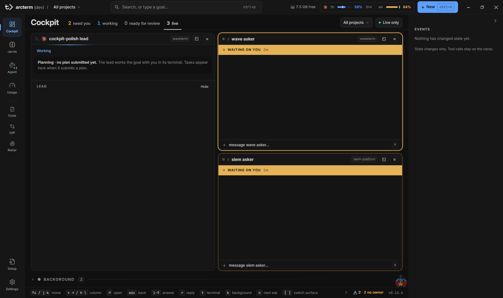
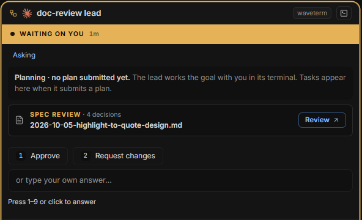
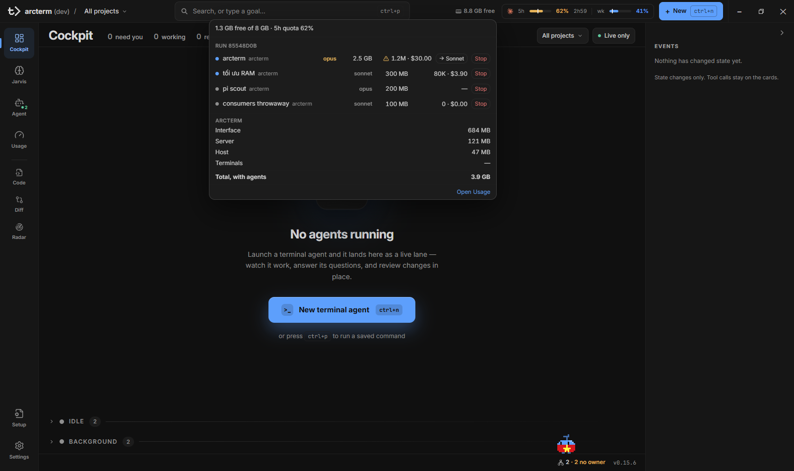
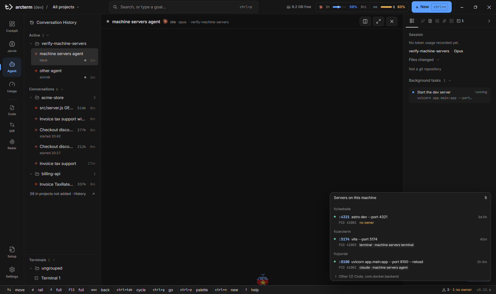

# Cockpit và khung ứng dụng

**Cockpit** là surface tổng quan của arcterm: mọi agent đang chạy hiện thành các thẻ, bạn nhìn một lượt là biết cái nào đang làm, cái nào đang chờ bạn trả lời, cái nào vừa xong. Từ đó bạn trả lời câu hỏi, nhắn thêm một câu, mở terminal hoặc đẩy một agent xuống nền mà không phải rời màn hình.

Trang này gồm hai phần:

1. **Màn Cockpit** — dải tab trạng thái, dải **Needs you**, lưới thẻ, rail **Events** và các phím triage.
2. **Khung ứng dụng** — những thứ luôn có mặt ở mọi surface: app bar (chọn project, tìm kiếm, **+ New**, chip RAM, thanh quota), nav rail bên trái, footer (gợi ý phím, chip **Servers**, phiên bản), thông báo, con vật Jarvis và command palette.

Các trang liên quan: [Agent](agent.md) (terminal thật của từng agent), [Jarvis](jarvis.md) (brief, run, initiative), [Orchestrator](orchestrator.md) (thẻ của một run), [Usage](usage.md) (thống kê token), [Settings](settings.md), và danh sách đầy đủ ở [Phím tắt](../keyboard-shortcuts.md).

> Trong trang này `Ctrl` là phím chuẩn trên Windows; trên macOS các phím của app dùng `Cmd` thay cho `Ctrl` (ví dụ `Cmd+P`). `Ctrl+Tab` và `Ctrl+C` luôn là Control.

## Bố cục chung

```
┌───────────────────────────────────────────────────────────────────────────┐
│ App bar:  arcterm / <project ▾>   [ Search, or type a goal…  Ctrl+P ]      │
│                                   RAM chip · quota · [ + New ]            │
├──────┬──────────────────────────────────────────────────────┬─────────────┤
│ Nav  │  Surface đang mở                                      │  Rail       │
│ rail │  (Cockpit: tab, Needs you, lưới thẻ, HintsBar)        │  (Events)   │
├──────┴──────────────────────────────────────────────────────┴─────────────┤
│ Footer: gợi ý phím                       Servers · v0.15.6                │
└───────────────────────────────────────────────────────────────────────────┘
```



## Mở Cockpit

- Bấm **Cockpit** ở đầu nav rail, hoặc `Ctrl+1`, hoặc `Ctrl+G` rồi `c`.
- Từ Jarvis, Usage, Code, Diff hoặc Radar, `Esc` (khi không đang gõ) đưa bạn về Cockpit. Từ Agent, `Esc` cũng về Cockpit (xem [Agent](agent.md)).
- Khi mở app, arcterm vào lại surface bạn dùng lần trước. Đổi ở **Settings → General → Startup surface** (mặc định **Last opened**; nếu không đọc được thì vào Cockpit).

## Đọc màn Cockpit

Từ trên xuống dưới:

1. **Hàng tiêu đề** — chữ *Cockpit*, bốn tab trạng thái có số đếm, nút chọn project, nút **Live only**.
2. **Dải Needs you** — chỉ hiện khi có việc chờ bạn mà không phải là một thẻ.
3. **Lưới thẻ** — mỗi agent thường hoặc mỗi run orchestrator là một thẻ.
4. **Các mục gấp** dưới lưới — **Backgrounded**, **Idle**, **Background**.
5. **HintsBar** — dải phím gợi ý ở đáy, kèm chip **Servers** và phiên bản.
6. **Rail Events** ở bên phải.

Khi chưa có agent nào, Cockpit hiện màn "No agents running" với nút **New terminal agent** (`Ctrl+N`); `Ctrl+P` mở palette. Lúc app vừa khởi động và roster chưa đọc xong, lưới hiện khung xương thay cho thẻ.

### Bốn tab trạng thái

| Tab | Số đếm là | Khi bấm |
|---|---|---|
| **need you** (màu vàng) | Số agent đang chờ bạn trả lời hoặc duyệt (kể cả worker của run đang hỏi). Không tính câu hỏi đã được tự động trả lời. | Lưới chỉ còn thẻ đang hỏi; thẻ run hiện khi trong run có gì chờ bạn |
| **working** | Số agent đang làm | Lưới chỉ còn thẻ đang làm (thẻ run: run đang chạy) |
| **ready for review** | Số thẻ đã xong: agent vừa xong (còn thẻ đầy đủ, xem "Idle" bên dưới) và run đã kết thúc | Lưới chỉ còn thẻ đã xong |
| **live** | Số agent đang có thẻ (không tính agent ở **Backgrounded** hay **Idle**) | Về lại toàn bộ |

Bấm lại tab đang chọn để quay về **live**. Số đếm theo project đang chọn và theo **Live only**, nhưng không đổi khi bạn đổi tab.

Một agent chưa có gì để hiển thị (vừa mở, chưa gửi prompt, chưa có dòng transcript nào) chưa có thẻ và chưa được tính vào các số này. Terminal của nó vẫn có trong [Agent](agent.md).

### Lọc theo project và Live only

- Nút project ở bên phải hàng tiêu đề dùng chung trạng thái với bộ chọn project ở app bar. Chọn một project thì lưới, dải **Needs you** và các mục gấp chỉ còn project đó; sidebar của Agent cũng thu hẹp theo.
- **Live only** ẩn các agent đã xong khỏi lưới và ẩn mục **Idle**. Nút sáng viền xanh khi đang bật.

### Thẻ agent

Thẻ của một agent thường (không thuộc run) có, từ trên xuống:

| Phần | Ý nghĩa |
|---|---|
| Đầu thẻ | Chấm trạng thái, logo harness, tên, chip project. Bên phải: chip **N subagents** (rê chuột để xem từng subagent, bấm để mở), chip `+N −M` (số dòng thêm/xóa, bấm để review ở Diff), nút terminal (`t`), nút đưa xuống nền (`b`). |
| Dải "Waiting on you" | Chỉ khi agent đang hỏi. Câu hỏi hiện đậm ngay dưới dải. Câu hỏi nhiều phần thì có tab cho từng phần. |
| Dải "Finished" | Chỉ khi agent vừa xong: tuổi của lần xong, nút **Review changes** (nếu có thay đổi) và **Open**. |
| Thân thẻ | Dòng hoạt động hiện tại khi đang làm, rồi diễn biến gần đây (lời agent, các lệnh đã chạy). Chip tiến độ (vd. `3/5 tasks`) mở danh sách việc của agent. |
| Khung trả lời | Khi agent hỏi: các lựa chọn đánh số `1`–`9`, ô "or type your own answer…". |
| Dòng nhắn | `message <tên>…` với phím `R`: mở ô soạn để nhắn thêm cho agent mà không rời Cockpit. |

Chuột phải vào thẻ mở menu: **Open**, **Open terminal**, **Review changes**, **Move to background**, **Copy name**, **Close agent**.

Một agent Claude đang làm mà terminal im lặng từ 3 phút trở lên được coi là treo: dòng hoạt động đổi thành `quiet · no output Nm` kèm nút **Nudge** (gõ `continue` vào terminal của nó).



### Thẻ run

Một run orchestrator chỉ có **một** thẻ, ở vị trí của lead; worker của run là các dòng task bên trong thẻ, không phải thẻ riêng. Thẻ có trạng thái của lead, thanh tiến độ các task, nút mở DAG, ô chỉnh số worker chạy song song, và ngăn **Done · N** gom các task đã xong. Câu hỏi của một worker được trả lời ngay trong dòng task của nó. Cách làm việc với run: xem [Orchestrator](orchestrator.md).

Sắp xếp lưới: khi có cả thẻ run và thẻ agent thường, thẻ run xếp ở cột trái và agent thường ở cột phải; chỉ có một loại thì chia luân phiên giữa các cột (vùng lưới rộng từ 1340 px thì có 3 cột thay vì 2). Thẻ giữ chỗ khi trạng thái đổi (từ working sang asking không làm thẻ nhảy), và thẻ đang hỏi được cao hơn để đọc câu hỏi.

### Dải Needs you

Những việc chờ bạn mà không phải câu hỏi của một agent (câu hỏi đã là thẻ rồi) hiện thành các dòng ở đầu Cockpit, mỗi dòng có nút bấm ngay tại chỗ:

| Loại dòng | Nút chính | Ghi chú |
|---|---|---|
| **Review task** | **Approve** | Cổng duyệt của một task trong DAG |
| **Blocked task** | **Retry** (khi chạy lại được), không thì **Open** | Task thất bại hoặc bị chặn |
| **Run to confirm** | **Acknowledge** | Run đã xong nhưng có phần chưa được kiểm chứng; đọc lý do trong dòng rồi mới xác nhận |
| **Run to land** | **Land again** | Lần land trước bị giữ lại; lý do nằm cạnh dòng |
| **Escalation** | **Open** | Worker chuyển câu hỏi lên bạn; mở thẻ của agent đang hỏi |

Mỗi dòng còn có nguồn (run/agent), nội dung, lý do và thời gian chờ. Nút **Open** đưa bạn tới run hoặc thẻ liên quan. Dải ẩn khi không có gì chờ, và theo project đang chọn. Số trên mục **Cockpit** ở nav rail đếm cả những dòng này lẫn các câu hỏi đang là thẻ.

<!-- shot: cockpit-needs-you.png | Dải "Needs you" ở đầu Cockpit với ít nhất một dòng có nút bấm (Escalation + Open, hoặc Review task + Approve nếu dựng được run có cổng duyệt) | Scenario CDP `cockpit-needs-you-cross-channel` (scripts/cdp/scenarios.mjs) arrange sẵn một Escalation; dòng Review task cần một run có gate (xem arrange của `dag-lifecycle`). Selector `[data-cockpit-needs-you]` -->

### Các mục gấp dưới lưới

| Mục | Chứa gì | Thao tác |
|---|---|---|
| **Backgrounded** (*still running*) | Agent bạn đã đẩy xuống nền bằng `b`; vẫn chạy bình thường | Bấm một dòng để **Restore to working** |
| **Idle** | Agent đã xong quá 5 phút, hoặc bạn đã bấm gỡ thẻ; mỗi dòng có ô nhắn nhanh | Bấm dòng để mở terminal |
| **Background** | Phiên `claude --bg` / `claude agents` chạy tách rời mà arcterm không có terminal cho | **Attach** mở nó vào một terminal mới; `×` bỏ khỏi danh sách (transcript giữ nguyên) |

Cả ba gấp lại theo mặc định. Một agent vừa xong giữ nguyên thẻ đầy đủ trong 5 phút để bạn trả lời, sau đó mới chuyển xuống **Idle**. Một agent đang hỏi không bao giờ ở dưới nền: nếu bạn đã đẩy nó xuống mà nó bắt đầu hỏi, thẻ tự hiện lại.

## Làm thế nào…

### Trả lời câu hỏi của agent ngay trên thẻ

1. `n` nhảy tới thẻ đang hỏi kế tiếp (hoặc `j`/`k` tới thẻ bạn muốn).
2. Bấm vào một lựa chọn, hoặc nhấn phím số `1`–`9`. Với câu hỏi chọn một đáp án, bấm chuột gửi luôn; phím số chỉ chọn, bạn xác nhận bằng `Enter`.
3. Câu hỏi nhiều đáp án (multi-select) thì chọn các đáp án rồi `Enter`.
4. Câu hỏi nhiều phần: `h`/`l` (hoặc `←`/`→`) chuyển phần. Khi mọi phần đã có đáp án, `Enter` (hoặc bấm đáp án của phần cuối) gửi cả bộ. Dòng gợi ý dưới câu hỏi cho biết đã trả lời `N/M` phần và còn cần `Enter` không.
5. Muốn trả lời bằng chữ: gõ vào ô "or type your own answer…" rồi `Enter`. Gõ chữ sẽ bỏ lựa chọn đã chọn và ngược lại.

Với yêu cầu duyệt tài liệu (**Spec review**, **Plan review**, **Doc review**) thẻ chỉ hiện tóm tắt và nút **Review**; bạn duyệt trong [Agent](agent.md#duyệt-tài-liệu-do-agent-yêu-cầu).

### Nhắn thêm cho một agent

1. Đưa con trỏ tới thẻ (`j`/`k`) và nhấn `r`, hoặc bấm vào dòng `message <tên>…`.
2. Gõ nội dung, `Enter` gửi. `Esc` đóng ô soạn và trả phím về lưới.

`r` không làm gì khi thẻ đang có câu hỏi cần trả lời (hãy trả lời nó trước).

### Đẩy một agent xuống nền, rồi lấy lại

1. Chọn thẻ và nhấn `b` (hoặc nút mũi tên xuống ở đầu thẻ).
2. Thẻ biến mất khỏi lưới và nằm trong **Backgrounded**; agent vẫn chạy.
3. Bấm dòng của nó trong **Backgrounded** để đưa lại.

Với agent đã xong, cùng nút đó **gỡ thẻ** xuống mục **Idle** thay vì đẩy xuống nền. Lead của một run đẩy xuống nền thì cả thẻ run đi theo, cho tới khi trong run có gì cần bạn.

### Mở terminal hoặc review thay đổi của một agent

- `t` hoặc nút terminal trên thẻ: sang surface [Agent](agent.md) và chọn agent đó.
- `Enter` trên thẻ không có câu hỏi cũng làm như vậy.
- Chip `+N −M` hoặc **Review changes**: mở thay đổi của agent trong [Diff](diff.md).
- `Space`: xem nhanh agent (peek) trong popup của Jarvis mà không rời Cockpit.

### Xử lý một mục trong Needs you

Bấm nút trên dòng (**Approve**, **Retry**, **Acknowledge**, **Land again**). Nút bị khóa trong lúc lệnh đang chạy để không gửi hai lần; kết quả hiện ở một toast. **Open** đưa bạn tới nơi cần quyết định (thẻ của agent hoặc run sheet trong Jarvis).

## Phím trên Cockpit

Các phím này chỉ có tác dụng khi không đang gõ trong ô nhập.

| Phím | Tác dụng |
|---|---|
| `j` / `k` (hoặc `↓` / `↑`) | Thẻ hoặc dòng task kế tiếp / trước |
| `h` / `l` (hoặc `←` / `→`) | Sang cột bên kia; với câu hỏi nhiều phần thì chuyển phần |
| `n` | Nhảy tới câu hỏi kế tiếp |
| `1`–`9` | Chọn đáp án; trên dòng task của run thì chạy hành động của dòng (hoặc trả lời câu hỏi của worker) |
| `Enter` | Gửi câu trả lời đã chọn, không thì mở agent; trên dòng task thì mở worker |
| `r` | Nhắn thêm cho agent |
| `t` | Mở terminal của agent |
| `b` | Đẩy xuống nền / gỡ thẻ đã xong |
| `Space` | Peek agent trong popup |
| `[` / `]` | Surface trước / sau |
| `Ctrl+G` rồi một chữ | Nhảy tới surface (xem bên dưới) |
| `?` | Mở bảng phím tắt đầy đủ |

HintsBar ở đáy Cockpit liệt kê gần như đúng các phím này; cửa sổ hẹp thì các gợi ý cuối danh sách bị bỏ bớt.

## Rail Events

Rail bên phải ghi lại mọi **thay đổi trạng thái** trong đội agent, không ghi nội dung agent nói. Mỗi dòng: loại sự kiện, tên agent hoặc run, nội dung, tuổi.

| Sự kiện | Khi nào |
|---|---|
| asked | Agent bắt đầu hỏi |
| answered | Câu hỏi được trả lời |
| finished | Agent xong lượt; run xong hoặc bị hủy |
| went quiet | Task của run bị đứng |
| failed | Task hoặc review thất bại, lead không dậy được, engine kẹt |
| you told | Bạn nhắn cho một task |
| landed | Một task đã land |

Sự kiện mới nằm dưới nhãn **New** kèm chấm xanh; **Mark all read** chuyển chúng xuống **Earlier**. Nhiều sự kiện của cùng một run gộp thành một dòng (`+N more from <run>`, bấm để mở rộng). Bấm một dòng để nhảy tới thẻ liên quan.

Sự kiện của agent thường được suy ra từ thay đổi trạng thái trong lúc Cockpit mở, nên mất khi tải lại app; sự kiện của run là sự kiện thật do engine ghi. Rail giữ tối đa 50 dòng và có nút thu gọn (**Collapse panel**).

## App bar

Thanh trên cùng cao 46 px, luôn hiện ở mọi surface. Kéo vào chỗ trống để di chuyển cửa sổ.

| Phần | Ý nghĩa |
|---|---|
| Logo **arcterm** (kèm `(dev)` ở bản dev) | — |
| `/ <project> ▾` | **Bộ chọn project**. Xem bên dưới |
| Ô **Search, or type a goal…** | Mở command palette (`Ctrl+P`) |
| Pill `x.y.z / a.b.c` màu cam | Chỉ hiện khi app và backend build từ hai phiên bản khác nhau (bản dev quên `task build:backend`). Rê chuột để xem lời nhắc |
| Chip RAM (`1.3 GB free`) | RAM còn trống. Chuyển cam kèm ⚠ khi dưới 512 MB. Rê chuột xem tổng RAM, mức RAM mỗi worker và còn chứa được ~N worker. Bấm mở panel **Consumers** ở dạng RAM |
| Thanh quota | Mức dùng quota của từng provider. Bấm mở **Consumers** ở dạng Tokens |
| **+ New** | Mở hộp thoại tạo agent / run. Xem [Agent](agent.md#khởi-chạy-agent-mới) |
| Nút cửa sổ (Windows) | Thu nhỏ, phóng to, đóng. Trên macOS dùng đèn giao thông gốc của hệ điều hành |

Chip RAM và thanh quota chỉ hiện khi đã có số liệu.

### Bộ chọn project

`/ <project> ▾` đặt phạm vi project cho cả app. Nhãn đổi theo surface:

- Trên **Cockpit** và **Agent**: tên project (hoặc *All projects*), là **bộ lọc** — các thẻ và sidebar chỉ còn project đó.
- Trên các surface khác (Jarvis, Radar, Diff, Code): `Default · <project>`, là project mặc định; surface giữ target bạn chọn rõ ràng.
- Trên Usage, Setup, Settings: cũng `Default · …`, nhưng surface không lọc theo project.

Danh sách thả xuống ("Switch project") có *All projects* kèm tổng số agent, rồi từng project với chấm vàng nếu có agent đang hỏi, số agent đang hỏi và số agent. Rê chuột vào một dòng thì hiện biểu tượng thùng rác; bấm rồi xác nhận `Remove?` sẽ bỏ project khỏi arcterm (file và run của project không bị đụng tới). Dưới cùng là **New project**: tìm trong danh sách thư mục Claude Code đã từng làm việc, hoặc **Choose a folder…** để nhập tên và đường dẫn (**Browse…** mở hộp chọn thư mục), rồi **Create project**.

### Thanh quota

Mỗi provider có dữ liệu (Claude, Codex, OpenCode, Pi, Antigravity) hiện logo cùng hai thanh nhỏ: `5h` (cửa sổ 5 giờ) và `wk` (cửa sổ tuần), mỗi thanh kèm phần trăm đã dùng. Chi tiết:

- Màu thanh theo mức đã dùng: xanh, chuyển cam khi quá 60%, đỏ khi quá 85%.
- Vạch sáng trên thanh là phần cửa sổ đã trôi qua. Thanh còn ngắn hơn vạch nghĩa là quota sẽ đủ tới lúc reset.
- Cạnh thanh `5h` có đếm ngược tới lúc reset (`1h55`). Rê chuột để xem số token đã dùng và lúc reset của cửa sổ tuần.
- Quota Claude là của tài khoản Claude đang chọn trong **Settings → Agents**; đổi tài khoản thì thanh đọc lại ngay.

Muốn xem biểu đồ và phân tích chi tiết: [Usage](usage.md).

### Panel Consumers

Bấm chip RAM hoặc thanh quota để mở panel **Consumers** treo ngay dưới nút bạn bấm. Panel liệt kê mọi agent đang chạy, worker của run nằm dưới nhóm `Run <id>`. Nút chuyển **RAM** / **Tokens** ở đầu panel đổi cách xem; thứ tự dòng được xếp lúc mở và giữ nguyên khi panel còn mở.

| Chế độ | Đầu panel | Mỗi dòng | Cuối panel |
|---|---|---|---|
| **RAM** | `<trống> GB free of <tổng> GB` | RAM của agent | Mục *arcterm*: Interface, Server, Host, Terminals, **Agents** (RAM của mọi agent cộng lại) và **Total, with agents** (mọi thứ arcterm chạy, kể cả agent) |
| **Tokens** | `Tokens, last 10 min · 5h quota N%` | Token và chi phí ước tính trong 10 phút gần nhất (không tính cache read) | — |

Mỗi dòng có chấm trạng thái, tên (bấm để mở agent), project, model và hai nút:

- **Stop** — kết thúc phiên của agent (có hỏi xác nhận). Với worker của run, task bị dừng và **không** được thử lại: các task sau nó chờ đến khi bạn **Retry** hoặc **Skip** trong run.
- **→ Sonnet** — chỉ với agent Claude đang chạy Opus: gõ `/model sonnet`. Nếu agent đang giữa một lượt thì đổi có hiệu lực từ lượt sau.

Biểu tượng cảnh báo ở chế độ Tokens đánh dấu agent đốt nhiều nhất khi vượt 500.000 token trong cửa sổ. **Open Usage** ở chân panel chuyển sang surface Usage. `Esc` hoặc bấm ra ngoài để đóng. Panel đọc lại mỗi 5 giây; nếu một lần đọc thất bại, danh sách mờ đi kèm dòng "Couldn't read usage".



## Nav rail bên trái

Chín mục, chia ba nhóm:

| Nhóm | Mục | Phím nhảy |
|---|---|---|
| Dùng hằng ngày | **Cockpit**, **Jarvis**, **Agent**, **Usage** | `Ctrl+1` … `Ctrl+4` |
| Công cụ | **Code**, **Diff**, **Radar** | `Ctrl+5` … `Ctrl+7` |
| Đáy rail | **Setup**, **Settings** | `Ctrl+G` `.` và `Ctrl+G` `,` (không có `Ctrl+số`) |

Phím `Ctrl+G` rồi: `c` Cockpit, `j` Jarvis, `a` Agent, `s` Conversation History, `u` Usage, `b` Code, `f` Diff, `r` Radar, `.` Setup, `,` Settings, `p` Search, `w` việc đang chờ (popup của Jarvis). `[` và `]` đi lùi/tiến qua các surface.

Các huy hiệu trên rail:

| Mục | Huy hiệu |
|---|---|
| **Cockpit** | Số việc đang chờ bạn (câu hỏi, cổng duyệt, task bị chặn, run cần xác nhận hoặc land). Màu vàng |
| **Agent** | Số agent có lượt đã xong mà bạn chưa đọc (màu accent; chỉ tính agent cấp trên, không tính worker của run). Khi bạn đang ở surface khác, còn có chấm xanh nhấp nháy cùng số agent đang làm; rê chuột để đọc bằng chữ |
| **Radar** | Số project có phát hiện chưa triage |

Trên macOS, tổng huy hiệu Agent và Cockpit cũng hiện trên biểu tượng Dock. Khi cửa sổ hẹp hơn 900 px, rail thu thành cột biểu tượng không có nhãn.

## Footer

Footer cao 28 px, luôn ở đáy. Hai nửa:

- **Bên trái — gợi ý phím** theo ngữ cảnh. Trên Cockpit nó được thay bằng HintsBar của chính Cockpit (ở trên). Ở các surface khác, nó hiện các phím đang dùng được ở đây — ví dụ `Ctrl+G go`, `esc home`, `Ctrl+P palette`, `Ctrl+N new`, `? help`, cùng phím riêng của surface — và chỉ hiện phím thật sự chạy được trong ngữ cảnh hiện tại. Khi bạn gõ trong terminal, các gợi ý mờ đi và chỉ còn những phím vẫn dùng được khi đang gõ. Chip `space · ctrl+click peek` sáng lên khi bạn giữ `Ctrl` (`Cmd` trên macOS).
- **Bên phải — trạng thái**: chip **Servers** và số phiên bản.

Sau khi nhấn `Ctrl+G`, footer đổi thành thanh *which-key*: `Ctrl+G →` kèm các chữ có thể bấm tiếp và đích của từng chữ. `Esc` hủy.

### Chip Servers và popover

Chip **Servers** (biểu tượng mạng) cho biết bao nhiêu server đang lắng nghe cổng **bên trong các repo của bạn**; nếu có server mà không ai giữ, số đó có thêm `· N no owner` màu cam. Chip xám và chỉ có biểu tượng khi không có server nào trong repo, hiện `?` khi lần đọc cuối thất bại. Chip chưa hiện cho tới khi có lần đọc đầu tiên.

Bấm chip mở popover **Servers on this machine** (đóng Consumers nếu đang mở): mọi tiến trình đang lắng nghe trên máy, nhóm theo repo (nhóm có server *no owner* lên đầu), các tiến trình ngoài repo gấp trong dòng **Other (N)**. Popover đọc mỗi 3 giây khi mở và 15 giây khi đóng.

Mỗi dòng gồm: các cổng (bấm để mở `http://localhost:<cổng>` trong trình duyệt), lệnh đang chạy, tuổi, `PID`, và nhãn *ai giữ nó*:

| Nhãn | Nghĩa |
|---|---|
| `<harness> · <tên agent>` | Một agent đã khởi động nó; bấm để mở agent |
| `terminal · <tên>` | Một terminal trong arcterm |
| Tên ứng dụng | Một app khác (vd. Docker) hoặc server mà launcher đã thoát |
| **no owner** (cam) | Vẫn chạy nhưng không agent, terminal hay app nào giữ — thường là server bị bỏ quên |

Rê chuột (hoặc focus) vào một dòng để hiện ba nút: **Log** (mở output của lệnh nền đã khởi động server, theo dõi trực tiếp — chỉ khi server do một agent khởi động bằng lệnh nền), **Copy** (PID và lệnh) và **Stop**. Stop hỏi hai lần (bấm lần một đổi thành `Stop?`, bấm lần hai mới dừng) và dừng cả những gì tiến trình đó đã khởi động.



### Phiên bản

Số phiên bản (`v0.15.6`) nằm ở cuối footer. Rê chuột để xem phiên bản backend và giờ build.

## Command palette (`Ctrl+P`)

Một lớp phủ tìm kiếm duy nhất, mở bằng `Ctrl+P`, `Ctrl+G` `p`, hoặc bấm ô tìm kiếm ở app bar. Trên Code, nó mở ở phạm vi **Files** (thay cho trình tìm file).

Palette có các phạm vi (scope) hiện thành chip; `Tab` / `Shift+Tab` đổi phạm vi. Gõ tiền tố ở đầu ô khi đang ở **All** để thu hẹp ngay:

| Scope | Tiền tố | Tìm gì |
|---|---|---|
| **All** | — | Mọi thứ trừ file |
| **Needs you** | `n:` | Việc đang chờ bạn; trả lời câu hỏi tại chỗ bằng `1`–`9` |
| **Go to** | `g:` | Các surface |
| **Agents** | `a:` (hoặc `@`) | Agent đang chạy |
| **Runs** | `r:` | Run |
| **Sessions** | `s:` (hoặc `/`) | Phiên đã kết thúc để Resume |
| **Records** | `re:` | Record và initiative |
| **Projects** | `p:` (hoặc `#`) | Đổi project, hoặc `<project> <mục tiêu>` để bắt đầu mục tiêu trong project đó |
| **Files** | `f:` | File; `đường-dẫn:123` nhảy tới dòng |
| **Commands** | `c:` (hoặc `>`) | Mọi lệnh có phím tắt, cộng thêm **New project** và **Switch theme…** |

Khi ô trống, palette hiện vài mục **Needs you**, nhóm **Start** (*New run…*, *New agent…*, *New initiative…*), **Recent** và **Go to**. `→` (khi con trỏ ở cuối ô) trên một dòng agent/run/session/project mở danh sách hành động của nó — ví dụ **Open in split** cho agent. Gõ một động từ như "cancel" thì liệt kê *Cancel run · <run>* cho từng run hủy được.

Nếu chữ bạn gõ không trùng với thứ nào, palette hiểu đó là một **mục tiêu**: hàng cuối **Start "…" as a goal** mở hộp **New run** với mục tiêu đã điền (**Quick** hoặc **Orchestrate**; `Ctrl+Enter` chọn Orchestrate), hoặc gửi câu hỏi một lần cho `claude` / `pi` (**Ask**). Project được xác nhận trong hộp thoại trước khi có gì chạy.

`?` (khi không đang gõ) mở bảng **phím tắt** có ô lọc; khi đang gõ trong terminal, vào palette → **Commands** → "Keyboard shortcuts".

## Thông báo

arcterm báo khi một agent cần bạn hoặc vừa xong lượt, ở bất kỳ surface nào:

- **Bong bóng của con vật Jarvis** khi arcterm đang ở phía trước và có việc cần bạn: câu hỏi của agent (dạng `<tên agent>: <câu hỏi>`) hoặc việc chờ quyết định như cổng duyệt hay task bị chặn. Bong bóng đứng 15 giây, và đứng yên khi con trỏ ở trên nó; bấm vào để mở popup và trả lời ngay tại đó. Tin do agent gửi bằng `wsh notify` cũng hiện ở đây.
- **Toast** ở góc phải dưới khi một agent vừa xong lượt (**Finished**), với tên agent, project và logo harness. Bấm vào toast để mở agent; `×` đóng mà không mở. Toast nằm yên khi con trỏ đang ở trên nó và biến mất sau 6 giây. Ở chế độ Float và khi đã thu vào Sprout, con vật nói thay toast: mọi việc trên, kể cả **Finished**, hiện thành bong bóng của nó; khi đã thu vào Sprout, bong bóng hiện cả lúc bạn đang ở app khác, thay cho thông báo hệ thống. Không có toast hay bong bóng cho agent bạn đang nhìn.
- **Thông báo hệ điều hành** khi arcterm ở nền, tiêu đề dạng `[<project>] Finished: <agent>` (hoặc `Needs you: <agent>`); bấm vào để mở agent (trên Windows và macOS). Thông báo "xong" kèm câu đầu tiên của câu trả lời cuối của agent (tối đa 80 ký tự).
- Một loạt sự kiện đến cùng lúc được gộp thành một thông báo tóm tắt.

Bật/tắt ở **Settings → General → Notifications**: **OS notifications**, **In-app toasts**, **When an agent finishes** (tắt thì chỉ báo khi agent cần bạn; worker của run không bao giờ báo "xong"). Xem [Settings](settings.md).

## Con vật Jarvis

Một con vật pixel nhỏ đi dọc mép trên của footer trên mọi surface. Nó là cách nhìn nhanh việc đang chờ bạn: nét mặt và tư thế đổi theo tình hình, nhưng không bao giờ hiện số (số nằm ở huy hiệu của nav rail).

- Bấm vào nó, hoặc `Ctrl+G` rồi `w`, để mở popup **việc đang chờ**: duyệt, retry, acknowledge, land again hoặc trả lời câu hỏi một lựa chọn bằng `1`–`9` ngay tại đó; `Space` xem trước nơi nút **Open** sẽ dẫn tới; `Esc` đóng.
- Ở chế độ **Float**, con vật đi trên một gờ dưới đáy cửa sổ, không bao giờ đứng lên dấu nhắc của terminal, kèm chip
  số việc đang chờ; bấm vào nó mở cùng popup.
- **Thu vào Sprout:** nút **Sprout** trên app bar hoặc trên thanh Float, hay nút minimize (nút vàng và `⌘M` trên
  macOS), thu cả cửa sổ vào con vật ngay chỗ nó đang đứng. Nó bay trên mọi app, đeo dấu và số việc đang chờ, kéo đi đâu
  cũng được. Rê chuột lên nó để thấy mọi agent và trạng thái: bấm một agent để mở Float trên agent đó, **Restore**
  (hoặc bấm đúp con vật) để về đúng chế độ trước khi thu, đầy đủ hay Float, đúng khung cũ. Bấm vào nó để mở chat (hàng
  chờ và ô **Ask Jarvis**), `Esc` để thu lại; điều nó nói và câu trả lời đến lúc chat đang thu hiện thành bong bóng
  cạnh nó. Muốn nút minimize về Dock (taskbar trên Windows) như thường: **Settings → General → Window → Minimize**.
- Popup cũng là nơi **peek** hiển thị: `Space` trên một thẻ/hàng, hoặc giữ `Ctrl` rồi bấm một liên kết (`Cmd`+bấm trên macOS), mở run, agent, record hay initiative trong popup mà không đổi lựa chọn ở surface bên dưới. `Backspace` về màn đầu của popup, `Enter` mở mục đó đúng chỗ của nó.
- Đổi nhân vật (Sprout hoặc Minion một mắt) và trang phục (áo cờ, cầm cờ hoặc tắt) ở **Settings → Appearance**.

Chi tiết các hành động và cách con vật "nói" nằm ở [Jarvis](jarvis.md).

## Xem thêm

- [Agent](agent.md) — terminal của từng agent, sidebar, grid, rail chi tiết, lịch sử hội thoại.
- [Orchestrator](orchestrator.md) — run, DAG và thẻ run.
- [Jarvis](jarvis.md) — brief, initiative, popup việc chờ.
- [Settings](settings.md) — startup surface, thông báo, giao diện.
- [Phím tắt](../keyboard-shortcuts.md) — toàn bộ phím.
