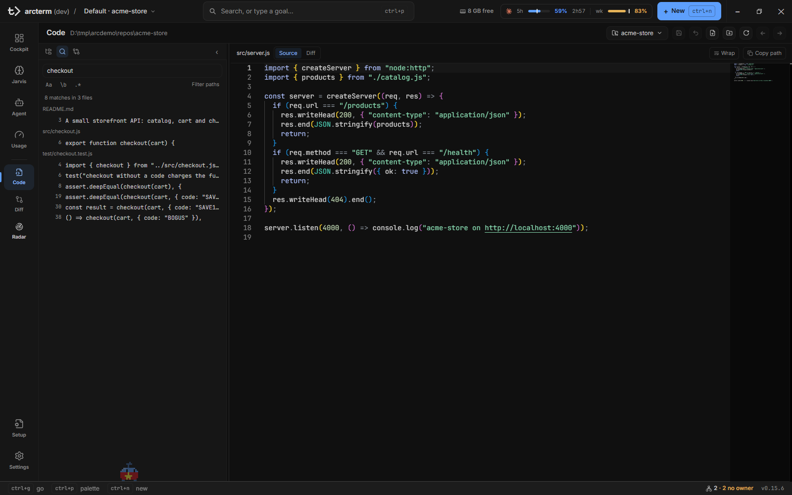
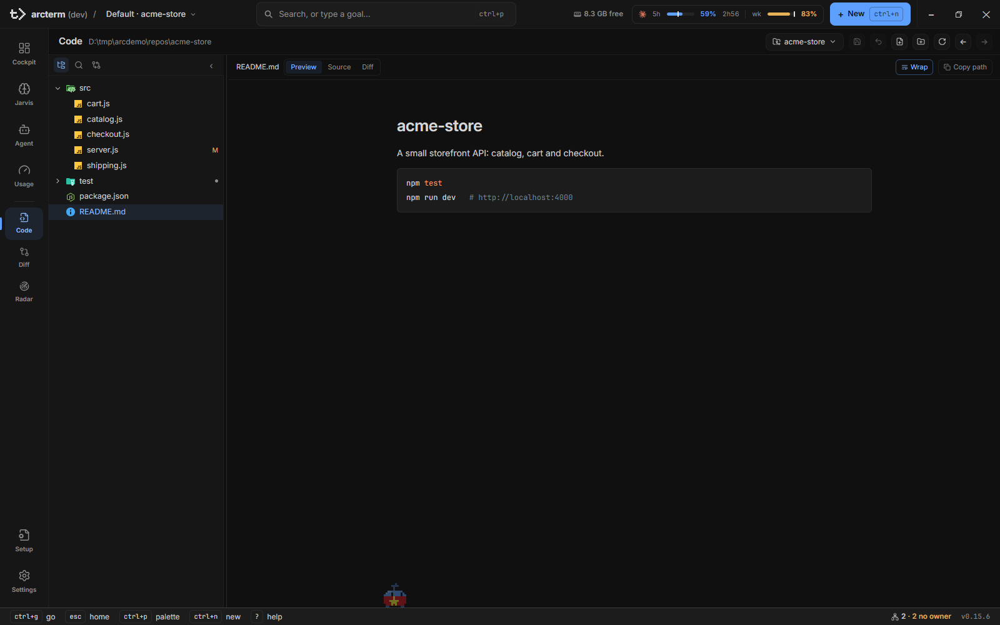
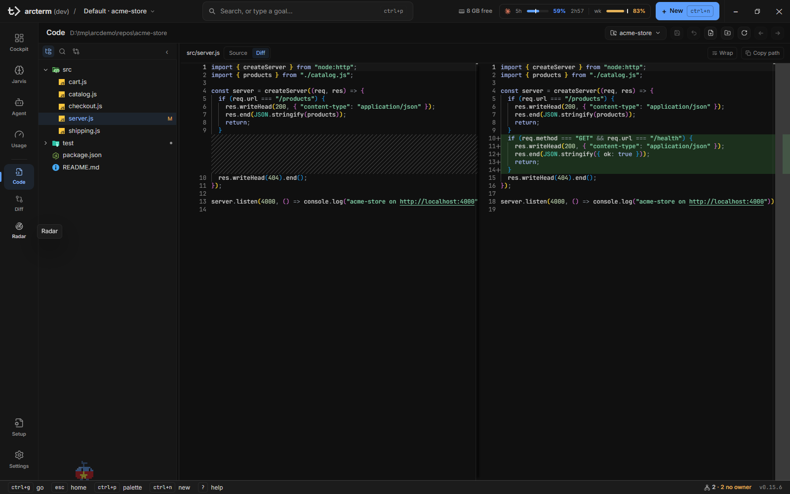

# Code

**Code** là nơi đọc và sửa file của một project ngay trong arcterm, không cần mở editor riêng: cây thư mục, trình soạn thảo Monaco có tô màu cú pháp, tìm trong nội dung, xem file Markdown và LaTeX như tài liệu, và một cột phụ chỉ-đọc để đặt hai file cạnh nhau. Code nhìn trực tiếp vào cây làm việc mà agent cũng đang sửa, nên nó cũng cho bạn thấy file nào vừa đổi trên đĩa.

Code mở một file tại một thời điểm. Không có hàng tab; để quay lại file trước bạn dùng **Back** / **Forward** (`Alt+←` / `Alt+→`), và để nhìn hai file cùng lúc bạn dùng [cột phụ](#cột-phụ-hai-file-cạnh-nhau). (File tab bạn thấy trong rail của một agent là việc của [Agent](agent.md), không phải của Code.)

Muốn xem một commit hay một khoảng lịch sử đã đổi gì, dùng [Diff](diff.md); Code chỉ trả lời "file này trông thế nào và tôi muốn sửa gì".

## Mở Code

| Cách | Kết quả |
|---|---|
| Nav rail → **Code** | Mục đầu của nhóm công cụ (Code, Diff, Radar) |
| `Ctrl+5` (`Cmd+5` trên Mac) | Nhảy theo vị trí trong nav rail |
| `Ctrl+G` rồi `b` | Chuỗi "go to": b là browse source |
| `[` / `]` | Chuyển sang surface trước / sau |

Code nhớ project bạn đã duyệt lần cuối và mở lại nó khi project vẫn còn trong registry; một project đã bị đổi tên hay xóa thì không tự mở lại. Lần đầu tiên, nếu app bar đang chọn một project thì Code lấy project đó.

Surface bị gỡ khỏi màn hình khi bạn chuyển đi, nhưng file đang mở, các bản nháp chưa lưu, lịch sử Back/Forward, con trỏ và vị trí cuộn của tối đa 20 file gần nhất vẫn còn. Mỗi lần quay lại Code, danh sách file và trạng thái git được đọc lại.

## Chọn project

Nút tên project ở góc phải tiêu đề (**Pick a project** khi chưa chọn) mở một bảng có bốn phần:

- **Projects**: mọi project đã đăng ký.
- **Worktrees**: chỉ hiện khi repo có nhiều hơn một checkout; mỗi dòng là một nhánh, kèm đường dẫn.
- **Recent**: các thư mục bạn từng mở qua đường dẫn gõ tay.
- Ô **Path to a directory** ở đáy: gõ một đường dẫn tuyệt đối rồi Enter hoặc bấm mũi tên **Open directory**. Đường dẫn sai hiện lỗi ngay trong bảng ("No such directory: …", "Enter an absolute path", "That is a file, not a directory").

Code duyệt được cả thư mục mà registry không biết, nên một worktree mà agent tạo ra vẫn mở được; tiêu đề phụ luôn hiện đường dẫn đầy đủ để bạn biết đang ở đâu.

Nếu project Code đang xem khác project đang chọn ở app bar, một dải thông báo `Showing <project của Code> · project is <project ở app bar>` hiện ra với nút **Show the project** để quay về. Code không tự nhảy theo app bar, vì sẽ làm mất chỗ bạn đang đọc.

Các trạng thái đặc biệt: "No registered projects" (đăng ký project ở [Settings](settings.md)), "No project selected", "Not a git repository" (Code liệt kê file bằng git nên cần repo), và "Could not list files: …" kèm **Retry**.

## Cột bên trái: Files, Search, Changed files

Ba biểu tượng ở đầu cột chuyển giữa ba chế độ; nút ‹ thu gọn cả cột (còn một nút › để mở lại) và đường kẻ giữa cột với trình soạn thảo kéo để đổi độ rộng (200–480 px, nhớ theo từng chế độ; cũng chỉnh được bằng ←/→, `Home`, `End` khi đường kẻ đang focus). Khi cửa sổ quá hẹp, cột tự thu thành nút ›.

| Chế độ | Phím | Dùng để |
|---|---|---|
| **Files** | `Alt+T` | Cây thư mục của project |
| **Search** | `Ctrl+Shift+F` | Tìm trong nội dung file |
| **Changed files** | | Danh sách phẳng những file cây làm việc đã đổi so với `HEAD` |

### Files: cây thư mục

Cây dựng từ cùng danh sách file mà ô tìm tên dùng, nên hai chỗ không bao giờ lệch nhau. Bên phải mỗi file có chữ trạng thái git: `A` thêm, `M` sửa, `D` xóa, `?` chưa theo dõi, `R` đổi tên, `C` sao chép. Thư mục đang gập mà bên trong có thay đổi thì có một chấm nhỏ ("Contains changes"). Một chấm đậm khác là "Unsaved edits": bạn đang có bản nháp chưa lưu cho file đó, kể cả khi bạn không nhìn thấy nó. Thư mục mà git bỏ qua (`.gitignore`) hiện mờ và được liệt kê khi bạn mở nó.

Cây chỉ nhận phím khi nó đang có focus (vào bằng `Alt+T`, hoặc ngay lúc mở surface). Với con trỏ trên một dòng:

| Phím | Việc |
|---|---|
| `j` / `k`, `↓` / `↑` | Dòng kế / trước |
| `→` / `←` | Mở / gập thư mục |
| `Enter` | Mở file, hoặc mở/gập thư mục |
| `n` | File mới trong thư mục của con trỏ |
| `Shift+N` | Thư mục mới |
| `F2` | Đổi tên |
| `Delete` | Xóa (có hộp xác nhận) |

Tạo mới và đổi tên dùng một ô nhập ngay trên dòng; `Enter` xác nhận, `Esc` hủy, và lỗi (tên trống, trùng, ký tự không hợp lệ) hiện ngay khi bạn gõ. Hai nút **New file (n)** và **New folder (Shift+N)** trên tiêu đề dùng khi cây trống hoặc chưa focus. Bấm chuột phải một dòng để có menu **Open to the Side**, **New File**, **New Folder**, **Rename**, **Delete**, **Copy Path**. Hộp xác nhận xóa nói rõ hậu quả: file chưa theo dõi thì "cannot be undone", còn file đã commit thì bản commit vẫn nằm trong lịch sử git. Kéo một file từ cây sang trình soạn thảo cũng mở được nó (xem cột phụ).

Danh sách file là một ảnh chụp, không có bộ theo dõi: file mới do agent tạo xuất hiện sau khi bạn bấm **Refresh index** (`r`), hoặc khi bạn quay lại Code từ surface khác. File đã biến mất khỏi đĩa thì Code ghi "File no longer exists" kèm nút **Refresh index**. Với repo cực lớn, cây dừng ở 20.000 file và báo "File list truncated".

### Search: tìm trong nội dung

Gõ vào ô "Search file contents" rồi nhấn `Enter`. Việc tìm chạy bằng `git grep`: có cả file mới chưa theo dõi, nhưng file bị `.gitignore` loại thì không. Ba nút bật/tắt dưới ô: `Aa` phân biệt hoa thường, `\b` nguyên từ, `.*` biểu thức chính quy ("Invalid pattern" nếu sai). Đổi nút khi đã có kết quả thì tìm lại ngay. **Filter paths** mở hai ô **Include** và **Exclude**: danh sách pathspec cách nhau bằng dấu phẩy, ví dụ `*.go, pkg` và `vendor, *_test.go`.

Kết quả gom theo file, mỗi dòng ghi số dòng và đoạn khớp. Bấm một dòng mở file ngay tại dòng đó. `↓` từ ô tìm đi vào danh sách kết quả, `↑` từ dòng đầu quay ra. Một lần tìm trả tối đa 500 kết quả; vượt thì ghi "(truncated)". Từ khóa và bộ lọc được giữ khi bạn rời Code, và bị xóa khi đổi project.

### Changed files

Một danh sách phẳng, chữ trạng thái, đường dẫn, và `+/−`. Bấm một dòng mở trình soạn thảo (không mở diff). Đây là câu trả lời cho "trong những file này tôi nên đọc file nào trước"; còn đọc từng thay đổi thì dùng chế độ **diff** của file hoặc surface [Diff](diff.md).

## Tìm file theo tên và nhảy dòng

`Ctrl+P` mở ô tìm kiếm chung của app; khi bạn đang ở Code nó mở sẵn ở phạm vi **Files** của project đang duyệt. Gõ một phần tên, các file mở gần đây được xếp trước. Thêm `:123` để mở file tại dòng 123 (`policy.go:123`). Trên Code, một `:123` đứng riêng nghĩa là "đưa file đang mở tới dòng 123".

## Đọc và sửa một file

Thanh đường dẫn phía trên trình soạn thảo cho biết file đang mở, có chấm tròn khi file có sửa đổi chưa lưu, rồi đến công tắc chế độ xem, nút **Wrap** và nút **Copy path** (chép đường dẫn tuyệt đối).

### Chế độ xem

| Loại file | Các chế độ | Mở mặc định ở |
|---|---|---|
| Markdown (`.md`, `.markdown`) | preview, source, diff | preview |
| LaTeX (`.tex`) có chữ để hiện | preview, source, diff; thêm PDF khi đã có PDF build | preview |
| `.tex` không có tiêu đề/đoạn văn (file macro sinh tự động) | source, diff | source |
| Mọi file văn bản khác | source, diff | source |
| `.pdf` | một trình xem PDF | |

Chế độ bạn chọn áp dụng cho mọi file; file nào không có chế độ đó thì rơi về preview, rồi source.

- **preview** của Markdown dựng tài liệu với khối thông tin front matter ở đầu, trong một cột đọc ở giữa. Liên kết tương đối trong tài liệu mở file đích ngay trong Code (kể cả neo kiểu GitHub `#L12`); liên kết ngoài mở như bình thường. Chữ đang soạn (chưa lưu) hiện ngay trong preview, nên bạn thấy đúng thứ sẽ lưu.
- **preview** của `.tex` hiện tiêu đề và tác giả, các đề mục đánh số, đoạn văn với khóa `\cite` / `\ref` và công thức đã dựng. Bấm đúp một câu để chuyển sang **source** tại dòng đó. Chế độ **PDF** hiện PDF đã build gần nhất (từ Doc review, hoặc file PDF cạnh file chính) cùng ghi chú nó cũ bao nhiêu; Code không tự biên dịch.
- **source** là Monaco: tô màu theo ngôn ngữ, gồm cả LaTeX và BibTeX. Trình soạn thảo giữ lại con trỏ, vùng chọn, vị trí cuộn và lịch sử undo của mỗi file khi bạn đổi file hay rời surface.
- **diff** đặt file với `HEAD`, xem [phần so sánh](#diff-của-code-và-surface-diff).

**Wrap** (`Alt+Z`, hoạt động cả khi bạn đang gõ trong trình soạn thảo) bật tắt việc bọc dòng dài, riêng cho từng file. `.tex`, `.bib`, `.md`, `.txt` bọc mặc định; code theo cài đặt `editor:wordwrap`.

File lớn hơn 2 MB hiện "File too large to display" kèm nút **Copy path**; file nhị phân hiện "Binary file" với kích thước.

### Sửa và lưu

Gõ thẳng vào Monaco. Mỗi sửa đổi là một bản nháp (draft) gắn với đường dẫn tuyệt đối, nên không lẫn giữa các project, sống sót khi bạn chuyển surface, đổi project, và cả khi khởi động lại app (lưu trong bộ nhớ trình duyệt của webview, có giới hạn dung lượng; bản nháp không lọt thì chỉ giữ trong bộ nhớ). Gõ lại đúng nội dung trên đĩa thì bản nháp biến mất và file hết "dirty".

| Điều khiển | Việc |
|---|---|
| Tiêu đề: chữ **Saving…** / **Saved** / **Unsaved** | Trạng thái duy nhất cho biết một lần ghi đã hạ cánh |
| **Save** (`Ctrl+S`) | Ghi bản nháp xuống đĩa |
| **Discard unsaved edits** | Bỏ bản nháp của file đang mở |

`Ctrl+S` ghi đè file trên đĩa và không hỏi lại. Nhưng trước khi ghi, Code so với file thật: nếu file đã đổi từ lúc bạn mở (thường là một agent đã sửa nó) hoặc đã bị xóa, Code từ chối ghi và hiện dải lỗi với nút **Reload from disk** ("The file changed on disk since you opened it … Refusing to overwrite"). Bản nháp của bạn vẫn còn cho đến khi bạn tự bấm tải lại; đó là hành động duy nhất cố ý vứt chữ bạn đã gõ, và nó không bao giờ tự xảy ra. Ghi lỗi vì lý do khác thì có dải "Could not save …" kèm **Retry**.

Khi bạn quay lại cửa sổ (hoặc đưa focus vào cây), Code kiểm tra file đang mở. Nếu nó đã đổi trên đĩa, một dải vàng báo `<file> changed on disk` với nút **Reload**; nếu bạn có bản nháp, dải ghi rõ "your unsaved edits are still here" và nút là **Discard my edits and reload**.

### Back và Forward

**Back** / **Forward** trên tiêu đề (hoặc `Alt+←` / `Alt+→`, `Option` trên Mac) đi lại giữa các file đã mở, nhớ cả dòng đang đứng. Lúc quay lại, file được đọc lại từ đĩa chứ không phát lại bản cũ.

## Cột phụ: hai file cạnh nhau

Cột phụ là một cột thứ hai chỉ-đọc cạnh trình soạn thảo, dùng khi bạn muốn một file làm tham chiếu trong lúc sửa file kia. Ví dụ điển hình: PDF hay bản preview của một bài báo bên cạnh file `.tex`; nó cập nhật theo chữ bạn gõ.

Mở cột phụ bằng một trong ba cách:

- `Ctrl+\` (cùng phím này đóng cột phụ nếu đang mở): mở file đang xem sang cột phụ.
- Chuột phải một file trong cây → **Open to the Side**.
- Kéo file từ cây thả lên nửa phải của trình soạn thảo (nửa trái mở nó ở cột chính). Trong lúc kéo, hai nửa hiện chữ **Open** và **Open to the side**.

Cột phụ mở một file ở chế độ preview, source hoặc PDF (tự chọn: `.tex` đã build thì mở ở PDF, tài liệu mở ở preview, còn lại là source) và có công tắc chế độ riêng trên đầu cột khi file có nhiều hơn một chế độ. Nút **Open in main** chuyển file ấy sang cột chính để sửa, nút × đóng cột. Mở file khác sang cột phụ thì thay file cũ; không bao giờ có quá hai cột. Cột phụ chỉ hiện khi vùng soạn thảo rộng từ 900 px; hẹp hơn nó được cất đi và thanh đường dẫn có chip `Side: <tên file>` để bấm mở file đó ngay ở cột chính. Đổi project thì cột phụ đóng. Tỉ lệ chia giữa hai cột kéo được và được nhớ.

<!-- shot: code-side-column.png | Hai cột trong Code: file `.tex` ở cột chính (source) và PDF đã build của nó ở cột phụ, chip tên file cùng nút "Open in main" và × trên đầu cột phụ, đường kéo giữa hai cột | Chạy scenario `code-side-column` (surface `code`; repo tạm có main.tex, main.pdf, numbers.tex). Mở main.tex, nhấn `Ctrl+\`. Cửa sổ rộng ~1600px để vùng soạn thảo >= 900px. -->

## Diff của Code và surface Diff

Chế độ **diff** (công tắc trên thanh đường dẫn, hoặc `d` khi không đang gõ) đặt file đang mở cạnh bản `HEAD` của nó trong chính chỗ bạn đang sửa. Phía phải là **bản nháp chưa lưu của bạn**, nên bạn thấy đúng câu hỏi "tôi sắp commit gì": thay đổi chưa lưu cũng hiện ra. Hai cột song song khi trình xem rộng từ 900 px; hẹp hơn là một cột. File chưa có trong `HEAD` thì phía trái trống.

Chế độ này chỉ so với `HEAD` và chỉ một file. Để so với commit tùy ý, so hai nhánh, đọc cả repository hay để lại comment cho agent, dùng surface [Diff](diff.md). Quy tắc thực dụng: viết code thì xem diff trong Code, review thì sang Diff.

## Các đường dẫn vào Code

Nhiều chỗ trong app mở thẳng một file trong Code:

| Từ đâu | Cách | Mở ở |
|---|---|---|
| [Diff](diff.md) | Nút **Open in Code** | File, tại dòng đầu tiên khác nhau |
| [Radar](radar.md) | Đường dẫn `file:dòng` trên finding | File, tại dòng của site anh em |
| Search trong Code | Bấm một kết quả | File, tại dòng khớp |
| Ô tìm kiếm chung (`Ctrl+P`) | Phạm vi Files, chọn một file | File (từ surface Agent, file nằm dưới thư mục của agent đang chọn thì mở ở File tab của agent) |
| Markdown preview | Liên kết tương đối | File được liên kết |
| Terminal thường | Bấm đường dẫn trong output | File, tại dòng nếu có. Trong terminal hay transcript của một agent, đường dẫn mở ở File tab của agent đó, xem [Agent](agent.md) |
| Dòng lệnh | `wsh view <file hoặc thư mục>` (còn gọi `wsh preview`, `wsh open`) | File ở preview; thư mục thì chỉ duyệt project |
| Dòng lệnh | `wsh edit <file>` | File ở source |

Một file nằm ngoài project đang xem sẽ thuộc về project đã đăng ký có đường dẫn chứa nó sâu nhất; không project nào thì Code duyệt thư mục chứa file đó.

## Phím tắt

Các phím này hoạt động khi Code đang hiện và bạn không gõ trong ô nhập (trừ những phím ghi chú). `Ctrl` là `Cmd` và `Alt` là `Option` trên Mac. Danh sách đầy đủ: [keyboard-shortcuts](../keyboard-shortcuts.md).

| Phím | Việc |
|---|---|
| `Ctrl+P` | Tìm file theo tên (phạm vi Files); `:123` hoặc `path:123` để nhảy dòng |
| `Ctrl+Shift+F` | Tìm trong nội dung (cũng hoạt động khi đang gõ trong trình soạn thảo) |
| `Alt+T` / `Alt+E` | Focus cây thư mục / focus trình soạn thảo |
| `Ctrl+S` | Lưu file đang mở (cũng hoạt động khi đang gõ) |
| `Alt+Z` | Bọc dòng cho file đang mở (cũng hoạt động khi đang gõ) |
| `Ctrl+\` | Mở/đóng cột phụ (cũng hoạt động khi đang gõ) |
| `Alt+←` / `Alt+→` | Back / Forward |
| `d` | Bật/tắt chế độ diff với `HEAD` |
| `r` | Đọc lại danh sách file (Refresh index) |
| `j` `k` `↑` `↓` `←` `→` `Enter` `n` `Shift+N` `F2` `Delete` | Trong cây, xem bảng ở trên |
| `Esc` | Về Cockpit |

## Giới hạn

- Danh sách file không tự làm tươi; file mới xuất hiện sau **Refresh index** hoặc khi quay lại Code.
- Không có hàng tab và không có nhiều cửa sổ soạn thảo; tối đa hai cột, cột phụ chỉ-đọc.
- Không có tìm-và-thay trong nhiều file; Search chỉ tìm, và bỏ qua file bị `.gitignore` loại.
- Chỉ xem được file ≤ 2 MB. PDF dùng trình xem riêng và không bị giới hạn đó.
- Không gửi dòng code cho agent từ Code. Việc đó thuộc review theo dòng của surface [Diff](diff.md).
