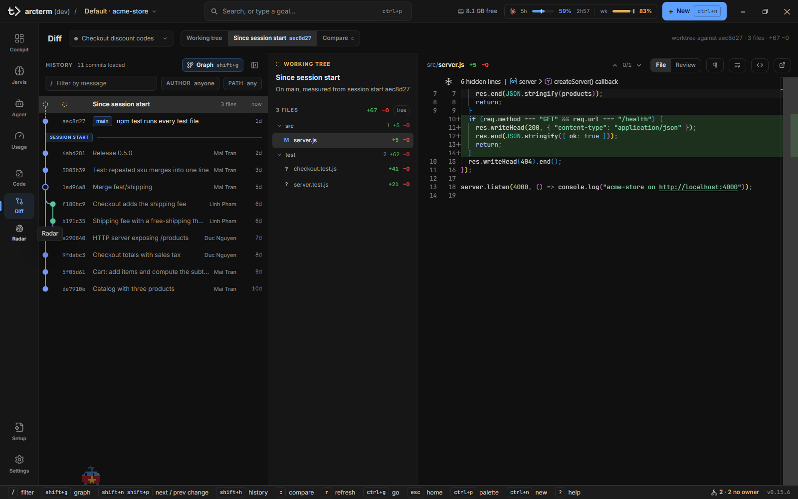
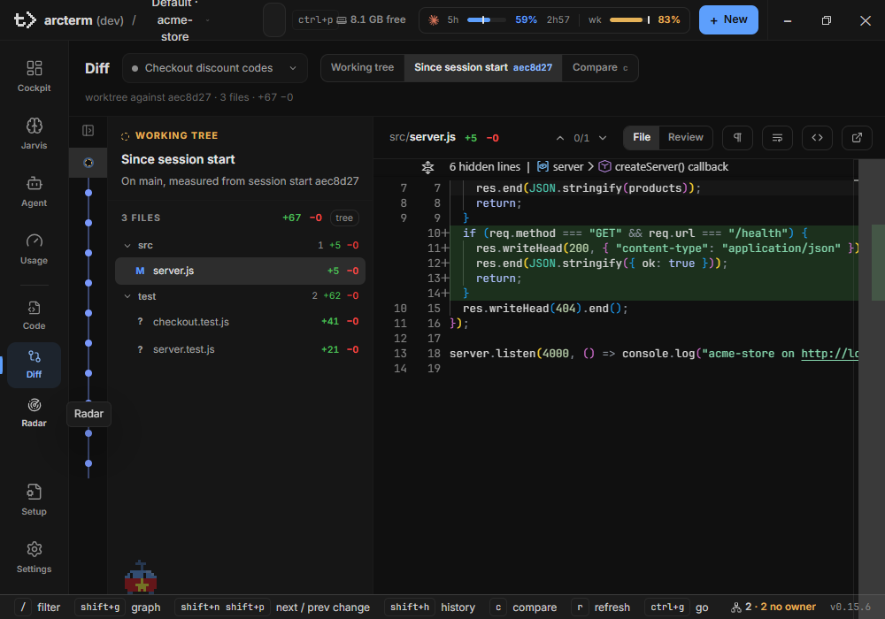
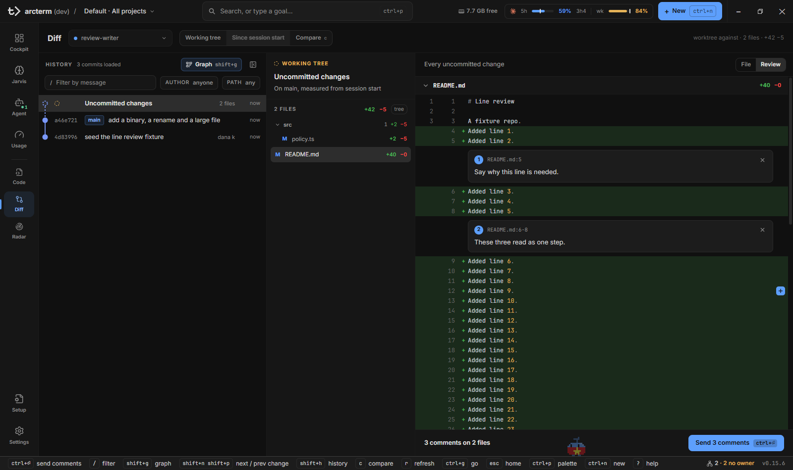

# Diff

**Diff** là mặt phẳng review Git của arcterm: chọn một repository, chọn một khoảng lịch sử, đi qua từng commit và đọc thay đổi của từng file. Bạn cũng có thể để lại comment theo dòng và gửi cả loạt cho agent trong một tin nhắn. Diff không bao giờ ghi vào repository của bạn (không stage, không checkout, không commit); thứ duy nhất nó ghi ra ngoài là tin nhắn gửi vào terminal của agent khi bạn bấm gửi comment.

Nhãn trên giao diện là **Diff**, còn khóa nội bộ của surface là `files` (ví dụ `wsh ui reveal surface:files`, hoặc `Ctrl+G` `f`).

Các trang liên quan: [Agent](agent.md) (File tab trong rail của agent), [Code](code.md) (sửa file, diff với HEAD), [Cockpit](cockpit.md), [Orchestrator](orchestrator.md) (diff của một run).

## Mở Diff

| Cách | Kết quả |
|---|---|
| Nav rail → **Diff** | Mục thứ hai trong nhóm công cụ (Code, Diff, Radar) |
| `Ctrl+6` (`Cmd+6` trên Mac) | Nhảy theo vị trí trong nav rail |
| `Ctrl+G` rồi `f` | Chuỗi "go to" |
| `[` / `]` | Chuyển sang surface trước / sau |

Khi Diff được mở mà chưa có nguồn nào được chọn và chưa agent nào đang được focus, nó lấy agent đầu tiên trong roster; nếu chỉ có project thì bạn chọn nguồn ở sidebar worktree bên trái. Không có agent nào và cũng không có project nào thì bạn thấy màn "No changes to show" với nút **New agent**.

Surface này bị gỡ khỏi màn hình mỗi khi bạn chuyển đi, nhưng vị trí cuộn, bộ lọc, commit và file đang chọn được giữ lại. Quay lại là về đúng chỗ cũ.

### Những chỗ khác trong app mở Diff sẵn

| Từ đâu | Thao tác | Diff mở ở |
|---|---|---|
| Thẻ agent trong Cockpit | Menu của dòng → **Review changes** (chỉ có khi agent có thay đổi) | Agent đó, range **Since session start** |
| Rail của agent → **Files changed** → bấm một file | Mở ngay | File tab cạnh terminal, dạng diff từ lúc session bắt đầu (chưa phải surface Diff) |
| File tab của agent | Nút **Open in Diff** (biểu tượng so sánh) | Agent đó, đúng file đó |
| Rail của agent → **View diff** | Bấm nút | Agent đó, chưa chọn file |
| Run sheet, màn hoàn tất run | Một file trong danh sách, hoặc **Open repository diff** / **Open the diff** | Run đó, range **This run**, có thể kèm file |
| Transcript của một session đã kết thúc | Nút **Review** ở thanh files | Project của session, range **Working tree** |

Lúc đi vào từ một file cụ thể, lần chọn file đó chỉ có tác dụng một lần: các lần quay lại sau không kéo bạn về file ấy nữa.

## Chọn nguồn và range

Bên trái là **sidebar worktree**; hàng trên cùng của phần còn lại có tiêu đề **Diff**, dải range, và một dòng tóm tắt bên phải.

**Sidebar worktree** là nơi duy nhất chọn bạn đang đọc repository nào. Nó liệt kê mọi project đã đăng ký, mỗi project là một nhóm thu/mở được; trong nhóm là checkout chính rồi các linked worktree theo thứ tự của `git worktree list`. Nhóm chứa nguồn đang xem tự mở; các nhóm khác mở khi bạn bấm vào header, và bấm lần nữa thì thu lại.

- **Dòng worktree** hiện nhánh (hoặc `detached <commit>`), số file chưa commit, và `↑`/`↓` số commit đi trước/sau nhánh của checkout chính. Huy hiệu chỉ hiện khi đã đọc được và khác 0. Một worktree đọc lỗi mang dấu cảnh báo; một project đọc lỗi hiện "Couldn't read worktrees" nhưng checkout chính của nó vẫn chọn được. Thư mục không phải repo hiện `not a repository`.
- **Dòng agent** nằm dưới worktree mà agent đang chạy trong đó. Agent có thư mục làm việc ngoài mọi worktree đã liệt kê, hoặc không xác định được, nằm trong nhóm **Other agents** ở cuối. Chọn một agent cũng chuyển focus của cockpit sang agent đó.
- **Ô lọc** ở đầu sidebar lọc theo tên project, nhánh, đường dẫn và tên agent, trong mọi project kể cả nhóm đang thu.

Chọn checkout chính là đọc project đó; chọn một linked worktree là đọc worktree đó với range **Working tree**. `r` đọc lại trạng thái của các nhóm đang mở.

**Thu sidebar**: nút ở đầu sidebar hoặc `Shift+B` thu nó thành một rail 36 px, trên đó checkout nào có thay đổi chưa commit mang một chấm. Khi bạn chưa tự quyết, sidebar tự thu khi bề rộng surface dưới 1000 px (nên ở cửa sổ mặc định 1000×700 nó mở dưới dạng rail); lựa chọn rõ ràng của bạn thắng và được nhớ qua các lần mở app.

Có loại nguồn không nằm trong sidebar: **run**. Bạn chỉ vào đó từ chứng cứ của một run (bảng trên), và dòng tóm tắt nói về range **This run** của nó.

Khi nguồn là một agent, Diff đi theo focus của cockpit: đổi agent được chọn ở nơi khác thì Diff đổi theo. Ghim một project hay một worktree, hoặc đến từ một run, thì focus không kéo Diff đi nữa.

**Dải range** là khoảng lịch sử cần xem:

| Chip | Hiện khi | Nghĩa |
|---|---|---|
| **Working tree** | Luôn luôn | Công việc chưa commit so với `HEAD` |
| **Since session start** | Nguồn là agent | Worktree so với commit đang là `HEAD` lúc session của agent bắt đầu |
| **This run** | Nguồn là run | Từ base commit của run đến `HEAD` |
| **Compare** | Luôn luôn | Hai ref so với nhau, xem [So sánh hai ref](#so-sánh-hai-ref) |

Chip nào có thể dùng nhưng tạm thời chưa dùng được thì bị làm mờ kèm tooltip giải thích. Ví dụ **Since session start** mờ với lý do "no session-start commit recorded yet" cho đến khi transcript của agent cho ra commit gốc. Chip nào không bao giờ áp dụng cho nguồn này thì không hiện.

**Dòng tóm tắt** bên phải là chữ, không phải nút. Nó nhắc lại range theo cách nói của git cùng tổng số, ví dụ `12 uncommitted files on main · +340 −86`. Nó đi theo lựa chọn hiện tại: chọn một commit thì dòng này nói về commit đó.



## Đọc lịch sử: ba cột

Từ trái sang phải, cùng một trục thời gian.

### Cột 1: lịch sử

Commit mới nhất ở trên. Mỗi dòng gồm hash ngắn, chip ref (nhánh, tag; chip thừa gộp thành `+2`), subject, tác giả (khi dòng không có ref) và thời gian.

- **Dòng đầu là working tree** khi có file thay đổi. Hash vẽ thành vòng tròn nét đứt, subject màu cảnh báo, thời gian là `now`. Chữ trên dòng phụ thuộc range: **Uncommitted changes**, **Since session start** hoặc **Run changes**. Công việc chưa commit là một dòng trong lịch sử, không phải một chế độ riêng.
- **Dải phân cách** đánh dấu điểm neo của range (`session start` hoặc `run base`). Các commit trước điểm neo bị làm mờ, nên thấy ngay cái gì nằm trong range mà không cần đếm.
- **Graph** (lane) vẽ phía sau các dòng, tối đa 7 lane; lane thừa gộp vào một cột xám và tiêu đề ghi `8 lanes · 1 folded`. Bật/tắt bằng nút **Graph** hoặc `Shift+G`. Graph tự tắt khi đang có bộ lọc, vì tập đã lọc thường thiếu cha của chính nó và lane sẽ vẽ cạnh nối đến commit không có trên màn hình.
- Lịch sử nạp **50 commit mỗi trang** và nạp thêm khi bạn cuộn đến gần đáy.

**Lọc lịch sử**: hàng lọc nằm dưới tiêu đề cột (không có khi đang Compare).

| Ô | Tương ứng |
|---|---|
| Ô văn bản "Filter by message" | `git log --grep` trên subject |
| Chip **author** | `git log --author` |
| Chip **path** | `git log -- <path>` |

Bấm chip để biến nó thành ô nhập. Gõ có độ trễ 250 ms, nên mỗi lần gõ xong mới chạy git một lần; xóa thì có hiệu lực ngay. Khi có lọc, tiêu đề cột báo số commit khớp và hiện nút **Clear filters** (phím tắt `Esc`). Nếu không có gì khớp, bạn thấy "No commits match" kèm câu mô tả bộ lọc.

Nếu lần đọc lịch sử đầu tiên kéo dài quá 10 giây, cột báo "Still reading history" kèm nút **Retry**.

**Thu cột lịch sử**: cửa sổ hẹp thì ba cột không đủ chỗ cho diff. Khi bề rộng surface dưới 1280 px, cột 1 tự thu thành một rail 44 px, mỗi commit là một chấm. Bấm nút thu/mở ở đầu cột hoặc `Shift+H` để tự quyết; lựa chọn rõ ràng của bạn thắng việc tự động theo bề rộng. Bấm một chấm trên rail để chọn commit đó.



**Banner "Back where you left off"**: nếu bạn rời Diff hơn hai phút rồi quay lại và Diff khôi phục một lựa chọn bạn đã để lại (một commit không phải dòng đầu, vị trí cuộn, hoặc bộ lọc), một banner viết rõ đã khôi phục gì, ví dụ `Back where you left off: commit 3e1f31e, your scroll position and 2 filters.` Banner có nút **Start from the top** và tự tắt sau 6 giây. Vắng mặt ít hơn hai phút thì khôi phục lặng lẽ.

### Cột 2: commit đang chọn và danh sách file

Ai, khi nào, file nào. Với một commit: hash (có nút **Copy hash**), tuổi, subject, tác giả kèm hai chữ cái đầu, các chip ref. Với dòng working tree: nhãn **Working tree** và một câu cho biết đo từ đâu, ví dụ `On main, measured from 3e1f31e` (hoặc `Detached HEAD`, `measured from session start …`, `measured from run base …`).

Bên dưới là số file với `+thêm −xóa`, rồi danh sách file thay đổi. Mỗi dòng có chữ trạng thái (M, A, D, ?…) tô màu, đường dẫn, và `+/−` riêng. Nút **tree** / **flat** ở đầu danh sách chuyển giữa nhóm theo thư mục (mặc định, bấm thư mục để gập) và danh sách đường dẫn phẳng. Bấm một file để nạp nó vào cột 3.

Danh sách file của working tree và lịch sử được làm tươi khi bạn đang xem: khi Diff đang hiện trên màn hình, danh sách thay đổi được đọc lại mỗi 10 giây, và một commit mới xuất hiện dưới chân bạn (agent commit trong worktree đang xem) làm cột lịch sử tự đọc lại một lần. `r` buộc đọc lại cả hai cột ngay.

### Cột 3: diff của file

Xem tiếp ở phần dưới.

## Đọc diff của một file

Cột 3 là một trình diff Monaco duy nhất cho mọi trạng thái (working tree, một commit, một phép so sánh). Chúng chỉ khác nhau ở hai ref được nạp vào hai phía:

| Đang chọn | Bên trái | Bên phải |
|---|---|---|
| Dòng working tree | Ref gốc của range (`HEAD`, commit bắt đầu session, hoặc base của run) | File trên đĩa, nên sửa đổi đang diễn ra hiện ngay |
| Một commit | Cha đầu tiên của commit (`<hash>^`) | Commit |
| Aggregate của Compare | Merge base hoặc base, tùy dạng so sánh | `head` |

Với working tree, nội dung bên phải được đọc lại theo nhịp thăm dò 10 giây, nên diff không cũ đi khi agent đang sửa file.

Header của cột có: đường dẫn (thư mục mờ, tên file đậm), `+thêm −xóa`, và các điều khiển. Khi cột rộng từ 1100 px nút có nhãn chữ; hẹp hơn thì chỉ còn biểu tượng.

| Điều khiển | Việc nó làm |
|---|---|
| ▲ / ▼ kèm `change 2/5` | Đi tới thay đổi trước / sau trong file (`Shift+P` / `Shift+N`) |
| **File** / **Review** | Một file, hoặc mọi file thay đổi để comment; xem [phần sau](#review-comment-theo-dòng-và-gửi-cho-agent) |
| **Unified** / **Split** | Chỉ hiện khi cột rộng từ 900 px (`Shift+D`). Mặc định Unified |
| **Hide whitespace** | Ẩn thay đổi chỉ khác khoảng trắng đầu/cuối dòng (`Shift+W`). Mặc định tắt để diff khớp với số `+/−` trong header |
| **Wrap** | Bọc dòng dài (`Alt+Z`), chọn riêng theo file và dùng chung với Code và File tab của agent |
| **Open in Code** | Mở file trong [Code](code.md) tại dòng đầu tiên khác nhau. Code luôn hiện file ở cây làm việc, không phải bản của commit đang xem; file đã bị xóa thì Code báo "File no longer exists" |
| Biểu tượng mở ngoài (tooltip "Open in editor") | Giao đường dẫn cho hệ điều hành mở. Chỉ có ở dòng working tree, vì chỉ file đó chắc chắn tồn tại trên đĩa |

Các vùng không đổi được gập lại, chỉ giữ 3 dòng ngữ cảnh quanh mỗi thay đổi; bấm dải gập để mở thêm.

**Khi không có gì để vẽ**, cột nói rõ lý do thay vì để trống:

| Trạng thái | Câu hiện ra |
|---|---|
| Chưa chọn file | "Pick a file to see its changes" |
| Compare không có khác biệt file | "Nothing to compare" |
| Một phía quá 2 MB | "Too large to show here": Diff dừng ở 2 MB, mở file trong Code để đọc |
| File nhị phân | "Binary file" |
| Nội dung giống nhau | "Contents unchanged": chỉ đổi tên hoặc mode của file |

File chưa được git theo dõi (untracked) không có bản `HEAD`, nên được hiện như file toàn dòng thêm.

## Review: comment theo dòng và gửi cho agent

Đây là cách trả lời một agent bằng đúng dòng code mà bạn có ý kiến, thay vì mô tả bằng lời.

Khi bạn chọn dòng working tree hoặc một commit (không phải Compare), header của cột 3 có công tắc **File** / **Review**. **Review** thay trình diff Monaco bằng một danh sách cuộn: mọi file thay đổi của lựa chọn đó xếp chồng nhau, mỗi file là một khối diff unified với số dòng cũ và mới. Đầu cột ghi "Every uncommitted change" hoặc "Every file in this commit".

- Bấm tên file trong cột 2 sẽ cuộn Review đến file đó. Bấm tiêu đề một file trong Review để gập/mở nó.
- Những đoạn không đổi dài được gập thành dải `⋯ N unchanged lines`; bấm để mở.
- Khi cây làm việc đổi, Review tự đọc lại mà không làm trắng màn hình.
- `Alt+Z` (Wrap) chỉ dùng cho chế độ **File**; Review luôn bọc dòng.

### Làm thế nào để comment một dòng

1. Chọn **Review**.
2. Rê chuột vào một dòng, bấm nút `+` ở mép phải của dòng.
3. Gõ vào ô "Leave a comment".
4. Bấm **Add Comment**, hoặc `Ctrl+Enter`. `Esc` hoặc **Cancel** bỏ ô.

Để comment nhiều dòng: bấm `+` rồi **shift-click** một `+` khác trong cùng file, hoặc nhấn `+` và kéo qua các dòng. Một khoảng không thể bắc qua hai phía (dòng đã xóa thuộc phía cũ, các dòng khác thuộc phía mới). Comment trên dòng đã xóa được ghi là `removed line`.

Mỗi comment hiện thành thẻ đánh số dưới dòng cuối của khoảng. Bấm vào lời ghi chú để sửa, bấm × để xóa. Chỉ có một ô comment mở một lúc. Ô nào đang chứa chữ thì không bị mất hay bị ẩn: mở comment khác sẽ đưa bạn về ô đang dở.

Comment được giữ trong bộ nhớ theo repository: sống sót khi bạn chuyển surface, nhưng mất khi khởi động lại app.



### Khay gửi comment

Khay dán ở đáy cột 3, ở cả hai chế độ **File** và **Review** (comment chỉ được tạo trong Review). Nó cho biết có bao nhiêu comment ("3 comments on 2 files") và có một nút gửi duy nhất, `Ctrl+Enter`. Một lần gửi đưa toàn bộ comment đến agent dưới dạng một tin nhắn.

Gửi cho ai:

| Tình huống | Nút | Việc xảy ra |
|---|---|---|
| Nguồn của Diff là một agent | **Send N comments** | Gửi cho agent đó |
| Nguồn là project/run, và project có đúng một agent sống | **Send N comments** | Gửi cho agent đó |
| Project có nhiều agent sống | **Send N comments** ▴ | Mở menu "Send to" để chọn agent; agent đang hỏi câu hỏi bị mờ |
| Không có agent nào | **Copy** | Chép tin nhắn vào clipboard để bạn dán vào agent |

Tin nhắn được dán vào terminal của agent (để nhiều dòng đến nguyên vẹn) rồi gửi `Enter`. Nó có dạng:

```
Review comments on your changes (2):

1. src/policy.ts:12-14
   > <tối đa 3 dòng trích>
   <lời ghi chú của bạn>

2. README.md:7
   > …
   …
```

Trích dẫn cắt ở 3 dòng và mỗi dòng 120 ký tự. Nếu comment thuộc nhiều nguồn (working tree và một số commit), tin nhắn ghi nguồn của từng comment (`in commit abc1234 (subject)`).

Nút gửi bị khóa, kèm dòng giải thích, trong hai trường hợp: agent đích đang chờ bạn trả lời một câu hỏi ("<tên> is waiting on a question — answer it first") hoặc còn một ô comment chưa bấm **Add Comment** ("A comment is not added yet"). Gửi xong, các comment bị xóa và khay hiện "Sent to <tên>". **Copy** (khay hiện "Copied — paste it to an agent") hoặc một lần gửi lỗi thì giữ nguyên comment để bạn thử lại ("Couldn't reach <tên> — comments kept", "Couldn't copy — comments kept"). Một agent chưa mở terminal cũng là lỗi gửi: "<tên>'s terminal is not open".

## So sánh hai ref

Dùng khi câu hỏi là "nhánh này khác nhánh kia chỗ nào", ví dụ trước khi merge.

1. Bấm chip **Compare** trong dải range, hoặc nhấn `c`.
2. Ô chọn ref mở ra, tiêu điểm nằm ở ô **base**. Mặc định `base` là nhánh mặc định của repo (`origin/HEAD` nếu remote công bố, nếu không thì `main`, rồi `master`) và `head` là nhánh đang checkout; nếu trước đó bạn đã so sánh trong repo này thì mở với cặp bạn đã dùng lần trước.
3. Gõ ref vào hai ô (thứ tự luôn là **base … head**) hoặc chọn từ gợi ý. Gợi ý chia nhóm **Local** và **Remote**, kèm tuổi của commit; ref là văn bản tự do nên tag hay SHA đều dùng được.
4. `Enter` hoặc nút **Compare** để áp dụng. `Esc` chỉ hủy việc sửa ô, không rời Compare.

Đóng lại, ô ref thu thành chip `base … head`; bấm chip (hoặc `c`) để sửa. Nút đảo (`Shift+S`) hoán đổi base và head.

Khi so sánh, thanh chủ đề có thêm nút **Fetch** ("Update remote-tracking refs") và đồng hồ `fetched 2m ago` sau lần fetch đầu tiên. Đây là lệnh chạm mạng duy nhất của Diff: một ref remote chỉ mới bằng lần fetch cuối. Fetch lỗi thì có banner "Fetch failed · showing refs as of the last fetch" với **Retry**; phép so sánh vẫn giữ nguyên.

**Cột Compare** thay cho cột lịch sử:

| Dòng | Là gì |
|---|---|
| Đầu cột: `split at abc1234 · 3d ago` | Merge base của hai ref |
| **All changes** (dòng không) | Tổng thể thay đổi của hai ref, kèm số file và `+/−` |
| Nhóm mang tên ref head, ghi "N ahead" | Commit có trên head mà không có trên base |
| Nhóm mang tên ref base, ghi "N behind" | Commit có trên base mà không có trên head |

Hai ref không phân kỳ thì cột ghi "These refs do not diverge."

Chọn **All changes** thì cột 2 hiện ô công tắc **Since the split** / **Tip to tip**:

- **Since the split** (mặc định, `base...head`): chỉ những gì head đã thêm kể từ lúc hai nhánh tách, bỏ phần base có thêm về sau.
- **Tip to tip** (`base..head`): mọi khác biệt giữa hai đầu mút, kể cả phần base đã có thêm.

Danh sách file và cột diff đọc cùng một dạng, nên không thể mâu thuẫn nhau; dòng tóm tắt ghi rõ dạng đang dùng. Chọn một commit trong cột thì cột 2 và 3 hiện commit đó như trong lịch sử thường. `Tab` nhảy giữa hai phía (đến commit đầu của phía còn lại). Review không có trong Compare.

`Esc` thoát Compare và trả về **đúng range bạn đang xem trước đó**, không đoán mặc định. Bấm Compare lúc đang Compare không lồng thêm một tầng: nó giữ range gốc làm chỗ quay về.


## Khi có sự cố

Hai màn hình chiếm cả surface, cố ý khác nhau:

- **"This folder isn't a Git repository"**: một sự thật bình thường về nguồn bạn chọn. Nút **Choose a source** mở sidebar worktree và đặt con trỏ vào ô lọc.
- **"Couldn't read this repository"**: một lỗi. Màn hình in lệnh git đã hỏng, mã thoát (hoặc "no exit code" nếu là timeout hay thiếu git), stderr nguyên văn trong khối chọn được, nút chép và nút **Retry**. Không có gì bị đổi nên thử lại là an toàn.

Một repository đọc hỏng được kiểm tra trước, vì đọc hỏng cũng báo "không phải repo"; hiện nó như vắng mặt sẽ che mất nguyên nhân.

## Phím tắt

Các phím này có hiệu lực khi Diff đang hiện và bạn không gõ trong ô nhập hay hộp thoại. Thanh gợi ý ở chân cửa sổ là bản trực tiếp của bảng này: nó chỉ liệt kê các phím đang áp dụng, nên đổi giữa lịch sử và Compare, và mờ đi khi tiêu điểm ở trong ô nhập. `Ctrl` là `Cmd` trên Mac, `Alt` là `Option`. Toàn bộ phím của app: [keyboard-shortcuts](../keyboard-shortcuts.md).

| Phím | Việc | Khi nào |
|---|---|---|
| `j` / `k`, `↓` / `↑` | Di con trỏ commit; di chuyển là chọn, nên các cột đi theo | Luôn luôn |
| `Enter` | Mở file đang chọn bằng ứng dụng mặc định của hệ điều hành | Có file được chọn |
| `/` | Focus ô lọc lịch sử | Chế độ lịch sử |
| `Shift+G` | Bật/tắt graph | Chế độ lịch sử |
| `Ctrl+G` `g` | Về đầu lịch sử | Chế độ lịch sử |
| `Shift+H` | Thu/mở cột lịch sử | Luôn luôn |
| `Shift+B` | Thu/mở sidebar worktree | Luôn luôn |
| `Shift+N` / `Shift+P` | Thay đổi kế / trước trong diff đang mở | Có diff Monaco |
| `Shift+D` | Split / Unified | Luôn luôn |
| `Shift+W` | Hide whitespace | Luôn luôn |
| `Alt+Z` | Wrap file đang mở (dùng chung với Code) | Chế độ File |
| `r` | Đọc lại danh sách thay đổi, lịch sử và sidebar worktree | Luôn luôn |
| `c` | Lịch sử: mở Compare. Trong Compare: sửa hai ref | Luôn luôn |
| `Shift+S` | Đảo base và head | Trong Compare |
| `Tab` | Nhảy giữa hai phía | Trong Compare |
| `Ctrl+Enter` | Gửi comment cho agent (trong ô comment thì nó thêm comment) | Có comment chờ gửi |
| `Esc` | Xóa bộ lọc; nếu không thì thoát Compare; nếu không thì về Cockpit | Theo đúng thứ tự đó |

`Shift+G` cố ý không phải `g` trần. Từ bản 0.15.6, mọi chuỗi "go to" mở bằng `Ctrl+G` rồi một chữ; một `g` trần không mở gì.

Chưa có phím để di chuyển trong danh sách file của một commit: chọn commit bằng bàn phím, nhưng chọn file thì bằng chuột.

## Diff ở đây và chế độ Diff của Code

[Code](code.md) cũng có diff, trả lời một câu hỏi khác.

| | Surface Diff | Chế độ **diff** của Code |
|---|---|---|
| Câu hỏi | "Commit / range này đã đổi gì?" | "Tôi sắp commit gì trong file này?" |
| So với | Bất kỳ commit nào, hoặc hai ref | Chỉ `HEAD` |
| Phía phải | Nội dung đã commit hoặc file trên đĩa | **Bản nháp chưa lưu của bạn** |
| Phạm vi | Cả repository | Đúng một file đang mở |
| Comment cho agent | Có | Không |

Quy tắc thực dụng: viết code thì dùng diff của Code, review thì dùng Diff.

## Giới hạn

- **Chỉ đọc.** Không stage, checkout, cherry-pick hay revert.
- **Comment chỉ tạo trong Review**, và chỉ cho dòng working tree hoặc một commit; không cho Compare. Chúng mất khi khởi động lại app.
- **Không có đánh dấu "đã xem"** cho từng file của một nhánh.
- **Trình diff Monaco đọc hai bản đầy đủ của file** nên một phía quá 2 MB thì không hiện.
- **Chỉ chạy trên máy cục bộ.** Worker qua SSH hay WSL chạy git ở nơi khác, và các lệnh git của Diff không đăng ký trên đường đó.
- **Cửa sổ nhỏ thì chật.** App mở ở 1000×700; sidebar worktree tự thu thành rail dưới 1000 px, cột lịch sử tự thu thành rail dưới 1280 px, cột file rộng 300 px, còn lại là diff. Phóng to cửa sổ trước khi review nghiêm túc.
