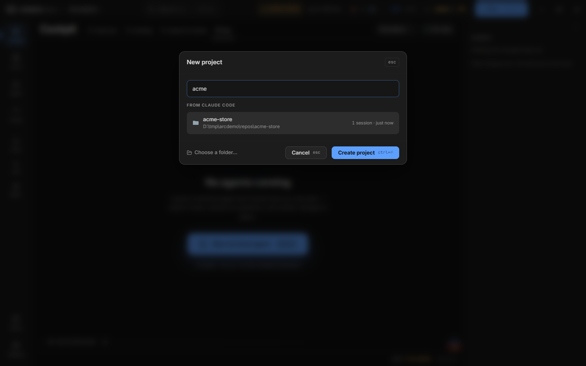
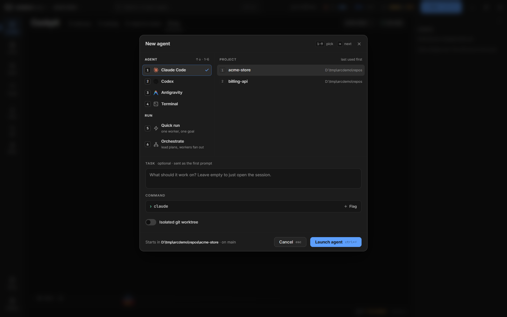

# Bắt đầu với arcterm

arcterm là một cockpit trên máy bạn để chạy và giám sát các coding agent (Claude Code, pi, Antigravity, Codex, OpenCode): xem agent nào đang làm, trả lời câu hỏi đang chờ, chạy nhiều worker song song theo kế hoạch, rồi đọc kết quả bằng diff, trong cùng một cửa sổ. arcterm bọc các CLI agent có sẵn của bạn; nó không cung cấp model hay tài khoản.

Hiện chưa có bản phát hành hay trang tải về: bạn build từ source, trên **Windows** hoặc **macOS chạy Apple silicon**. Trang này đi từ cài đặt đến lần chạy agent và run đầu tiên.

> Trên macOS các phím của app dùng `Cmd` thay cho `Ctrl` (`Cmd+N`, `Cmd+P`, `Cmd+1`…). Trang này viết theo Windows; xem [Phím tắt](../keyboard-shortcuts.md) cho bảng đầy đủ.

## Chuẩn bị

| Cần có | Windows | macOS (Apple silicon, macOS 13 trở lên) |
|---|---|---|
| [Task](https://taskfile.dev) | Có | Có |
| Node.js và npm | Có | Có |
| Go | Có (phiên bản theo `go.mod`, hiện là 1.25.6) | Có |
| Rust, và `cargo tauri` (tauri-cli 2.x, ví dụ `cargo install tauri-cli --version "^2"`) | Có | Có |
| Trình biên dịch C cho CGO | [Zig](https://ziglang.org/download/) (Taskfile build wavesrv bằng `zig cc`) | Xcode Command Line Tools (clang của máy) |
| Công cụ Tauri theo hệ điều hành | C++ build tools và WebView2 | Xcode Command Line Tools |
| Git | [Git for Windows](https://git-scm.com/downloads/win), kèm Git Bash (plan của orchestrator chạy lệnh trong POSIX shell) | Có sẵn hoặc qua Xcode CLT |

Để chạy agent, cài và đăng nhập sẵn CLI bạn định dùng. arcterm tự nhận ra CLI nào có trên máy và chỉ hiện những agent đã cài trong hộp thoại **New**:

| Agent | Lệnh | Ghi chú |
|---|---|---|
| Claude Code | `claude` | Hỗ trợ đầy đủ nhất. Có thể làm lead và worker của run. |
| pi | `pi` | Có thể làm lead và worker của run. |
| Antigravity | `agy` | Chạy `agy` một lần trong terminal trước (xem [Tích hợp agent](agent-integration.md#antigravity-agy)). Chỉ làm worker của run, không làm lead. |
| Codex | `codex` | Mở, resume, xem lịch sử và thống kê token. arcterm không cài hook báo trạng thái cho Codex. |
| OpenCode | `opencode` | Có plugin báo trạng thái. |

## Chạy bản dev

Từ thư mục gốc của repo:

```sh
task init   # npm install và go mod tidy
task dev    # build backend cho máy này rồi mở Tauri + Vite
```

`task dev` (bí danh của `task tauri:dev`) chỉ build backend cho đúng máy đang chạy (`wavesrv` và `wsh`), đồng bộ các artifact của pi, mod Claude và số phiên bản, rồi chạy `cargo tauri dev`. Vite phục vụ frontend ở `localhost:5174` với hot reload. Cửa sổ có tiêu đề **arcterm (dev)** để không nhầm với bản đã cài. Bạn không cần tự chạy `wavesrv`: app tự mở backend của nó.

Lần đầu `task dev` chậm vì phải build Rust và Go. Những lần sau nhanh hơn nhiều.

> **Trước khi chạy:** mỗi lần mở, arcterm cài hoặc làm mới các tích hợp agent vào cấu hình toàn cục trong thư mục home của bạn (xem [arcterm cài gì khi khởi động](#arcterm-cài-gì-khi-khởi-động)). Nếu phiên dev không được đụng vào chúng, đặt `ARC_DEV_NO_GLOBAL_INSTALL=1` trước `task dev`:
>
> ```sh
> ARC_DEV_NO_GLOBAL_INSTALL=1 task dev          # bash, zsh, Git Bash
> $env:ARC_DEV_NO_GLOBAL_INSTALL = "1"; task dev   # PowerShell
> ```
>
> Biến này chỉ có tác dụng với bản dev (debug). Bản đã cài luôn cài tích hợp.

Trên Mac 8 GB, bước build Vite và `task check:ts` dùng hết heap mặc định của Node. Thêm `NODE_OPTIONS=--max-old-space-size=4096` phía trước lệnh.

Bản dev và bản đã cài dùng kho dữ liệu riêng (xem [Dữ liệu, cấu hình và log](#dữ-liệu-cấu-hình-và-log)), nên chạy cạnh nhau được.

## Build và cài bản dùng hằng ngày

```sh
task tauri:build
```

Lệnh này đồng bộ số phiên bản, build backend cho một đích (Windows x64, hoặc macOS arm64) rồi đóng gói:

| Nền tảng | Kết quả | Vị trí |
|---|---|---|
| Windows | Trình cài NSIS `arcterm_<version>_x64-setup.exe` | `src-tauri\target\release\bundle\nsis\` |
| macOS | `arcterm.app` và `.dmg`, ký ad-hoc, chưa notarize | `src-tauri/target/release/bundle/macos/` và `.../dmg/` |

`npm run build` chạy cùng tác vụ đó. Mặc định không đổi số phiên bản; khi phát hành thì truyền `BUMP=patch`, `minor` hoặc `major`.

`task install` cài bản vừa build đè lên arcterm đang cài và mở lại. Nó **đóng arcterm đang chạy cùng mọi agent trong đó**, nên đừng chạy khi còn agent đang làm dở.

- Windows: chạy trình cài NSIS ở chế độ không trang (`/P /UPDATE /R`).
- macOS: `scripts/install-mac.mjs` thoát arcterm, thay `/Applications/arcterm.app` rồi mở lại từ một tiến trình tách riêng, nên chạy được cả từ terminal bên trong arcterm. Log nằm ở `$TMPDIR/arcterm-install.log`; thêm `--dry-run` (`node scripts/install-mac.mjs --dry-run`) để xem trước.

## arcterm cài gì khi khởi động

Mỗi lần mở, app chạy `wsh install-agent-hooks`. Lệnh này idempotent: chỉ ghi file khi nội dung khác, giữ nguyên các hook và khóa không phải của arcterm, và chạy lại được bằng tay trong terminal của arcterm. Mọi hook và `wsh` được trỏ vào một bản sao cố định ở `~/.arc/bin/` chứ không dựa vào PATH, nên app cập nhật xong hook vẫn chạy.

| Cho | arcterm ghi gì | Điều kiện |
|---|---|---|
| `wsh` | `~/.arc/bin/wsh` (`wsh.exe` trên Windows), bản sao cố định của CLI đi kèm app | Luôn luôn |
| Claude Code | Các hook arcterm quản lý trong `~/.claude/settings.json` (`PreToolUse`, `PostToolUse`, `Notification`, `Stop`, `SubagentStop`, `UserPromptSubmit`, `PreCompact`, `SessionStart`); hai mod `~/.arc/claude-mod` và `~/.arc/claude-view-mod`, được liệt kê trong `env.CLAUDE_CODE_PLUGIN_DIRS` | Luôn luôn (thư mục `~/.claude` được tạo nếu chưa có) |
| Claude Code cũ hơn 2.1.287, hoặc không tìm thấy `claude` | Bọc `statusLine.command` thành `wsh statusline --inner=…` để đọc usage; lệnh gốc của bạn vẫn chạy | Tự quyết định theo `claude --version` |
| pi | Các extension `waveterm-status.ts`, `waveterm-tools.ts`, `waveterm-ask.ts`, `waveterm-simplify-gate.ts` (kèm file `-core`) trong `~/.pi/agent/extensions/`; theme `arc` ở `~/.pi/agent/themes/arc.json`; trong `~/.pi/agent/settings.json` thêm `theme` và `packages` nếu chưa có; `keybindings.json` chỉ khi bạn chưa có file | Khi `pi` có trên PATH |
| OpenCode | Plugin `~/.config/opencode/plugins/waveterm-status.js` | Khi `opencode` có trên PATH |
| Antigravity | Khóa `arcterm` trong `~/.gemini/config/hooks.json` | Khi `~/.gemini/antigravity-cli/` tồn tại, tức là bạn đã chạy `agy` ít nhất một lần |
| Codex | Không cài gì | — |

Ngoài terminal của arcterm các tích hợp của pi, OpenCode và mod Claude không làm gì: chúng chỉ chạy khi có biến môi trường mà arcterm đặt cho terminal của nó. Chi tiết từng tích hợp ở [Tích hợp agent](agent-integration.md).

Ngoài ra, mỗi lần bạn khởi chạy một agent, arcterm đồng bộ **instructions** và **skills** dùng chung vào thư mục cấu hình của từng harness (xem [Setup](setup.md)).

## Dữ liệu, cấu hình và log

| | Bản đã cài | Bản dev |
|---|---|---|
| Thư mục gốc (Windows) | `%LOCALAPPDATA%\dev.arc.app\` | `%LOCALAPPDATA%\dev.arc.app-dev\` |
| Thư mục gốc (macOS) | thường là `~/Library/Application Support/dev.arc.app/` | cùng thư mục với hậu tố `-dev` |
| `data\` | Kho SQLite, log, `bin\wsh` cho terminal và các file shell integration | như bên trái |
| `config\` | `settings.json` và cấu hình khác | như bên trái |
| `EBWebView\` (Windows) | Hồ sơ WebView2 do Tauri quản lý | Hồ sơ WebView2 riêng, tách khỏi bản đã cài |

Hỏi đường dẫn thật ngay trong terminal của arcterm: `wsh wavepath data`, `wsh wavepath config`, `wsh wavepath log`. `wsh wavepath log -t` in 100 dòng cuối của log.

- **Log**: host Tauri ghi stderr của `wavesrv` (kể cả stack khi panic), các dòng `fe-log` của frontend và các dòng `[tauri]` của chính nó, có timestamp, vào `waveapp.log` trong `data\`. Quá 10 MB thì chuyển thành `waveapp.1.log` (giữ một bản). Dòng `[tauri] wavesrv stderr closed` đánh dấu lúc backend thoát.
- **Xóa dữ liệu dev**: dừng app dev rồi chạy `task dev:cleardata` (kho dữ liệu) hoặc `task dev:clearconfig` (cấu hình). Thư mục `EBWebView` xóa tay.
- **Ngoài hai thư mục trên**: `~/.arc/` (wsh, mod Claude, `trash/` cho session đã xóa, giữ 7 ngày) và vault, mặc định `~/.waveterm/vault` (đổi ở **Settings → General → Vault & sync**).

Khi dev, đừng dừng app bằng tên tiến trình: bản dev và bản đã cài dùng chung tên `wave-tauri.exe` và `wavesrv.x64.exe`, nên `taskkill /IM` giết luôn arcterm bạn đang dùng. Dừng theo PID của tiến trình nằm trong thư mục repo (`src-tauri\target`, `dist\bin`). Agent chạy trong arcterm còn bị chặn không cho làm việc này (xem [Tích hợp agent](agent-integration.md#mod-claude)).

## Lần chạy đầu tiên

### Đăng ký project

arcterm làm việc theo project: một thư mục (thường là repo git) đã đăng ký. Chưa có project thì chưa mở được agent hay run.

1. Trên app bar, bấm nút project sau chữ `arcterm /` (hiện **All projects**).
2. Cuối danh sách bấm **New project**.
3. Chọn một thư mục trong mục **From Claude Code** (các thư mục Claude Code đã có session; gõ để lọc, `↑`/`↓` để di chuyển), hoặc bấm **Choose a folder…** để nhập **Name** và **Local path** (có nút **Browse…**).
4. Bấm **Create project** (hoặc `Ctrl+Enter`).

Project mới được chọn làm bộ lọc hiện tại. Nếu chưa có project nào, cột Project của hộp thoại **New** cũng có nút **Register a project** dẫn tới cùng hộp thoại. Chọn project khác, hoặc xóa một project (biểu tượng thùng rác hiện khi rê chuột vào hàng, rồi xác nhận **Remove?**), ở cùng menu **Switch project**. Xóa project chỉ bỏ nó khỏi danh sách của arcterm; file và run của nó không bị động đến.



### Mở agent đầu tiên

1. Bấm **+ New** trên app bar, hoặc `Ctrl+N`. Hộp thoại **New agent** mở ra.
2. Cột **Start**: chọn agent bằng phím số (ví dụ `1` cho Claude Code). Chỉ những CLI đã cài mới hiện, cùng **Terminal** nếu bạn chỉ cần một shell.
3. `Tab` sang cột **Project** (gõ để lọc, hoặc bấm số) và chọn project vừa đăng ký.
4. Ô **Task** là tùy chọn: nội dung được gửi làm prompt đầu tiên. Để trống thì chỉ mở session.
5. Muốn agent làm trên nhánh riêng, bật **Isolated git worktree** và chọn nhánh.
6. Bấm **Launch agent** hoặc `Ctrl+Enter`.

Agent hiện thành một thẻ trên **Cockpit** và một hàng trong sidebar của **Agent**, nơi bạn gõ trực tiếp vào terminal của nó. Hộp thoại nhớ lựa chọn lần trước và, nếu RAM trống không đủ chỗ cho thêm một agent, cảnh báo nhưng vẫn cho chạy.



### Chạy run đầu tiên

Run là công việc được theo dõi: arcterm chạy worker trong worktree riêng, review, merge và verify, còn bạn chỉ trả lời những gì cần người quyết.

1. Bấm **+ New** (hoặc `Ctrl+Shift+R`) để mở hộp thoại ở hàng run, hoặc bấm số của **Quick run** / **Orchestrate** trong cột **Start**.
2. Chọn project rồi gõ mục tiêu vào ô **Goal** ("What should it do?").
3. **Quick run**: một worker làm một mục tiêu, không có lead hay đồ thị task. **Orchestrate**: một lead cùng bạn làm rõ mục tiêu rồi giao kế hoạch cho engine; chọn **Start from** là mục tiêu (goal) hoặc một file plan có sẵn.
4. Bấm **Start run**.

Theo dõi run trên [Jarvis](jarvis.md) (thẻ run và đồ thị task), trả lời câu hỏi của worker ngay ở [Cockpit](cockpit.md), và đọc thay đổi ở [Diff](diff.md). Cách chọn model, viết plan và hạ cánh (land) kết quả có ở [Orchestrator](orchestrator.md) và [Định dạng plan](plan-format.md).

## Bản đồ các surface

Nav rail bên trái có bảy surface đánh số (`Ctrl+1`…`Ctrl+7`, theo thứ tự dưới đây), thêm **Setup** và **Settings** ở đáy. `Ctrl+G` rồi một chữ cái nhảy tới surface đó từ bất kỳ đâu, kể cả trong terminal.

| Surface | Phím | Dùng để | Trang |
|---|---|---|---|
| **Cockpit** | `Ctrl+1`, `Ctrl+G` `c` | Tổng quan: thẻ mọi agent, dải **Needs you**, trả lời câu hỏi tại chỗ | [Cockpit](cockpit.md) |
| **Jarvis** | `Ctrl+2`, `Ctrl+G` `j` | Brief: initiative, run, kênh theo project, việc đang chờ bạn | [Jarvis](jarvis.md) |
| **Agent** | `Ctrl+3`, `Ctrl+G` `a` | Terminal thật của từng agent, sidebar Active và Conversations, Conversation History | [Agent](agent.md) |
| **Usage** | `Ctrl+4`, `Ctrl+G` `u` | Quota 5 giờ/tuần, token và chi phí ước tính, phân tích nơi quota đi | [Usage](usage.md) |
| **Code** | `Ctrl+5`, `Ctrl+G` `b` | Duyệt và sửa file của project | [Code](code.md) |
| **Diff** | `Ctrl+6`, `Ctrl+G` `f` | Lịch sử git, file đã đổi và diff, chỉ đọc | [Diff](diff.md) |
| **Radar** | `Ctrl+7`, `Ctrl+G` `r` | Phát hiện từ audit các commit sửa lỗi, biến thành việc | [Radar](radar.md) |
| **Setup** | `Ctrl+G` `.` | Instructions và skills dùng chung cho mọi harness | [Setup](setup.md) |
| **Settings** | `Ctrl+G` `,` | Tài khoản Claude, route của run, giao diện, terminal, AI nền | [Settings](settings.md) |

Hook, `wsh` và cách agent nói chuyện với cockpit: [Tích hợp agent](agent-integration.md). Toàn bộ phím tắt: [Phím tắt](../keyboard-shortcuts.md).

## Khi có gì đó không đúng

- **Chip `0.15.6 / 0.15.5` màu vàng trên app bar**: shell và backend khác phiên bản (`dist/bin` cũ). Chạy `task build:backend` rồi khởi động lại.
- **Agent không hiện trạng thái**: kiểm tra `waveapp.log`, rồi chạy lại `wsh install-agent-hooks` trong terminal của arcterm. Với Antigravity, đảm bảo đã chạy `agy` một lần.
- **Lệnh nặng của agent "Not run: …"**: RAM đang thiếu và bạn đã chọn không chạy; xem [Usage → Thẻ Low RAM](usage.md#thẻ-low-ram).
