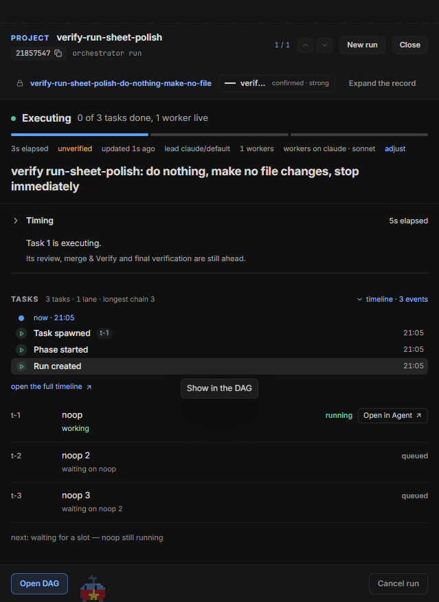
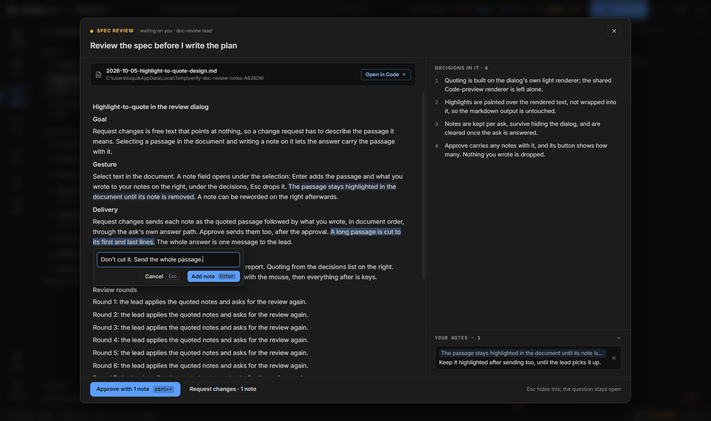

# Jarvis: brief, run và initiative

Jarvis là surface điều phối (`Ctrl+2`, `Ctrl+G` `j`): một **Brief** cho biết việc gì đang chờ bạn, run nào đang chạy hay vừa land, và các initiative lớn đang đi tới đâu. Từ đây bạn mở run sheet, trả lời câu hỏi của lead và worker, duyệt spec và plan, và đặt mặc định cho các run sau.

Các trang liên quan: [Orchestrator](orchestrator.md) (cách một run chạy), [Plan file](plan-format.md), [Cockpit](cockpit.md) (thẻ agent và dải **Needs you**), [Agent](agent.md) (terminal của lead và worker), [Phím tắt](../keyboard-shortcuts.md#jarvis).

<!-- shot: jarvis-brief.png | Brief của Jarvis với vùng Waiting on you, các thẻ initiative có thanh chunk và cột Ideas | Demo store, project acme-store; tạo một initiative bằng `wsh effort` và một run Quick đang chạy, rồi mở Jarvis -->

## Brief

Brief là một cột các vùng (region), mỗi vùng chỉ hiện khi có gì để hiện:

- **Waiting on you**: câu hỏi, cổng duyệt, task bị chặn, run cần acknowledge. Ẩn khi không có gì chờ. Huy hiệu trên nav rail đếm cùng các mục này.
- **Since you looked**: run đã land từ lần bạn nhìn gần nhất.
- Các run đang chạy, theo project (mỗi project có một channel; `c` tạo channel mới). `Shift+J` / `Shift+K` chuyển giữa các run của channel.
- **Initiatives**: mỗi initiative là một thẻ với thanh các chunk và chunk nên làm tiếp. Ý tưởng chưa có chunk nằm ở cột **Ideas** bên cạnh.

Tiêu đề mỗi vùng có menu **Show only this region** / **Show every region**. `/` lọc các hàng của Brief (`Esc` xóa lọc), `Enter` mở hàng dưới con trỏ, `d` bật rail ngữ cảnh, `e` mở rộng dải record, `Shift+G` mở graph peek.

Ô composer ở đầu Brief (`i` để vào, `Esc` để rời) nhận một mục tiêu hay một câu nhắn: tùy mục đang chọn, nó bắt đầu run mới hoặc nhắn cho lead / worker của session đó.

## Initiatives

Việc lớn hơn một run sống thành initiative (effort): một danh sách chunk, mỗi chunk có trạng thái và chuỗi ghi chú. Agent tạo và cập nhật chúng bằng `wsh effort` (skill `effort-tracking` dạy agent cách dùng; xem [Tích hợp agent](agent-integration.md#skills-đi-kèm)).

- Bấm một thẻ để mở initiative: các chunk theo stage, ghi chú, run đã gắn. `Alt+↑` / `Alt+↓` đổi thứ tự chunk trong stage.
- **Work on** (`w`) mở một agent mới làm initiative, hoặc nhảy tới agent đã mở trên nó. Bắt đầu run từ đó thì run được gắn vào chunk lúc tạo.
- Menu của thẻ (luôn hiện): **Rename**, **Edit details…**, **Pause** / **Resume**, **Archive**, **Delete**.
- Một ý tưởng (initiative chưa có chunk) mở ra với **Plan it** (một agent chia ý tưởng thành chunk) và **Add first chunk** (biến nó thành thẻ initiative).

Run và chunk nối với nhau thế nào, và ai đóng chunk khi run xong: [Orchestrator → Initiative qua nhiều run](orchestrator.md#initiative-qua-nhiều-run).

## Run sheet

Mở một run từ **Waiting on you**, danh sách run, Conversation History, hoặc ngay sau **Start run**. Từ trên xuống:

- **Verb** và dòng phụ: Planning, Starting, Executing, Waiting on you, Landing, Blocked, Done, Cancelled.
- **Thanh tiến độ** (mỗi task một đoạn) và các chip: thời gian đã trôi, worker-time, landed, answered, forwarded, unverified, attention.
- Dòng **started from** *tên session*, dưới goal, khi run do một session bắt đầu bằng `wsh runs start`: bấm để về session đó (terminal khi còn sống, transcript khi đã kết thúc).
- **Timing** (run orchestrator): mỗi hoạt động một thanh (Planning, Execution, Task review, Merge & Verify, Final verification, Landing / wrap-up) trên trục tính từ lúc khởi chạy. Thu gọn khi run đang chạy, mở khi run đã xong. Các hoạt động chồng lên nhau nên cộng lại không bằng tổng.
- **Questions for you**, khi bạn đang giữ câu hỏi.
- **Tasks**: mỗi task một hàng với trạng thái và một hành động: **Open in Agent ↗** cho worker đang sống, **View child run** cho task đã xong, **Open DAG ↗** cho task kẹt ở merge. Sau đó là dòng `next:` nói run đang đợi gì.
- **▸ timeline**: mọi sự kiện của run, mới nhất trước; **open the full timeline ↗** mở nó trong DAG view. Khi run cần bạn, timeline là phần hữu ích nhất.
- **Final check**: ảnh chụp của vòng final stage gần nhất, khi plan có lệnh Final (xem [Final check](#final-check)).
- **Dòng cấu hình**: `engine · orchestrator · lead … · parallelism … · workers …` với **Adjust** để đổi độ rộng và route cho các dispatch sau.
- **Dock**: **Open DAG**, **Open lead ↗**, **Ask Jarvis**, **Cancel run**.

`j` / `k` chuyển sang run kế / trước trong danh sách mà sheet đang đếm. Khi run xong, sheet thành mặt **Done**: báo cáo của lead hoặc **what landed** cùng bằng chứng đã niêm phong ([Orchestrator → Kết thúc run](orchestrator.md#kết-thúc-run)).

### Final check

Khi plan có lệnh **Final** chụp ảnh (như `final-verify.mjs` của repo này), dòng **Final check** của run sheet mở hộp xem ảnh: danh sách scenario bên trái, ảnh của scenario đang chọn, và các bước pass / fail / skip.

| Phím | Làm gì |
|---|---|
| `↑` / `↓` | Scenario trước / kế |
| `←` / `→` | Ảnh trước / kế của scenario |
| `z` | Vừa khung / kích thước thật |
| `s` | Hiện hoặc ẩn các bước |
| `Esc` | Đóng hộp xem; run sheet vẫn mở |

Khi hộp mở, đây là các phím duy nhất của cockpit: surface bên dưới không động. Ảnh đã bị xóa khỏi đĩa hiện **No longer on disk**.

## Trả lời câu hỏi của lead và worker

Lead và worker được dặn đưa mọi câu hỏi và phê duyệt qua công cụ hỏi của harness, nên chúng hiện ở **Waiting on you** (và trên Cockpit, popup của con vật Jarvis, palette scope **Needs you**) thay vì trôi qua trong terminal.

- **Chọn một lựa chọn**: bấm vào nó. Thẻ một câu hỏi, chọn một thì gửi ngay khi bấm. Câu hỏi của worker trong một task nhận phím `1`–`9` và `Enter` trên run sheet.
- **Trả lời bằng lời của bạn**: gõ trong terminal của agent trên surface Agent (picker của harness có lựa chọn tự gõ).
- **✕** bỏ qua câu hỏi.

Câu hỏi một worker không tự giải được thì lead xử lý trước; chỉ câu lead không nên quyết mới được **forward** cho bạn, kèm task nó thuộc về.

## Hộp Spec review và Plan review

**Spec review** của lead, và **Plan review** khi plan hỏng review hai vòng ([Orchestrator → Review plan](orchestrator.md#review-plan)), mở thành một hộp phủ lên surface bạn đang ở: tài liệu bên trái, các quyết định (hoặc phát hiện) cần bạn chấp nhận bên phải, và **Approve** (với plan là **Accept all and proceed**, `Ctrl+Enter`) hoặc **Request changes** ở đáy.

- **Request changes** nhận một ghi chú và gửi cho lead làm câu trả lời của bạn.
- **Trích dẫn**: bôi đen một đoạn trong tài liệu, ô ghi chú mở dưới đoạn đó (`Enter` thêm, `Esc` bỏ). Đoạn được tô sáng, các ghi chú gom dưới phần quyết định (bấm để mở lại, **✕** để xóa). Hai nút đổi thành **Approve with N notes** / **Request changes · N notes**, và lead nhận một câu trả lời: lời bạn hoặc nhãn approve, rồi từng đoạn trích trên dòng `> ` với ghi chú bên dưới, theo thứ tự tài liệu.
- Ở chỗ khác (thẻ lead trên Cockpit, Brief, run sheet) review hiện thành một dòng tóm tắt với nút **Review**. Trên surface Agent, hàng của lead có tag `review`, header có chip `Spec review` / `Plan review` màu hổ phách, và `r` mở hộp trên lead đang focus. Hộp tự mở một lần cho mỗi lần hỏi, khi bạn focus chính lead đó và không đang gõ trong terminal.
- `Esc` ẩn hộp mà vẫn để câu hỏi mở; hộp đóng hẳn khi lead nhận câu trả lời.

## Profile: mặc định của run và nguyên tắc

Nút **Profile — run defaults** trên Jarvis mở hai phần:

**Run defaults** (cách run mới được dựng). **Scope** là **Global** (mọi project kế thừa) hoặc **Project** (chỉ project này; trường nào để **Same as global** thì lấy giá trị toàn cục):

| Trường | Ý nghĩa |
|---|---|
| **Default shape** | **Quick** hoặc **Orchestrator** cho hộp New |
| **Lead route** | Harness và model của lead (và worker của phase) |
| **Worker route** | Nơi worker của engine chạy: **Same as lead**, một route, hoặc **Reviewer picks** |
| **Reviewer route** | Nơi chạy review từng task, review plan và final verify |
| **Parallel workers** | Số worker chạy cùng lúc (**Auto** để lead chọn) |
| **Runs land on** | **Own branch** (mặc định, `wave/<runId>`) hoặc **Project checkout** |

Thay đổi chưa lưu ghi **Unsaved changes · apply to future runs**; lưu bằng **Save profile** (hoặc **Save global profile**). Chỉ run khởi chạy sau đó dùng giá trị mới. Cờ của `wsh runs start` thắng profile, và `wsh runs route` in ra route mà run mới sẽ dùng cùng nguồn của từng cái. Cách các route quyết định model của từng task: [Orchestrator → Chọn route và model](orchestrator.md#chọn-route-và-model).

**Principles**: các nguyên tắc ngắn được đưa vào prompt của lead. Có danh sách toàn cục (**New principle…**) và phần **This project**, nơi bạn sửa riêng câu chữ của một nguyên tắc cho project (**Customized**), tắt nó (**Disabled for this project**), hoặc thêm nguyên tắc chỉ của project.

## Con vật Jarvis và popup việc chờ

Con vật pixel đi dọc footer trên mọi surface là cách nhìn nhanh Waiting on you: nét mặt và tư thế đổi theo tình hình, nhưng không hiện số. Nó mệt khi quota 5 giờ hoặc quota tuần sắp cạn, và nói một lần khi một cửa sổ vượt 85% và một lần khi hết hẳn; RAM đầy chỉ là một dòng trong popup, không làm nó mệt. Khi máy ngủ trong lúc agent đang chạy, lúc thức dậy nó nói máy đã ngủ bao lâu, từ mấy giờ đến mấy giờ và bao nhiêu agent bị dừng theo. Thỉnh thoảng (45 đến 90 phút một lần), khi không có gì chờ bạn, nó nói một câu danh ngôn về lập trình; tắt ở **Settings → Appearance → Jarvis quotes**. Nó tránh chỗ có toast, và khi bạn thả nó ra thì nó rơi về footer.

- Bấm vào nó, hoặc `Ctrl+G` `w`, mở **popup việc chờ**: duyệt cổng, retry task hỏng, acknowledge kết quả unverified, land lại một run bị giữ (hoặc **Dismiss** nó), và trả lời câu hỏi một lựa chọn bằng `1`–`9` ngay tại chỗ.
- **Peek**: `Space` trên một hàng, hoặc `Ctrl`+bấm một liên kết, mở run, agent, record hay initiative trong popup mà không đổi lựa chọn ở surface dưới. `Backspace` về màn đầu, `Enter` mở mục đó ở chỗ của nó.
- Nó "nói" khi một run land, khi có bản Claude Code mới (một lần), và khi một việc mới cần bạn.
- Trang phục đổi ở **Settings → Appearance**.

Phím đầy đủ của popup và peek: [Phím tắt](../keyboard-shortcuts.md).

## Xem thêm

- [Orchestrator](orchestrator.md) — run từ đầu tới lúc land, DAG view, khôi phục.
- [Cockpit](cockpit.md) — thẻ agent, dải Needs you, thông báo.
- [Tích hợp agent](agent-integration.md) — `wsh runs`, `wsh effort`, `wsh ask`.
