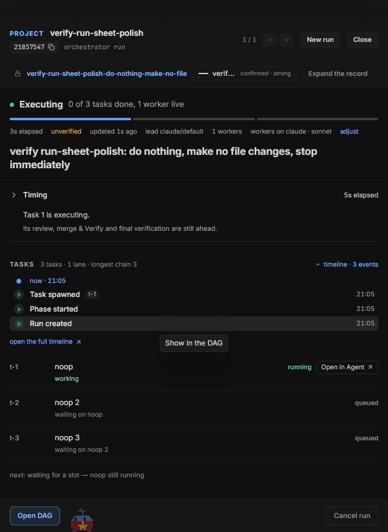
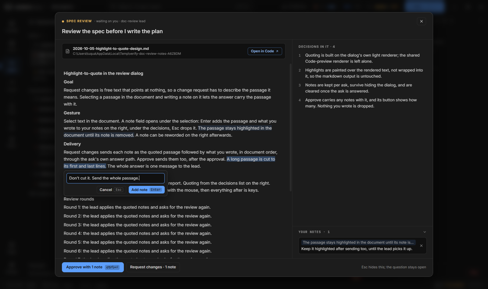

# Jarvis: brief, run và initiative

Jarvis là surface điều phối (`Ctrl+2`, `Ctrl+G` `j`): một **Brief** cho biết việc gì đang chờ bạn, run nào đang chạy hay vừa land, và các initiative lớn đang đi tới đâu. Từ đây bạn mở run sheet, trả lời câu hỏi của lead và worker, duyệt spec và plan, và đặt mặc định cho các run sau.

Các trang liên quan: [Orchestrator](orchestrator.md) (cách một run chạy), [Plan file](plan-format.md), [Cockpit](cockpit.md) (thẻ agent và dải **Needs you**), [Agent](agent.md) (terminal của lead và worker), [Phím tắt](../keyboard-shortcuts.md#jarvis).

<!-- shot: jarvis-brief.png | Brief của Jarvis với vùng Waiting on you, các hàng initiative có thanh chunk và cột bên cạnh (Since you looked, Shipped, Ideas) | Demo store, project acme-store; tạo một initiative bằng `wsh effort` và một run Quick đang chạy, rồi mở Jarvis -->

## Tour

Nút **?** trên header của Jarvis (cạnh **Profile**) mở bốn tour: **Brief**, **Initiatives**, **Run sheet** và
**Profile**. Mỗi bước làm sáng một chỗ trên màn hình kèm một thẻ giải thích, bằng tiếng Việt hoặc tiếng Anh (công tắc
**VI | EN** trên thẻ, được nhớ lại). `→` hoặc `Enter` sang bước kế, `←` về bước trước, `Esc` kết thúc. Tour tự mở
những gì bước cần (Profile, run sheet của run mới nhất) và đóng lại khi xong; bước nào không có gì để chỉ, như khi
chưa có run nào, hiện thẻ ở giữa màn hình. Lần đầu mở Jarvis, một thẻ nhỏ mời bạn xem tour Brief.

## Brief

Header của Brief có: chip **N waiting** hoặc **all clear**, ô lọc (`/`), chip autonomy (**All asks: to you**, **Routine asks: auto** hoặc **Mixed · K of N auto**; bấm để đổi mức), **Profile**, **?**, **New initiative** (`Shift+N`) và **New run** (`r`), nút nhấn mạnh duy nhất của surface, mở hộp khởi chạy run.

Dưới header, Brief có hai cột. Cột chính, từ trên xuống, mỗi vùng chỉ hiện khi có gì để hiện:

- **Waiting on you**: câu hỏi, cổng duyệt, task bị chặn, run cần accept. Dòng tóm tắt ở đầu vùng, rồi ba việc gấp nhất hiện sẵn, mỗi hàng có nút hành động ngay tại chỗ (**Approve**, **Answer**, **Open**, **Accept**); **+N more** (N là số việc còn ẩn) mở phần còn lại, **Show less** gập lại. Khi có hơn một run unverified, **Accept K unverified** ở đầu vùng nhận hết một lượt. Ẩn khi không có gì chờ (header ghi **all clear**). Huy hiệu trên nav rail đếm cùng các mục này.
- **Runs**: các run đang chạy, theo project (mỗi project có một channel). `Shift+J` / `Shift+K` chuyển giữa các run của channel.
- **Initiatives**: mỗi initiative là một hàng; xem [Initiatives](#initiatives).

Cột bên cạnh (340px) giữ phần đã qua:

- **Since you looked**: run bắt đầu, run xong, quyết định đã ghi và cập nhật record kể từ lần bạn nhìn gần nhất. **Mark seen** (hoàn tác được) làm vùng này gọn lại.
- **Shipped · 7 days**: những gì đã ship trong bảy ngày qua, hiện ba mục rồi `+N more`.
- **Ideas**: ý tưởng chưa có chunk. Gõ vào ô **Jot down an idea** rồi `Enter` để ghi nhanh một ý (`Esc` xóa ô); không cần form.

Brief hẹp hơn 1100px thì cột bên cạnh rớt xuống dưới cột chính. Khi **Runs** hay **Initiatives** trống, vùng đó hiện một khung nét đứt với một câu và nút bắt đầu (**New run**, **New initiative**).

Cuối tiêu đề mỗi vùng có nút biểu tượng nhỏ **Show only** (bấm lại: **Show every region**) để xem riêng vùng đó; tiêu đề chỉ là nhãn, bấm vào không làm gì. `/` lọc các hàng của Brief (`Esc` xóa lọc), `j` / `k` đi giữa các hàng, `Enter` mở hàng dưới con trỏ, `r` mở run mới, `e` mở rộng dải record; footer liệt kê các phím này khi bạn ở Jarvis. Ô composer nhắn cho lead / worker nằm trong run sheet đang mở, không ở Brief ([Run sheet](#run-sheet)).

## Initiatives

Việc lớn hơn một run sống thành initiative (effort): một danh sách chunk, mỗi chunk có trạng thái và chuỗi ghi chú. Agent tạo và cập nhật chúng bằng `wsh effort` (skill `effort-tracking` dạy agent cách dùng; xem [Tích hợp agent](agent-integration.md#skills-đi-kèm)).

- Mỗi initiative là một hàng: tên và project, thanh các chunk kèm `done/total`, ghi chú **Next** hoặc **Blocked on**, ô trạng thái (**● blocked**, **● agent open**, hoặc ngày hoạt động gần nhất), nút **Work on** / **Go to agent** và menu ⋯.
- Thứ tự cho biết nên làm gì trước: initiative có chunk bị chặn hoặc có blocker lên đầu, rồi đến những cái đang có agent mở, rồi theo hoạt động gần nhất; initiative tạm dừng xuống cuối. Brief hiện tám hàng rồi `+N more`; **Show K archived** hiện các initiative đã lưu trữ.
- Bấm một hàng (hoặc `Enter`) để mở initiative ngay tại chỗ, không nhảy đi đâu: các chunk theo stage hiện dưới hàng, mỗi chunk một dòng gồm trạng thái, nhãn (tối đa hai dòng), số ghi chú và chữ trạng thái. Bấm chữ trạng thái để đổi trạng thái chunk; **Add chunk** và **New stage** ở cuối. `Alt+↑` / `Alt+↓` đổi thứ tự chunk trong stage, `Enter` mở chunk.
- **Work on** (`w`) mở một agent mới làm initiative, hoặc nhảy tới agent đã mở trên nó (nút khi đó đọc **Go to agent**). Bắt đầu run từ đó thì run được gắn vào chunk lúc tạo.
- Menu của hàng (luôn hiện): **Rename**, **Edit details…**, **Link to…** (hoặc **Unlink from …**), **Pause** / **Resume**, **Archive**, **Delete**.
- Một ý tưởng (initiative chưa có chunk) mở ra với **Plan it** (một agent chia ý tưởng thành chunk) và **Add first chunk** (biến nó thành initiative).

### Chunk do agent đề xuất

Chunk một agent đề xuất bằng `wsh effort chunk add --proposed` (**Plan it** cũng đề xuất) có trạng thái `proposed`: nó **không tính** vào `done/total` hay thanh tiến độ cho tới khi bạn chấp nhận. Chunk chờ hiện ở ba chỗ:

- Hàng initiative ghi `N proposed` dưới ô trạng thái; hàng ý tưởng ở cột Ideas ghi cùng chữ đó.
- Mở initiative (hoặc ý tưởng) ra thì có nhóm **Proposed · N** với từng chunk và ba nút ✓ **Accept** (thành `pending`), ✎ **Rename** và ✕ **Drop**, cùng **Accept all** và **Drop all** cho cả nhóm. **Drop** ở Brief có vài giây để **Undo** trước khi chunk bị xóa thật. Một ý tưởng bị **Drop all** vẫn là ý tưởng.
- **Waiting on you** có một mục `plan` cho mỗi initiative còn chunk chờ (đọc `N proposed`, nút **Open**): nó mở agent đã đề xuất khi agent còn mở, không thì mở initiative. Hàng đó cũng hiện ở popup của Sprout (**Plan to review**) và đếm vào huy hiệu như các việc chờ khác.

Khi agent còn mở, bạn quyết định ngay trên rail của nó: [Agent → Plan to review](agent.md#plan-to-review-trên-rail).

### Initiative con

Một initiative có thể là **một phần của** initiative khác. **Link to…** trong menu ⋯ của hàng mở picker (không liệt kê chính nó và những gì nằm dưới nó); chọn một initiative thì hàng chuyển xuống dưới initiative đó. **Unlink from …** đưa nó về cấp trên cùng; cả hai đều có **Undo** trong toast. Server từ chối một liên kết làm initiative nằm dưới chính nó (`that would put the initiative under itself`).

- Initiative con nằm ngay dưới cha, thụt vào và có khuỷu nối lên cha; dòng phụ đọc `↳ Part of <cha>`. Hàng cha ghi `+N sub` sau tên.
- Mở hàng cha thì dưới nó có **Sub-initiatives** (tên, `done/total`, trạng thái) và **Ideas** liên kết với nó (kèm `N proposed` nếu có); bấm một dòng để mở hàng đó.
- Cha bị xóa thì các con của nó vẫn hiện, thành hàng cấp trên cùng.

### Review: cái gì đổi, cái gì nằm yên

Tiêu đề vùng **Initiatives** có nút **Review · N** khi có initiative cần nhìn lại (không có thì không hiện; review không gấp nên không đếm vào huy hiệu). Hai loại:

- **Changed**: đổi kể từ lần bạn đánh dấu **reviewed** nó (initiative chưa từng review thì tính từ lần "Since you looked"). Hàng của nó có chấm màu accent trước tên.
- **Idle**: đang `active`, không agent nào làm, và không đổi cũng không được review trong 14 ngày. Ô trạng thái của hàng đọc `idle 3w`.

`v` hoặc **Review · N** bắt đầu một lượt đi qua hàng đợi theo thứ tự: bị chặn, đang chờ bạn, đang có agent làm, changed, rồi idle. Mỗi lúc một initiative mở ra, các cái còn lại là một dòng kèm lý do (`blocked`, `asks you`, `at work`, `changed`, `idle`):

- Khối **Since you reviewed** liệt kê những gì xảy ra từ lần đánh dấu trước (chunk xong, chunk thêm, đổi trạng thái, ghi chú); một initiative idle ghi `nothing moved in N weeks and no agent is on it`.
- Nút: **Keep going** (đánh dấu rồi sang cái kế), **Go to agent** hoặc **Work on**, **Pause** / **Resume**, **Archive**, và **Mark reviewed** (`Enter`). Initiative idle xếp **Pause** và **Archive** lên đầu. **Pause** và **Archive** cũng đánh dấu cái đó là đã review.
- `j` / `k` (hoặc `←` / `→`) đi qua lượt mà không động tới con trỏ của danh sách; `Esc` hoặc **Exit review** rời đi. Hết hàng đợi thì đọc **All reviewed**. Lượt còn nguyên khi bạn sang surface khác rồi quay lại; dấu đã review thì được nhớ giữa các lần mở app.

Popup của Sprout có một dòng `N initiatives changed · M idle` với **Review in Jarvis**: bấm nó mở Jarvis ngay trong lượt review.

### Panel của chunk

Bấm một chunk (hoặc `Enter` trên nó) mở panel của chunk. Khi Brief rộng từ 1281px, panel thế chỗ cột bên cạnh và cột chính giữ nguyên bề rộng; hẹp hơn, panel nổi lên trên Brief. `Esc` đóng panel (một ghi chú đang mở thì `Esc` gập nó trước).

- **Header**: `n / tổng`, ↑ ↓ (`k` / `j`) đổi chunk, **Work on this chunk**, **Copy wsh command** (lệnh `wsh effort note …` đầy đủ nằm trong tooltip) và ✕.
- **Thân**: initiative (và stage, với plan chia stage) ở dòng nhỏ phía trên, nhãn chunk, dòng `N notes · last Oct 9 · Activity ↗`, hàng sáu trạng thái, rồi chuỗi ghi chú. Ô ghi chú ghi **Add a note…**; `Ctrl+Enter` thêm, `Esc` xóa. Một ghi chú gắn với run không còn đọc được hiện "The run's report is no longer available."
- **Work on this chunk** mở một agent chỉ làm chunk này: đọc ghi chú của nó, làm, ghi kết quả thành một ghi chú của chunk và đánh dấu xong. Khi đã có agent mở trên initiative, nút đọc **Go to agent** và chỉ nhảy tới agent đó.

Run và chunk nối với nhau thế nào, và ai đóng chunk khi run xong: [Orchestrator → Initiative qua nhiều run](orchestrator.md#initiative-qua-nhiều-run).

## Run sheet

Mở một run từ **Waiting on you**, **Runs**, **Shipped**, Conversation History, hoặc ngay sau **Start run**. Từ trên xuống:

- **Verb** và dòng phụ: Planning, Starting, Working, Final check, Wrapping up, Landing, Waiting on you, Blocked, Done, Cancelled. Một run Done mà land đang chờ đọc **Landing**, kể cả khi land đang xếp hàng sau land khác của project (dòng phụ: *#2 in line to merge wave/… into main*) hay khi một resolver đang merge base vào branch của run (*a resolver is merging main into wave/…*): cả hai tự land, không cần bạn; land bị giữ đọc **Waiting on you** kèm lý do.
- **Thanh tiến độ** (mỗi task một đoạn, rồi ba chấm cuối cho **Final check**, **Wrap-up** và **Land**: mọi task xanh mà ba chấm chưa xong thì run chưa xong) và các chip: thời gian đã trôi, worker-time, landed, answered, forwarded, unverified, **N needs you**.
- **Dòng cấu hình**: `engine · orchestrator · lead … · parallelism … · workers …` với **Adjust** để đổi độ rộng và route cho các dispatch sau.
- Dòng **started from** *tên session*, dưới goal, khi run do một session bắt đầu bằng `wsh runs start`: bấm để về session đó (terminal khi còn sống, transcript khi đã kết thúc).
- **Questions for you**, khi bạn đang giữ câu hỏi: câu hỏi đứng đầu phần thân của sheet, trên cả Tasks, để việc cần bạn không bị đẩy xuống dưới các số đo.
- **Tasks**: mỗi task một hàng với trạng thái và một hành động: **Open in Agent ↗** cho worker đang sống, **View child run** cho task đã xong, **Open DAG ↗** cho task kẹt ở merge. Sau đó là dòng `next:` nói run đang đợi gì.
- **▸ timeline**: mọi sự kiện của run, mới nhất trước; **open the full timeline ↗** mở nó trong DAG view. Khi run cần bạn, timeline là phần hữu ích nhất.
- **Timing** (run orchestrator): mỗi hoạt động một thanh (Planning, Execution, Task review, Merge & Verify, Final verification, Landing / wrap-up) trên trục tính từ lúc khởi chạy. Thu gọn khi run đang chạy, mở khi run đã xong. Các hoạt động chồng lên nhau nên cộng lại không bằng tổng.
- **Final check**: ảnh chụp của vòng final stage gần nhất, khi plan có lệnh Final (xem [Final check](#final-check)).
- **Dock**: **Open DAG**, **Open lead ↗** và **Open in Agent ↗** (hai nút liền nhau trong một nhóm **Open**), **Cancel run**. Dock có nhiều nhất một nút nhấn mạnh, là việc đầu tiên đưa run đi tiếp: **Land again**, **Resume**, hoặc **Open DAG** cho một merge bị giữ.
- **Composer** dưới dock, khi run đang sống: nhãn **Message the lead** (hoặc **the worker**) kèm phím `i`, nhắn thẳng vào terminal của lead hay worker. `i` vào ô, `Esc` rời ô, `Esc` lần hai đóng sheet.

`j` / `k` chuyển sang run kế / trước trong danh sách mà sheet đang đếm. Khi run xong, sheet thành mặt **Done**: báo cáo của lead hoặc **what landed** cùng bằng chứng đã niêm phong ([Orchestrator → Kết thúc run](orchestrator.md#kết-thúc-run)).

### Final check

Khi plan có lệnh **Final** chụp ảnh (như `final-verify.mjs` của repo này), dòng **Final check** của run sheet mở hộp xem ảnh: danh sách scenario bên trái, ảnh của scenario đang chọn, và các bước pass / fail / skip.

| Phím | Làm gì |
|---|---|
| `↑` / `↓` | Scenario trước / kế |
| `←` / `→` | Ảnh trước / kế của scenario |
| `z` | Vừa khung / kích thước thật |
| `s` | Hiện hoặc ẩn các bước |
| `Esc` | Đóng hộp xem; run sheet vẫn mở |

Khi hộp mở, đây là các phím duy nhất của cockpit: surface bên dưới không động. Ảnh đã bị xóa khỏi đĩa hiện **No longer on disk**.

## Trả lời câu hỏi của lead và worker

Lead và worker được dặn đưa mọi câu hỏi và phê duyệt qua công cụ hỏi của harness, nên chúng hiện ở **Waiting on you** (và trên Cockpit, popup của con vật Jarvis, palette scope **Needs you**) thay vì trôi qua trong terminal.

- **Chọn một lựa chọn**: bấm vào nó. Thẻ một câu hỏi, chọn một thì gửi ngay khi bấm. Câu hỏi của worker trong một task nhận phím `1`–`9` và `Enter` trên run sheet.
- **Trả lời bằng lời của bạn**: gõ trong terminal của agent trên surface Agent (picker của harness có lựa chọn tự gõ).
- **✕** bỏ qua câu hỏi.

Câu hỏi một worker không tự giải được thì lead xử lý trước; chỉ câu lead không nên quyết mới được **forward** cho bạn, kèm task nó thuộc về.

## Hộp Spec review và Plan review

**Spec review** của lead, và **Plan review** khi plan hỏng review hai vòng ([Orchestrator → Review plan](orchestrator.md#review-plan)), mở thành một hộp phủ lên surface bạn đang ở: tài liệu bên trái, các quyết định (hoặc phát hiện) cần bạn chấp nhận bên phải, và **Approve** (với plan là **Accept all and proceed**, `Ctrl+Enter`) hoặc **Request changes** ở đáy.

- **Request changes** nhận một ghi chú và gửi cho lead làm câu trả lời của bạn.
- **Trích dẫn**: bôi đen một đoạn trong tài liệu, ô ghi chú mở dưới đoạn đó (`Enter` thêm, `Esc` bỏ). Đoạn được tô sáng, các ghi chú gom dưới phần quyết định (bấm để mở lại, **✕** để xóa). Hai nút đổi thành **Approve with N notes** / **Request changes · N notes**, và lead nhận một câu trả lời: lời bạn hoặc nhãn approve, rồi từng đoạn trích trên dòng `> ` với ghi chú bên dưới, theo thứ tự tài liệu.
- Ở chỗ khác (thẻ lead trên Cockpit, Brief, run sheet) review hiện thành một dòng tóm tắt với nút **Review**. Trên surface Agent, hàng của lead có tag `review`, header có chip `Spec review` / `Plan review` màu hổ phách, và `r` mở hộp trên lead đang focus. Hộp tự mở một lần cho mỗi lần hỏi, khi bạn focus chính lead đó và không đang gõ trong terminal.
- `Esc` ẩn hộp mà vẫn để câu hỏi mở; hộp đóng hẳn khi lead nhận câu trả lời.

## Profile: mặc định của run và nguyên tắc

Nút **Profile — run defaults** trên Jarvis mở hai phần:

**Run defaults** (cách run mới được dựng). **Scope** là **Global** (mọi project kế thừa) hoặc **Project** (chỉ project này; trường nào để **Same as global** thì lấy giá trị toàn cục):

| Trường | Ý nghĩa |
|---|---|
| **Default shape** | **Quick** hoặc **Orchestrator** cho hộp New |
| **Lead route** | Harness và model của lead (và worker của phase) |
| **Worker route** | Nơi worker của engine chạy: **Same as lead**, một route, hoặc **Reviewer picks** |
| **Reviewer route** | Nơi chạy review từng task, review plan và final verify |
| **Parallel workers** | Số worker chạy cùng lúc (**Auto** để lead chọn) |
| **Runs land on** | **Own branch** (mặc định, `wave/<runId>`) hoặc **Project checkout** |

Thay đổi chưa lưu ghi **Unsaved changes · apply to future runs**; lưu bằng **Save profile** (hoặc **Save global profile**). Chỉ run khởi chạy sau đó dùng giá trị mới. Cờ của `wsh runs start` thắng profile, và `wsh runs route` in ra route mà run mới sẽ dùng cùng nguồn của từng cái. Cách các route quyết định model của từng task: [Orchestrator → Chọn route và model](orchestrator.md#chọn-route-và-model).

**Principles**: các nguyên tắc ngắn được đưa vào prompt của lead. Có danh sách toàn cục (**New principle…**) và phần **This project**, nơi bạn sửa riêng câu chữ của một nguyên tắc cho project (**Customized**), tắt nó (**Disabled for this project**), hoặc thêm nguyên tắc chỉ của project.

## Con vật Jarvis và popup việc chờ

Con vật pixel đi dọc footer trên mọi surface là cách nhìn nhanh Waiting on you: nét mặt và tư thế đổi theo tình hình, nhưng không hiện số. Nó mệt khi quota 5 giờ hoặc quota tuần sắp cạn, và nói một lần khi một cửa sổ vượt 85% và một lần khi hết hẳn; RAM đầy chỉ là một dòng trong popup, không làm nó mệt. Khi máy ngủ trong lúc agent đang chạy, lúc thức dậy nó nói máy đã ngủ bao lâu, từ mấy giờ đến mấy giờ và bao nhiêu agent bị dừng theo. Thỉnh thoảng (45 đến 90 phút một lần), khi không có gì chờ bạn, nó nói một câu danh ngôn về lập trình; tắt ở **Settings → Jarvis & Office → Jarvis quotes**. Nó tránh chỗ có toast, và khi bạn thả nó ra thì nó rơi về footer.

- Bấm vào nó, hoặc `Ctrl+G` `w`, mở **popup việc chờ**: duyệt cổng, retry task hỏng, accept kết quả unverified, land lại một run bị giữ (hoặc **Dismiss** nó), và trả lời câu hỏi của agent ngay tại chỗ. Câu hỏi một lựa chọn trả lời bằng `1`–`9`. Câu hỏi nhiều câu hoặc chọn nhiều có nút **Answer** (hoặc `Enter`) mở form trả lời dưới hàng, giống form trên thẻ Cockpit: `1`–`9` chọn, `←` / `→` chuyển câu, `Enter` gửi khi mọi câu đã có đáp án, `Esc` thu form. Doc review vẫn mở bằng **Open**.
- Bấm vào bong bóng **Needs you** (hoặc mở popup khi bong bóng đang hiện) thì con trỏ nằm sẵn trên câu hỏi đó, form của nó mở sẵn.
- **Peek**: `Space` trên một hàng, hoặc `Ctrl`+bấm một liên kết, mở run, agent, record hay initiative trong popup mà không đổi lựa chọn ở surface dưới. `Backspace` về màn đầu, `Enter` mở mục đó ở chỗ của nó.
- Nó "nói" khi một run land, khi có bản Claude Code mới (một lần), và khi một việc mới cần bạn.
- Trang phục đổi ở **Settings → Jarvis & Office**.

Phím đầy đủ của popup và peek: [Phím tắt](../keyboard-shortcuts.md).

## Xem thêm

- [Orchestrator](orchestrator.md) — run từ đầu tới lúc land, DAG view, khôi phục.
- [Cockpit](cockpit.md) — thẻ agent, dải Needs you, thông báo.
- [Tích hợp agent](agent-integration.md) — `wsh runs`, `wsh effort`, `wsh ask`.
