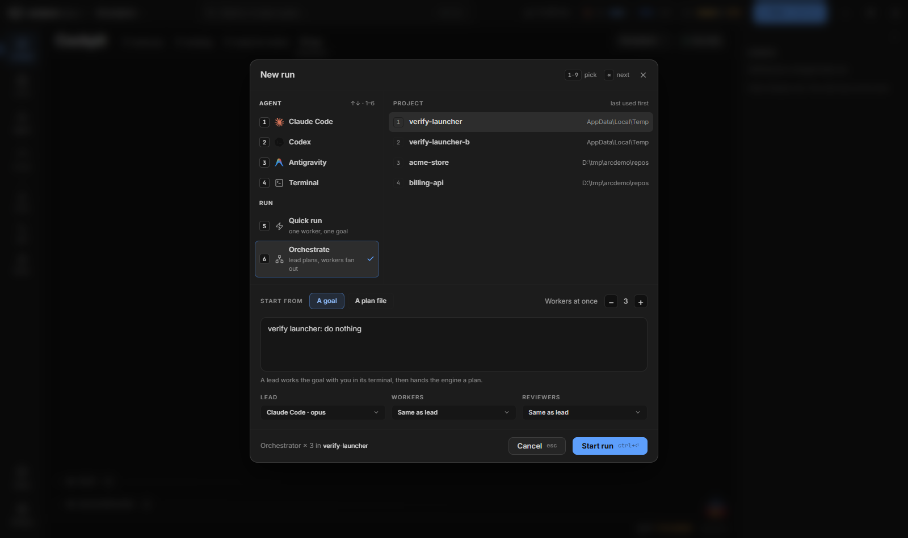
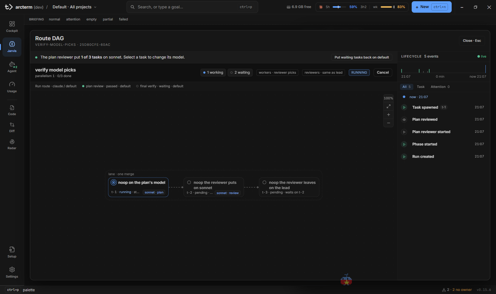
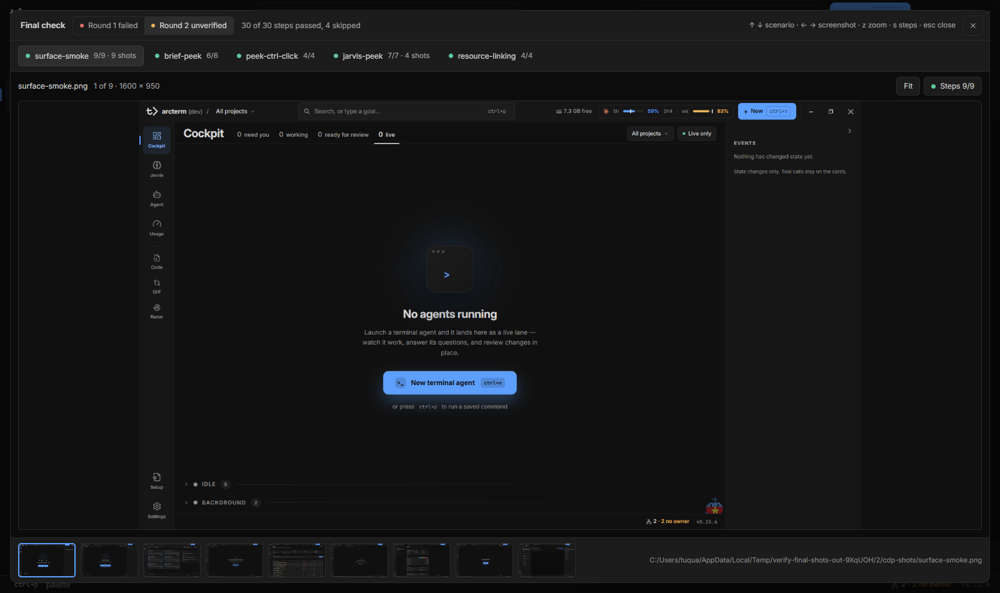

# Orchestrator: chạy và giám sát run

Trang này nói về việc **giao việc cho nhiều agent chạy song song** và theo dõi chúng cho tới khi kết quả nằm trong repo của bạn: bắt đầu một run (Quick, Orchestrate từ một goal, Orchestrate từ một plan file), cách engine chọn model, review plan, xem DAG, những lúc run cần bạn xét đoán, final stage, và run được merge về như thế nào.

Các trang liên quan: [Plan file](plan-format.md) (định dạng plan engine chạy), [Jarvis](jarvis.md) (run sheet, câu hỏi, các hộp review, initiative), [Cockpit](cockpit.md) (thẻ run trên Cockpit), [Agent](agent.md) (terminal của lead và worker), [Phím tắt](../keyboard-shortcuts.md).

## Chọn cách chạy

Mở hộp **New** bằng nút **+ New** ở app bar, hoặc trực tiếp ở dòng run bằng `Ctrl+Shift+R` (`Cmd+Shift+R` trên macOS; trên Jarvis còn có phím `r`). Chọn một trong ba:

| Bạn có | Chọn | Cái gì chạy |
|---|---|---|
| Một thay đổi nhỏ tả được trong một câu | **Quick run** | Một worker mới. Không lead, không plan. Nếu goal hóa ra lớn hơn, worker dừng lại và hỏi. |
| Một goal còn cần quyết định thiết kế | **Orchestrate → A goal** | Một lead brainstorm goal cùng bạn trong terminal của nó, rồi hoặc tự làm, hoặc giao cho engine một plan. |
| Một plan đã viết đúng [định dạng](plan-format.md) | **Orchestrate → A plan file** | Engine chạy plan ngay. Lead chỉ được mở khi có chuyện cần xét đoán. |

**Phân công.** Code làm phần cơ học: lập lịch, worktree, Setup, merge, Verify, các lệnh của final stage, retry, và merge run về lại. Các session reviewer mới (không dính vào lịch sử làm việc) xét plan, từng task và kết quả sau khi gộp. Lead chỉ xét những gì họ tìm ra: câu hỏi, lỗi, conflict, Verify hỏng, review hỏng, final stage hỏng. Bạn nhận phần lead không thể hoặc không nên tự quyết.

## Trước khi bắt đầu

### Đăng ký project

Cột **Project** của hộp New liệt kê các project đã đăng ký, không phải bất cứ thứ gì bạn từng nhắc tới. Mở bộ chọn project ở app bar, chọn **New project**, đặt tên và đường dẫn repo local rồi **Create project**. Command palette có mục "New project" mở cùng hộp đó. Hộp New khi chưa có project nào hiện nút **Register a project**.

### Run đáp xuống đâu

Mặc định một run orchestrator **đáp xuống branch riêng**:

- Lúc khởi chạy, engine tạo branch `wave/<runId>` trong một worktree ở `<project>/.waveterm/worktrees/<runId>`, và ghi lại branch mà checkout đang đứng làm **base** của run.
- Lead làm việc trong cây đó, các lane squash-merge vào đó, Verify chạy ở đó. Setup của plan chạy ở đó một lần khi plan được submit (hoặc `.arc/setup` của project nếu plan không có dòng Setup).
- Checkout của bạn **không nhúc nhích**, và index bẩn ở đó không chặn merge của run.
- Khi run hoàn tất, **engine tự merge branch về base** ([Land về base](#land-về-base)).
- Với repo arcterm có thêm một lý do: dev app phục vụ frontend từ checkout chính, nên merge rơi thẳng vào đó sẽ kích hoạt HMR giữa chừng.

Để đáp xuống chính checkout, đặt **Runs land on → Project checkout** trong profile (toàn cục hoặc theo project, mục [Profile](jarvis.md#profile-mặc-định-của-run-và-nguyên-tắc)), hoặc chạy `wsh runs start --landing checkout`. Cờ thắng profile; profile rỗng nghĩa là branch. Khi đó:

- các lane merge vào branch nào checkout đang đứng, đường merge từ chối index đã staged, và không có gì để merge về;
- bằng chứng của run chỉ đếm các commit mang trailer `Arc-Run: <runId>` (engine gắn cho lane, lead gắn cho commit của nó);
- run **không có base** (repo chưa có commit, hoặc thư mục không phải git) đáp xuống checkout dù bạn chọn gì;
- run bắt đầu trên **detached HEAD** vẫn có branch, nhưng không có branch nào để merge về nên bước land bị giữ.

Muốn run xuất phát từ và merge về một branch bạn đặt tên, tạo sẵn worktree cho branch đó và đăng ký **chính đường dẫn worktree ấy** làm project:

```bash
git worktree add -b backlog-cleanup .worktrees/backlog-cleanup main
cd .worktrees/backlog-cleanup && task worktree:prepare
```

**Dọn dẹp.** Run đã land thì engine tự xóa cây và xóa `wave/<runId>`. Run bị hủy hoặc bị giữ land thì cả hai **còn lại**. Trong repo arcterm xóa bằng `task worktree:cleanup -- .waveterm/worktrees/<runId>` (Setup đã junction `node_modules`, `src-tauri/target`, `dist/bin` vào cây, và `git worktree remove` thường có thể đi theo junction để xóa bản của checkout chính); lệnh này chỉ xóa branch đã merge, còn `git branch -D wave/<runId>` bỏ branch chưa merge. Repo nào Setup không tạo junction thì `git worktree remove .waveterm/worktrees/<runId>` rồi `git branch -D wave/<runId>` là đủ. Khi **hủy** một run, mỗi lane được lưu việc dang dở ra `<project>/.waveterm/recovery/<lane>.patch` trước khi cây của nó bị xóa.

### Biết bạn đang lái app nào

Bản đã cài và dev app giữ **store riêng**. Run bạn khởi chạy trong dev app, các effort và lệnh `wsh` của nó nằm trong store dev; `wsh` trong terminal của bản đã cài nói chuyện với store của bản đó. Terminal mà run tự mở (lead và mọi worker) có `wsh` gắn với app đã sinh ra nó, nên lệnh của run luôn tới đúng store.

### Chọn route và model

Một **route** là một harness cộng một model cụ thể; không có tier.

| Vai trò | Harness được phép |
|---|---|
| **Lead**, **Reviewers** (reviewer của task, plan reviewer, final verifier) | Claude Code, Pi |
| **Workers** | Claude Code, Pi, Antigravity (`agy`), Codex |

OpenCode chỉ để consult, không chạy được trong run. Codex chỉ làm worker của task: nó không làm lead, reviewer hay stage session. Bộ chọn route lọc theo harness (**All / Pi / Claude Code**), nhận cả model id gõ tay, và bộ chọn của lead/reviewer chỉ liệt kê harness có thể lead.

Worker Codex khác các worker còn lại ở ba điểm:

- **Hai cờ bypass.** Nó khởi động bằng `codex --dangerously-bypass-approvals-and-sandbox --dangerously-bypass-hook-trust` (thêm `--model <id>` nếu route có model), prompt đặt ngay sau, nên vẫn là một terminal sống để bạn xem và engine gõ vào. Cờ đầu vì worker không có người ở các prompt xin quyền (nó cũng bỏ qua màn hình "trust this folder" trong worktree mới). Cờ sau vì Codex chỉ chạy hook của người dùng khi bạn đã tin nó bằng `/hooks`; thiếu cờ này, worker không bao giờ báo session id và kẹt ở hạn token đầu tiên. Đổi lại, trong worker mọi hook đang bật trong `~/.codex/hooks.json` (cả của công cụ khác) chạy mà chưa được tin.
- **Hỏi bằng `wsh ask --wait`.** Codex không có tool hỏi mà cockpit thấy được, nên worker hỏi bằng lệnh shell `wsh ask --wait --questions-json '<json>'`: lệnh chặn cho tới khi lead hoặc bạn trả lời (tối đa 30 phút) rồi in câu trả lời dạng JSON. Câu hỏi đi qua cùng đường với câu hỏi của worker khác: lead trước, rồi tới bạn.
- **Lệnh nặng không xếp hàng.** Build hay test nặng của worker Codex không chờ trong [hàng đợi lệnh nặng](usage.md#hàng-đợi-lệnh-nặng); chỉ **Workers at once** giới hạn số build Codex chạy song song.

Một run orchestrator có ba route, chọn ở hộp New (**Lead**, **Workers**, **Reviewers**) và điền sẵn từ [profile](jarvis.md#profile-mặc-định-của-run-và-nguyên-tắc):

- **Lead**: brainstorm, viết spec và plan, và về sau xét các wake. Đây là model mà nếu xét sai thì chạy lại không cứu được.
- **Workers**, một trong ba:
  - **Same as lead** (mặc định): mọi task chạy trên route của lead.
  - **một route**: mọi task chạy trên route đó.
  - **Reviewer picks**: mỗi task chạy trên dòng `**Model:**` của plan nếu có (dòng này có thể nêu cả harness, như `codex:gpt-5.5`: xem [Plan file](plan-format.md#các-dòng-đầu-task)), nếu không thì trên model plan reviewer chọn cho nó, `sonnet` hoặc model của lead ([Model picks](#model-picks)). Reviewer picks và một route là **một** cài đặt, nên run không bao giờ có cả hai; server từ chối request gửi cả hai.
- **Reviewers**: nơi các session xét của engine chạy: reviewer từng task, plan reviewer, final verifier. Mặc định là route của lead. Chỉ bạn đặt (hộp New, profile, `wsh runs start`, hoặc **Adjust** trên run đang chạy); lead không có lệnh nào ghi nó.

Engine tìm route của từng task bằng một quy tắc (`effectiveTaskRoute`, `pkg/orchestrate/modelroute.go`), lấy nấc đầu tiên áp dụng được:

1. Route bạn đặt cho task (công tắc model trong rail chi tiết của DAG), hoặc một lần escalate.
2. Dòng Model của plan hoặc lựa chọn của reviewer, **chỉ khi** run ở Reviewer picks.
3. Route của workers, nếu run có.
4. Route của lead.

Nên với Same as lead hay một route, các dòng Model và lựa chọn của reviewer bị bỏ qua. Lựa chọn "lead" của reviewer không lưu ghim nào, nên rơi xuống nấc 3 hoặc 4.

Lead là **pi** thì cần gói `@juicesharp/rpiv-ask-user-question` (để câu hỏi của nó tới cockpit) và gói superpowers cài vào chính pi (lead lập kế hoạch bằng `brainstorming` và `writing-plans`).

`wsh runs route` in route lead, workers và reviewers mà một run mới sẽ dùng, kèm nguồn của từng cái; thêm cờ workers (`--worker-runtime claude --worker-model sonnet`, `--reviewer-picks`, hoặc `--same-as-lead`) để **lưu** mặc định cho project này (`--global`: mọi project). Lệnh này chỉ lưu mặc định workers, không lưu route reviewer.

### RAM và số worker

Chip bên trái các đồng hồ quota ở app bar hiện RAM trống của máy (`1.3 GB free`). Tooltip cho biết RAM trống trên tổng, kích thước một worker điển hình, kích thước job nặng nhất, đang chạy mấy worker và còn vừa mấy cái. Worker phần lớn thời gian nhỏ (rảnh hoặc đang hỏi ~330 MB, một lần chạy vitest ~0,9 GB) và chỉ phình ở job nặng (`tsc` ~3 GB chừng một phút), và nhiều worker hiếm khi cùng phình một lúc. Vì thế mỗi worker được tính theo cỡ điển hình (trung bình các lần đo của cây tiến trình, lấy trên các worker đang chạy và 10 worker vừa xong gần nhất; mặc định 1 GB cho tới khi đo được), và phần dôi của **một** job nặng (đỉnh cao nhất; mặc định 3 GB) được giữ lại một lần: `còn vừa = (trống − phần các worker đang chạy còn có thể phình − (nặng − điển hình)) ÷ điển hình`, làm tròn xuống.

Khi số **Workers at once** bạn chọn (trong hộp New, hoặc **Adjust** trên run đang chạy) thêm nhiều worker hơn mức đó, con số chuyển sang màu hổ phách kèm ⚠ mà tooltip nói còn vừa mấy cái. Nó chỉ cảnh báo; run vẫn chạy đúng như bạn chọn. Chip chuyển hổ phách kèm ⚠ chỉ khi RAM trống dưới 512 MB. Verify, Final và Setup nặng của run chờ đến lượt trong hàng đợi lệnh nặng cùng với lệnh nặng của các agent, xem [Usage → Hàng đợi lệnh nặng](usage.md#hàng-đợi-lệnh-nặng). Con vật Jarvis hiện vẻ mệt khi không còn vừa worker nào. Bấm chip mở panel **Consumers** ([Cockpit](cockpit.md#panel-consumers)).

## Bắt đầu một run

### Quick

1. Mở hộp New ở dòng run: `Ctrl+Shift+R`, hoặc **+ New** rồi phím số của **Quick run** ở cột **Start**.
2. `Tab` sang cột **Project**, chọn project (gõ để lọc, hoặc bấm số).
3. Viết **Goal**, chọn **Model** nếu cần, rồi **Start run** (`Ctrl+Enter`).

Sheet của run mở ra. Run Quick không có đồ thị task; transcript của worker chính là cả run, nên **Open in Agent ↗** là nơi bạn theo dõi nó. Worker được dặn: nếu goal hóa ra hơn một thay đổi hoặc cần quyết định thiết kế thì dừng lại hỏi thay vì cố làm; câu hỏi đó đến mục **Waiting on you** như mọi câu hỏi. Worker commit, viết báo cáo và gọi `wsh jarvis complete`; sheet chuyển sang **Done** với bằng chứng được niêm phong. Cài đặt của run Quick cố định vì không có scheduler để cấu hình lại.



### Orchestrate từ một goal

Cấu hình trong hộp New:

| Điều khiển | Quyết định gì |
|---|---|
| **Project** | Nơi lead làm việc và nơi các lane merge. |
| **Start → Orchestrate** | Một lead cộng engine. |
| **Start from → A goal** | "A lead works the goal with you in its terminal, then hands the engine a plan." |
| **Workers at once** | Số lane chạy cùng lúc, 1–8 (giá trị khởi đầu 3, hoặc độ rộng của profile). Chỉnh được trên run đang chạy. |
| **Lead** | Route của lead. |
| **Workers** | Cài đặt workers: Same as lead, **Reviewer picks**, hoặc một route. Đổi được trên run đang chạy cho các task chưa được dispatch. |
| **Reviewers** | Route reviewer (Same as lead nếu không đặt). |
| **Goal** | Thứ duy nhất lead xuất phát từ đó. |

Nút **Start run** bị khóa khi còn thiếu gì đó, và dòng ở chân hộp nói thiếu gì: `Pick a project`, `Write the goal`, `Give the plan's absolute path`, `Reading the plan…`, hoặc lỗi của parser. Khi hộp được mở kèm một Prototype (ví dụ từ một design canvas), một chip `Prototype · <đường dẫn>` hiện dưới các bộ chọn và có nút gỡ. Đóng hộp không mất gì bạn đã gõ: mở lại thì bản nháp được khôi phục (hộp ghi "draft restored" kèm nút **Clear**).

**Start run** tạo run và mở sheet của nó ở trạng thái **Planning** ("the lead is writing the plan"). Không gì được dispatch cho tới khi lead submit một plan.

1. **Open lead ↗** (nút ở dock của sheet) đưa bạn tới lead trên surface Agent. Lead chạy `superpowers:brainstorming` trên code thật trong cây của nó (branch của run, hoặc checkout).
2. Lead được dặn đưa **mọi câu hỏi và phê duyệt** qua công cụ hỏi, nên chúng hiện ở **Waiting on you** trên Jarvis (và trên Cockpit) thay vì trôi qua trong terminal. Trả lời như [Jarvis → Trả lời câu hỏi](jarvis.md#trả-lời-câu-hỏi-của-lead-và-worker) mô tả.
3. Khi lead đưa ra **Spec review** (và về sau, nếu cần, **Plan review**), hộp review mở ra: xem [Jarvis → Hộp review](jarvis.md#hộp-spec-review-và-plan-review).
4. Phản biện khi một lựa chọn dựa trên điều bạn biết là sai. Ví dụ trên một run dọn backlog, lựa chọn đầu của lead đề nghị xóa bốn RPC; câu trả lời "xóa, nhưng grep `scripts/` tìm chỗ gọi trước" giúp nó phát hiện `deletechannel` là bước dọn của các scenario CDP và quay lại với một phương án hẹp hơn.

**Lead chọn đường nào.** Skill brainstorming phân loại goal. Lead nêu đường nó đi rồi làm tiếp, chỉ hỏi về đường đi khi thật sự không rõ:

| Loại | Lead làm | Bạn thấy |
|---|---|---|
| **Spike** (một câu hỏi cần trả lời) | báo câu trả lời, `wsh jarvis complete` | Done, với câu trả lời là phần tóm tắt |
| **Bounded** (một thay đổi) | xin bạn một cái "yes", làm trong cây của nó, test, commit, `wsh jarvis complete --commit` | Done, kèm commit, đã merge về |
| **Architectural** (cần plan) | hỏi các quyết định cần thiết bằng câu hỏi có lựa chọn, viết thiết kế thẳng vào spec, xin **một** lần **Spec review** (đường dẫn spec ở dòng đầu của câu hỏi), viết plan bằng `superpowers:writing-plans`, chạy `wsh jarvis dag submit --plan <plan> --spec <spec>` rồi dừng | review plan, rồi sheet đầy task |

Spec review là phê duyệt duy nhất: lead không hỏi từng mục, và sau `dag submit` nó không xin bạn duyệt plan hay chọn chế độ thực thi, vì engine tự review plan. Goal nhắc tới một mockup/design canvas đã chốt thiết kế thì lead không viết spec: Spec review mang đường dẫn canvas ở dòng đầu, kèm mỗi quyết định ngoài mockup một dòng; plan ghi canvas ở dòng `**Prototype:**` và được submit không có `--spec`, plan reviewer đọc canvas như spec.

Task trong plan do lead viết mang quyết định thiết kế, các file nó sở hữu, interface mà task khác dựa vào, và tiêu chí chấp nhận kèm test, **không** mang mã triển khai. Một goal mà lead sẽ làm theo kiểu plan, mỗi task một subagent, là architectural chứ không phải bounded: engine chạy nó. Mọi session claude trong một block của arcterm (lead, worker, hay session bạn tự mở) dispatch **tối đa 10 subagent**; prompt của lead, quick và worker nói rõ trần này, và `wsh agent-hook` từ chối mỗi lần gọi Agent vượt trần trong hook PreToolUse, bảo agent tự làm nốt hoặc giao một plan cho engine (`wsh runs start --plan`). Hook đếm lệnh gọi của từng session trong `%TEMP%\arc-subagents\<session>.log`.

Khi plan review qua (hoặc bạn chấp nhận một plan nó không cho qua), engine đợi lead rảnh rồi gõ `/compact` giữ lại những gì bạn đã nói và bỏ mã nó đã đọc. Mỗi lần lead bị compact, các luật điều phối của nó (`wsh jarvis dag rules`) được nạp lại, để khi tỉnh lại nó vẫn biết mình là lead của một run.

Với run đáp xuống branch riêng, `dag submit` commit spec và plan lên `wave/<runId>` **trước** khi cắt lane nào (subject `docs: spec and plan for <title>`, bỏ " Implementation Plan" của mẫu plan; trailer `Arc-Run: <runId>`). Mọi lane xuất phát từ commit đó nên worker và reviewer đọc đúng bản chụp ấy trong cây của mình, không phải bản lead đang sửa, và tài liệu land cùng run. Submit lại với tài liệu đã sửa thì *amend* commit đó khi chưa lane nào cắt từ nó (sau một plan review hỏng), và commit mới khi đã có (plan của một fix round); nội dung y hệt thì không commit gì. Với run đáp xuống checkout, tài liệu chưa commit cho tới khi lane đầu tiên merge, và engine gộp cả hai vào commit squash của lane đó.

Lead thoát trước khi submit thì run **fail** với dòng **Lead exited** (xem [Khi lead chết](#khi-lead-chết)).

**Viết goal.** Goal là thứ duy nhất lead xuất phát từ đó. Một goal tốt nêu effort cần đọc, phạm vi và phần bị loại, nơi các sự kiện đã xác minh nằm, và các ràng buộc plan phải mang (lệnh Setup và Verify, task nào phải chung lane, "định vị theo symbol, không theo số dòng", đóng chunk trước `wsh jarvis complete`). Trả lời trước các quyết định ở đó tiết kiệm một vòng câu hỏi. Cẩn thận ràng buộc ép plan thành tuần tự: nếu goal bắt mọi task cập nhật cùng một hàng tracker trong cùng commit, mọi task sẽ cùng sửa một file và chỉ chạy được lần lượt. Giải pháp: các task code không đụng `docs/`, cộng một task cuối phụ thuộc vào tất cả để cập nhật các hàng. Một file mà mọi task đều phải sửa chính là thứ quyết định độ rộng của plan.

### Orchestrate từ một plan file

1. Mở hộp New, chọn **Orchestrate**, bấm **A plan file**.
2. Dán đường dẫn plan (tuyệt đối, hoặc tương đối với project). Hộp parse khi bạn gõ và **không cho bắt đầu** cho tới khi parse được; lỗi hiện bằng chữ đỏ thay cho bảng task. Preview hiện `N tasks · M lanes · longest chain K`, cảnh báo **serial** / **unverified**, và bảng task với cột model ([Plan file → Kiểm tra trước khi chạy](plan-format.md#kiểm-tra-trước-khi-chạy)). Đường kiểm tra nhanh nhất rằng các dòng `Depends on` nói đúng điều bạn muốn là dòng `N tasks · M lanes` này.
3. **Start run** gửi plan ngay. Không có bước duyệt của bạn và không có lead; plan reviewer của engine đọc plan trước ([Review plan](#review-plan)) và lớp đầu tiên được dispatch khi nó qua. Hộp không truyền spec riêng: dòng `**Spec:**` của plan nêu nó. Với run branch, engine commit plan và spec lên `wave/<runId>` lúc submit; với run checkout, gộp vào commit squash đầu tiên. Plan không có dòng Spec chạy không spec.

Từ dòng lệnh: `wsh runs start --plan <plan.md>` (xem [CLI](#cli)).

Engine mở một lead **chỉ ở sự kiện cần xét đoán đầu tiên**, với luật điều phối làm prompt và sự kiện làm dòng đầu. Một plan land xong và kết thúc final stage ở trạng thái *passed* hoặc *unverified*, không có gì để quyết, thì không bao giờ có lead: engine tự đóng run, niêm phong bằng chứng và merge nó về. Nếu Setup của plan hỏng trong cây của run lúc submit, lead cũng được mở (với lỗi Setup trong tay) thay vì từ chối plan; plan hỏng lúc parse thì hộp New đã chặn từ trước và không run nào được tạo.

Dùng palette: gõ một goal vào ô **Search, or type a goal…** (`Ctrl+P`); chữ không khớp gì được coi là goal, và **Quick** hay **Orchestrate** mở hộp New ở dòng run với goal đã điền sẵn và project vừa dùng được chọn sẵn, để bạn xác nhận project trước khi chạy gì cả. Một run mà một session bắt đầu bằng `wsh runs start` mang link về session đó: `↰ <session>` trên header của lead (hay của agent run Quick) và dòng **started from** trên run sheet; header của session có link `↳` tới các run nó đã bắt đầu.

## Review plan

Cả hai flow đều submit một plan file và **engine review plan trước khi worker nào chạy**. Trạng thái dag là `plan-review`, và scheduler không dispatch gì cho tới khi review qua hoặc lead chấp nhận nó. Dag submit không qua file (JSON) và một fix round bỏ qua bước này.

Engine mở một session **plan reviewer** mới trong cây nơi lane đáp xuống, trên route reviewer. Nó đọc spec (hoặc, không có spec, canvas Prototype của plan), plan và các file chúng nêu, rồi kiểm:

- mọi yêu cầu trong spec có một task;
- không hai task sửa cùng file mà thiếu `Depends` giữa chúng (submit đã chặn các cặp cùng liệt kê `Files`, nên reviewer tìm task không có dòng `Files` hoặc file bị bỏ sót);
- kiểu, hàm, cờ có cùng tên trong mọi task nhắc tới chúng;
- mỗi task nêu tiêu chí chấp nhận và các test chứng minh chúng;
- các lệnh plan nêu (Verify, Setup, Check, Final) tồn tại;
- mỗi task thêm hoặc đổi một view, một trạng thái hiển thị hay một tương tác nêu **bước của scenario Final** cho thấy nó (một scenario chỉ mở surface thì không tính); có Prototype thì mỗi board `.dc.html` trong thư mục canvas cần một bước.

Nó cũng báo các lỗ hổng trong spec và chỗ spec với plan mâu thuẫn nhau. Nó chỉ đọc, và kết thúc bằng `wsh jarvis dag planreview pass "<tóm tắt>"` hoặc `wsh jarvis dag planreview fail "<phát hiện>"`. Reviewer kết thúc không có kết luận, hoặc chạy quá 20 phút, được thay **một lần**; mất hai lần thì review hỏng kèm lý do, và cùng plan đó có thể submit lại.

- **Pass:** worker bắt đầu, lead nhận một dòng yên lặng `plan review passed; workers are starting: …`.
- **Fail:** lead được đánh thức với các phát hiện. Nó sửa plan, đưa thay đổi spec cho bạn quyết, rồi chạy lại `wsh jarvis dag submit`. Khi chưa task nào được dispatch, lần submit lại thay thế plan hỏng và mở **vòng review 2**. Run bắt đầu từ plan file mà chưa có lead thì được mở một lead bởi lần đánh thức này.
- **Vòng 2 cũng hỏng** (tối đa hai vòng): lead bắt buộc đưa cho bạn một câu hỏi **Plan review**: đường dẫn plan và mỗi phát hiện một dòng, mở thành [hộp review](jarvis.md#hộp-spec-review-và-plan-review). Nếu bạn nói cứ tiếp tục, nó đưa từng phát hiện đã chấp nhận vào các task chờ bị ảnh hưởng bằng `dag amend` (mọi task vẫn đang chờ), rồi chạy `wsh jarvis dag planreview accept "<lý do của bạn>"`, và việc dispatch bắt đầu trên plan như hiện có. `accept` chỉ dùng được khi review đang ở trạng thái hỏng.

Lần submit lại của lead thay plan, **không** thay cài đặt của bạn: cài đặt workers và route reviewer vẫn giữ, kể cả thay đổi bạn làm trong run sheet trước đó. Dòng Check hoặc Setup mới trong plan sửa đặt lại bước kiểm Check nền.

### Model picks

Khi cài đặt workers của run là **Reviewer picks**, plan reviewer còn chọn model cho mọi task mà plan không cho dòng Model. Brief của nó liệt kê các task đó và quy tắc: `sonnet` chỉ cho task cơ học và được tả kỹ (sao một mẫu có sẵn, thêm một trường, văn xuôi theo code đã viết), `lead` cho mọi thứ có lựa chọn thiết kế, kèm một dòng lý do. Lệnh pass mang một `--pick` cho mỗi task được liệt kê:

```bash
wsh jarvis dag planreview pass "<tóm tắt>" --pick "t-2=sonnet: sao lại mẫu hàng có sẵn" --pick "t-3=lead: chọn luật ưu tiên"
```

Dạng là `t-N=<sonnet|lead>: <lý do>`. `wsh` từ chối mọi dạng khác trước khi gửi (`Task 2=sonnet`, `t-2 sonnet`, thiếu lý do). Server từ chối lần pass và nêu tên task khi: thiếu pick, pick cho task đã có dòng Model, task lạ hoặc lặp, lý do rỗng, nhiều dòng hay quá 200 ký tự, hoặc pick `sonnet` khi harness claude không chạy được worker ở đây (nó bảo hãy pick `lead`). Reviewer khi đó gửi lại. Run không ở Reviewer picks từ chối mọi pick; `accept` không nhận `--pick`.

Một lần fail cũng mang pick theo cách đó và được để sót task (các task ấy ở trên route lead). Pick được áp dụng cho các task đang bị giữ ngay trong cùng một lần ghi với kết luận, nên không worker nào bắt đầu mà thiếu pick của nó. `sonnet` đặt task lên Claude Code · `sonnet`; `lead` để nó trên route của lead. Task review không pick cho (task một lần fail bỏ sót, task của fix round) chạy trên route của lead trừ khi có dòng Model.

**Nơi thấy pick.**

- Timeline của run liệt kê chúng dưới dòng **Plan reviewed**, mỗi dòng `t-N · <model> · <lý do>`.
- Thẻ task có model khác với model workers của run mang tag `<model> · plan`, `· review`, `· you`, `· escalated` hoặc `· pinned`; rail chi tiết của DAG nói nguồn model của worker (`plan's pick`, `reviewer's pick`, `your pick`, `escalated`, `pinned`, `workers route`, `same as lead`).
- Header đồ thị có chip cài đặt workers và route reviewer; đồ thị còn có dòng giai đoạn như `plan review · passed · <model>`.

**Đổi pick.** Khi còn task nào reviewer đưa lên `sonnet` (hoặc bạn đã đổi) chưa bắt đầu, DAG view hiện dải trên đồ thị: "The plan reviewer put N of M tasks on sonnet. Select a task to change its model." cùng nút **Put waiting tasks back on <model lead>** đưa mọi task đang chờ về route lead cùng lúc. Chọn một task rồi dùng công tắc **model** (`sonnet | <lead>`) trong rail chi tiết của nó: kèm lý do của reviewer (`Plan reviewer: …`) và `waiting` hoặc `you changed it`. Task chỉ đổi được **tới trước khi nó bắt đầu**; sau đó rail ghi `running on <model>` và "A task that already started keeps its model. If it fails, retry it on <lead> from here." Thay đổi của bạn thắng plan và reviewer (nấc 1 ở [Chọn route và model](#chọn-route-và-model)), lý do của reviewer vẫn hiện. Dải biến mất khi không còn task nào được liệt kê đang chờ; thẻ và rail vẫn giữ nguồn.


## Theo dõi run đang chạy

### Run sheet

Mở một run từ **Waiting on you**, **Runs** hoặc **Shipped** trên [Jarvis](jarvis.md), từ Conversation History, hoặc ngay sau **Start run**. Sheet có: verb và dòng phụ (Planning, Starting, Executing, Waiting on you, Landing, Blocked, Done, Cancelled), thanh tiến độ mỗi task một đoạn, các chip meta (đã trôi qua, worker-time, landed, answered, forwarded, unverified, attention), mục **Timing**, **Questions for you**, danh sách **tasks** với trạng thái và nút hành động, dòng `next:`, **timeline**, và dock (**Open DAG**, **Open lead ↗**, **Cancel run**…). Chi tiết từng phần ở [Jarvis → Run sheet](jarvis.md#run-sheet).

### DAG view

**Open DAG** (ở dock của sheet) mở hộp **Route DAG**, phủ lên surface đang mở; `Esc` hoặc **Close · Esc** đóng nó.

- **Header** của đồ thị: tiêu đề plan, `parallelism N · done/total done` (kèm token đã dùng), các chip tóm tắt (**need you**, **working**, **done**, **waiting**, **skipped** có số đếm; bấm một chip để nhảy qua các task thuộc nhóm đó), chip route workers và reviewers, một pill trạng thái dag (`running`, `plan review`, `finalizing`, `blocked`, `done`, `cancelled`) và nút **Cancel**. Cancel ở đây hủy dag **ngay**, không hỏi lại.
- **Đồ thị**: mỗi task là một node, các cạnh là `Depends on`, và một dải nét đứt bao các task cùng lane (các task sẽ merge như một). Rê chuột lên node hiện peek: tiêu đề đầy đủ, đoạn đầu của mô tả (hoặc các file nó chạm), nó đang chờ gì, hoạt động mới nhất, và vì sao nó hỏng. Kéo node để dời (vị trí được nhớ cho run đó tới khi **Reset layout**), kéo nền để cuộn.
- **Rail chi tiết** ngay dưới đồ thị, cho task đang chọn: id, trạng thái, route worker, dòng review, token, nút **Description**, công tắc model, trạng thái worker (dòng trạng thái và **Open in Agent ↗**, hoặc "Worker session unavailable" với **View child run**), và các nút hành động. Nút chỉ hiện khi node cần một quyết định:

  | Nút | Hiện khi | Làm gì |
  |---|---|---|
  | `retry` / `skip` | task `failed` hoặc `stalled`; cũng ở `review-failed` | chạy lại / bỏ qua task |
  | `approve` / `sendback` | task `review-failed` | chấp nhận commit như hiện có / cho thêm một vòng kèm hướng dẫn |
  | `escalate…` | task `failed`, `stalled` hoặc `review-failed` chưa escalate | mở bộ chọn route, rồi **Re-queue on model**; một bước mỗi task |
  | `resolve` | task `blocked-merge` hoặc `verify-failed` | `dag merge --continue` sau khi bạn sửa cây |
  | `merge` | cuối lane mà engine không tự merge | squash-merge lane đó |

- **Rail Lifecycle** (bên phải khi cửa sổ đủ rộng, thành ngăn kéo khi hẹp): mọi sự kiện của run, mới nhất ở trên, nhóm theo đợt, có bộ lọc **All / Task / Attention** (Task lọc theo task đang chọn). Chọn một dòng thì đồ thị nhảy tới task của nó. Dòng **Lead wake failed** có nút **Relaunch lead**.
- Phím: `j`/`k` task kế/trước theo thứ tự plan; `←`/`→` đi theo cạnh tới dependency/dependent gần nhất; `↑`/`↓` task kế trong cùng cột; `Enter` (hoặc nhấp đúp) mở worker của task ở surface Agent, hoặc child run khi session đã hết; `f` vừa khung; `+`/`-` zoom; `Esc` bỏ chọn, rồi đóng đồ thị.



### Cockpit và surface Agent

Trên **Cockpit**, một run là **một** thẻ ở vị trí của lead ([Cockpit → Thẻ run](cockpit.md#thẻ-run)); worker là các dòng task trong thẻ, câu hỏi của worker trả lời ngay ở dòng đó. Thẻ có **Adjust** (chỉ chỉnh số worker chạy cùng lúc), **Cancel run** và, khi lead không nhận wake, banner **Lead wake failed** với **Relaunch lead**. Các hàng task có nút **Retry**, **Skip**, **Take over**, **Tell**, **Continue** tùy trạng thái. Một lead đứng chờ ở prompt hiện `standing by` (kèm số lane engine đang chạy); dấu Workflow của nó giữ màu nhấn không nhấp nháy khi còn worker, reviewer hay Verify đang làm việc, và chỉ mờ đi khi không còn gì.

Trên **Agent**, cây nhóm agent theo project và lồng worker của một run dưới lead ("◆ tên"), kèm chip số worker đang chạy hoặc "N done". Worker xong được gập dưới **✓ N done**; mở một cái ra thấy transcript chỉ-đọc ("Session ended · landed `<sha>` · read-only transcript"), mở đầu bằng hợp đồng worker được giao. Hàng worker đọc `t-4 · <tiêu đề>` kèm lane và trạng thái; header của nó có liên kết về lead (**↑ lead**). Rail chi tiết (`d`) có mục **Run** cho lead (tiến độ, lane, sức khỏe, vài dòng timeline cuối, câu hỏi đang giữ) và mục **Task** cho worker (**plan · Task N ↗**, Lead, Lane, Depends on, Result).

Một lần land không đánh thức lead. Mỗi task qua review xếp một dòng (`t-4 passed review: …`) đi kèm lần đánh thức kế tiếp của lead, và lần đánh thức khi run xong mang phần còn lại, để lead biết điều gì đã land mà không cần một lượt cho mỗi task.

## Merge và Verify

Engine biến task thành **lane**: một chuỗi mà mỗi task có đúng một dependency và là dependent duy nhất của nó dùng chung một worktree và một branch; mỗi task một worker mới commit chồng lên task trước, và cả lane land bằng một squash merge. Commit squash mang thông điệp commit của các worker (cũ nhất trước, bỏ các dòng co-author), tiêu đề các task đứng thay chỉ khi thông điệp rỗng; với lane từ hai task, subject là các tiêu đề task nối lại (cắt ở 72 ký tự). Nó mang trailer `Arc-Run: <run>-<task đầu>` và một `Arc-Task: t-N` cho mỗi task đã land. Task độc lập, và task sau một chỗ rẽ nhánh hay hội tụ, mở lane riêng; **lane là thứ tính vào độ rộng**.

Task có dependency ở lane khác bắt đầu khi lane đó đã merge, còn Verify của lần merge thì vẫn chạy; Verify hỏng giữ lần merge kế, không giữ lúc bắt đầu của một dependent. Khi hết chỗ trống, engine nhường chỗ cho task sẵn sàng có chuỗi task chờ phía sau dài nhất (rồi theo id), để một chuỗi không xếp hàng sau những task chẳng ai chờ.

`dag status` báo một khúc chạy chậm là `dependency-wait` (kèm task mà mỗi task đang chờ cần; rail Run của agent đọc "… waiting on …"), còn `parallelism-wait` ("waiting for a slot") nghĩa là mọi chỗ đã bận. Muốn rút ngắn khúc đuôi thì cắt bớt `Depends on` trong plan; tăng độ rộng không giúp.

**Merge theo đợt.** Khi không gì giữ hàng đợi merge, mọi lane sẵn sàng merge, mỗi cái một commit squash, và **một** Verify xét cả đợt, phạm vi từ commit cũ nhất của đợt tới `HEAD` (đó là nội dung `ARC_VERIFY_CHANGED`). Lane có dependency vừa merge trong cùng đợt phải chờ đợt sau. Một conflict **kết thúc** đợt, và không Verify nào chạy khi cây đang giữa chừng merge: các lane đã merge trước nó được verify cùng lane conflict sau khi lead chạy `--continue`. Git từ chối merge (không phải conflict) được thử lại 3 lần trước khi task bị chặn.

Nếu Verify của một đợt từ **hai lane trở lên** hỏng, engine **bisect**: nó verify các tiền tố của đợt trong một cây tách rời `<project>/.waveterm/worktrees/<run>-bisect` (dựng bằng Setup của plan) cho tới khi tìm lane đầu tiên làm merge hỏng. Các lane trước nó land. Lane đó là `verify-failed` và lead được đánh thức ("… bisected from t-1, t-4, t-6"). Các lane sau nó ở lại `verifying`, hiện "held", và Verify sau lúc lead sửa và chạy `dag merge <task> --continue` xét chúng cùng nhau. Một lane đơn lẻ không bao giờ bị bisect, đợt sau một commit sửa cũng không (tiền tố không có bản sửa sẽ lại đổ lỗi cho lane cũ): lane cũ nhất nhận lỗi. Bisect không chạy được (cây hoặc Setup của nó hỏng) thì đổ lỗi cho lane cũ nhất chưa biết là tốt, nên không bao giờ land lane mà không Verify nào qua.

### Merge cuối bỏ Verify của nó

Khi một lần merge không còn gì để chạy, review hay merge, final stage chạy ngay sau đó toàn bộ Verify trên đúng cây ấy, nên lần merge không chạy Verify riêng. Task chuyển thẳng sang `done`, dòng **Task merged** ghi "Verify left to the final stage" (`"verify": "final"`); không có dòng **Verify started** hay **Verify passed** cho nó. Lỗi khi đó hiện thành final stage hỏng ("Verify … failed on the merged result"), chặn run và đánh thức lead cho một fix round như mọi lỗi Verify cuối; không bisect và không nêu lane nào. Mọi merge khác verify như thường: còn task nào đó đang chờ, chạy, review, ở cổng hay chờ merge; merge là một trong đợt từ hai lane (cả đợt cuối của plan, để vẫn bisect được); plan không có dòng Verify; hoặc merge của một fix round (mọi merge của fix round chạy Verify, kể cả cái cuối). Một final stage kết thúc trước khi Verify chạy (không dựng được cây, Check hỏng, hoặc bạn tự kết thúc) để lần merge đó không có Verify nào: lý do của stage nói điều ấy, và các chunk của merge ở lại mở cho tới khi Verify của một vòng sau qua.

## Khi run cần bạn xét đoán

Engine đánh thức lead bằng cách gõ vào terminal của nó một dòng tự đủ nghĩa, ví dụ `wake: Verify failed after merging task t-1 (exit 1). wsh jarvis dag status`. Lead đang bận, hoặc đang giữ một câu hỏi mở, thì giữ các wake và nhận chúng gộp thành một tin khi nó trở lại prompt; lead mà mod giữ một luồng điều khiển nhận wake qua luồng thay vì gõ. Một wake đọc hành động trước, rồi các câu hỏi, rồi `Unverified:` (những gì các lần review đã qua không kiểm chứng được), và phần tóm tắt cuối cùng dưới `Since your last wake:`. Wake **không** biến lead sang trạng thái làm việc trong 30 giây thì được thử lại một lần; sau đó lead coi như đã chết và các sự kiện của nó đến tay bạn. Lead chết thì lại được đánh dấu sống khi nó báo đang làm việc trở lại (dòng **Lead taking wakes again**).

| Sự kiện | Lead làm | Đến tay bạn |
|---|---|---|
| **Plan review hỏng** | sửa plan, `dag submit` lại; sau vòng 2 hỏi bạn, rồi theo lời bạn `dag amend` rồi `dag planreview accept` | thay đổi spec, và lần review hỏng thứ hai |
| **Plan reviewer không xong** (mất hai session) | như một lần fail | như trên |
| **Merge conflict** ở một lần merge lane | sửa trong cây nơi lane đáp xuống, commit, `wsh jarvis dag merge <task> --continue` | không gì, trừ khi lead chuyển lên hoặc đã chết |
| **Git từ chối merge** (không phải conflict: file untracked chặn đường, khóa, index bẩn) | xử lý theo lý do git nêu | như trên |
| **Verify hỏng** sau merge | sửa, commit, `dag merge <task> --continue` (chạy lại Verify tại HEAD) | như trên |
| **Review hỏng** hai lần, hoặc reviewer không làm được việc | đọc phát hiện trong `dag status`; `dag sendback <task> "<hướng dẫn>"`, `dag approve <task>`, retry, escalate, skip hoặc forward | các lần review hỏng được chuyển lên |
| **Task qua review kèm ghi chú cho task sau** mà engine không chuyển được (không còn task chưa xong nào theo sau, hoặc task được nêu đã xong hay không còn terminal sống) | `dag amend` các task chờ bị ảnh hưởng, hoặc `dag tell` một task đang chạy | không gì |
| **Câu hỏi của worker** | trả lời từ spec, plan và code, hoặc chuyển một quyết định sản phẩm kèm ghi chú | câu hỏi được chuyển và mọi câu lead không trả lời trong **10 phút** |
| **Task fail** hết lượt retry | `dag retry`, `dag escalate --model`, `dag skip`, hoặc chuyển lên | lỗi được chuyển |
| **Worker treo** | như một lần fail | như vậy |
| **Worker có thể đang kẹt** | `dag tell`, `dag retry`, `dag escalate`, hoặc để nó chạy | như vậy |
| **Worker không bao giờ bắt đầu** | `dag retry` | như vậy |
| **Final stage hỏng** | viết fix plan và chạy `dag submit --round --plan <fix plan>` | vòng cuối hỏng, hoặc một quyết định sản phẩm |
| **Run xong** | sửa và commit những gì các task đã land để lại, viết báo cáo chỉ-xét-đoán ra file, rồi tự `wsh jarvis complete --report <file>` | câu hỏi chỉ khi cần quyết định, rồi mặt Done |

Chi tiết các sự kiện "worker":

- **Treo**: im lặng 15 phút (tính từ lần mới nhất trong ghi transcript, mẫu CPU bận, hay câu hỏi chờ), tiến trình còn sống, không có câu hỏi nào đang chờ. Có hai biến thể: worker thoát mà không báo xong (tiến trình biến mất, báo ngay), và worker kết thúc lượt mà không hoàn tất rồi đứng rảnh 3 phút sau hook Stop (engine **không** tự retry biến thể này).
- **Có thể đang kẹt**: cây làm việc không đổi 20 phút trong khi worker vẫn "hoạt động" (ghi transcript hoặc CPU bận trong 5 phút qua), hoặc cùng một lệnh thất bại cùng một kiểu 3 lần. Engine kiểm mỗi phút và không tự làm gì; lead quyết.
- **Không bao giờ bắt đầu**: shell của terminal worker không lên nổi sau 5 phút kể từ lúc spawn (pi, agy và codex còn bị canh bằng "chưa có transcript nào").

`dag status` hiện worker không ghi gì gần đây là `idle Nm`, hoặc `running a command Nm · <tool>` khi tiến trình của nó đang bận (một lần test dài không ghi transcript); worker bị cờ đọc `stuck? <lý do>`. Mỗi task xong có một dòng báo cáo nêu các mục không rỗng và lệnh kéo, ví dụ `t-3 report: differs, not verified, found not fixed (wsh jarvis dag report t-3)`; báo cáo đời cũ đọc `t-3 report: unstructured (…)`.

### Review của một task

Test không phải kiểm tra duy nhất. Worker kết thúc bằng cách commit, viết **báo cáo** vào một file do engine đặt tên nằm ngoài mọi worktree (`<temp>/arc-reports/<dag>/<task>.md`), rồi chạy `wsh jarvis complete --commit $(git rev-parse HEAD) --report <file>`. Báo cáo gồm năm mục theo thứ tự: `## Done`, `## Differs from plan`, `## Not verified`, `## For later tasks`, `## Found not fixed`, mỗi mục là `None` khi trống và không có gì trước tiêu đề đầu. Server từ chối `complete` của worker task không có `--report` hoặc có báo cáo không parse được, và in mẫu trong lời từ chối; lead, spike, reviewer và verifier cuối không bị yêu cầu. Mỗi mục đến đúng người cần nó: lần đánh thức khi review qua mang Differs from plan, Not verified và Found not fixed (và For later tasks chỉ khi không còn task chưa xong nào theo sau), task sau nhận For later tasks theo cạnh plan, và final stage liệt kê Not verified của mỗi task đã land. Một mục dài hơn 2500 ký tự bị cắt ở ranh giới dòng và kết thúc `… <N> more characters: wsh jarvis dag report <task> <section>`; lệnh đó (section: `done`, `differs`, `not-verified`, `for-later`, `found-not-fixed`) đọc phần còn lại. Khi lead niêm phong, engine ghi các mục, số đếm, các tin đã nhắn và các worktree bị bỏ lại; `wsh runs show` và sidebar của run hiển thị bản ghi đó.

Khi worker xong có commit, task sang **reviewing** và engine mở một **reviewer** trong worktree lane của task, trên route reviewer. Reviewer đọc task, spec, toàn bộ báo cáo của worker và `git diff` của các commit của task. Nó kiểm thay đổi với điều task yêu cầu (thiếu yêu cầu, mâu thuẫn spec, làm tắt, đổi ngoài task), và kết thúc bằng một lệnh:

- `wsh jarvis dag review pass "<tóm tắt>"`: task land. Reviewer kiểm mục For later tasks của worker thay vì chuyển tiếp nó. `--downstream "<ghi chú>"` tới các hậu duệ chưa xong của task (cộng `--for t-3,t-5` nếu có): engine thêm vào prompt của task chưa bắt đầu và gõ vào terminal của task đang chạy, lead đọc nó đã đi đâu ở lần đánh thức tiếp theo; nó chỉ đánh thức lead khi không còn task chưa xong nào theo sau. `--for` đứng một mình chuyển For later tasks của worker tới các task được nêu và bị từ chối khi mục đó là None hoặc báo cáo đời cũ. `--unverified "<cái gì, vì sao>"` ghi một kiểm tra task được yêu cầu (test, ảnh chụp, lần chạy thật) mà diff và báo cáo cho thấy chưa làm; dòng `passed review` của lead in nó đầy đủ, trước nhất, `dag status` in nó dưới task, và nó thành một lý do *unverified* của run ở final stage.
- `wsh jarvis dag review fail "<phát hiện>"`: lần đầu, task quay về một worker trong cùng worktree, xuất phát từ commit bị từ chối, phát hiện nằm trong prompt. Lần hai, task sang **review-failed** và lead được đánh thức.

Reviewer kết thúc không có kết luận hoặc chạy quá 20 phút được thay một lần; sau đó task sang review-failed. Reviewer mà **commit** thì kết luận bị bỏ và task sang review-failed ngay, không thay. Worker báo không có commit thì không được review: task xong, và wake kế của lead nói `t-N finished without reporting a commit` kèm lời kết của worker. Trên một task review-failed, lead (hoặc bạn, từ DAG) có thể `approve` (cho phép land như hiện có), `sendback` (thêm một vòng kèm hướng dẫn; sau đó một lần fail nữa quay thẳng về review-failed), hoặc `retry`, `escalate`, `skip`, `forward`. Lead lái các task sau bằng `dag amend <task> "<ghi chú>"` (thêm vào prompt của task chưa bắt đầu, chỉ khi task còn `pending` hay `ready`) và `dag tell <task> "<chữ>"` (gõ vào terminal của worker hoặc reviewer đang chạy; hiện `lead told t-N`).

### Merge conflict và Verify hỏng

Khi hai lane cùng sửa một dòng, lần merge thứ hai conflict. Sheet gắn cờ task là **blocked-merge** với hành động `resolve`, và engine mở lead đầu tiên của run (nếu chưa có) với conflict làm wake. Các lane khác vẫn tiếp tục merge. Lead giải conflict ở cây nơi lane đáp xuống, commit, chạy `dag merge <task> --continue`.

Tự làm: sửa cây nơi lane đáp xuống (cây branch của run mà thẻ nêu tên, hoặc checkout project), commit, rồi `resolve` trên node DAG (hoặc `wsh jarvis dag merge <task> --continue`). Verify hỏng sau merge theo cùng đường: sửa, commit, `resolve`; engine chạy lại Verify tại HEAD.

### Một worker đặt câu hỏi

Câu hỏi của worker đi tới **lead trước** và không vào Jarvis của bạn. Trong lúc lead giữ nó, mục **Run** của rail chi tiết hiện nó kèm đếm ngược ("lead is answering · Nm left") và nút **Take over** chuyển câu hỏi cho bạn; từ lúc đó `dag answer` của lead bị từ chối. Câu hỏi lead chuyển lên, câu lead không trả lời trong 10 phút, và câu bạn lấy về đều hiện dưới **Questions for you** trên run sheet cùng ghi chú của lead. Chọn một lựa chọn hoặc gõ câu trả lời rồi **Send answer**. Worker chạy tiếp, và timeline ghi `t-4 answered`. Lead đã chết thì mọi câu hỏi nó đang giữ được chuyển cho bạn ngay.

### Task fail hoặc treo

Task fail hoặc stalled hiện ở hàng của nó và trong DAG với `retry`, `skip` và `escalate`. Lead nhận nó trước; bạn thấy khi nó được chuyển lên hoặc lead đã chết. `retry` và `escalate` **dừng** worker mà chúng thay, nên trước khi retry một task stalled hãy xem worktree lane của nó dưới `.waveterm/worktrees/` có file nào mới ghi không: worker còn đang ghi file là còn sống, và tín hiệu stall là sai. Để đưa task sang model khác dùng **escalate…** trong rail chi tiết của DAG (mở bộ chọn route, rồi **Re-queue on model**); escalate là một bước cho mỗi task.

Một task mà việc dispatch hỏng trước khi có worker (worktree không dựng được: `worktree-failed`; tab worker không mở/không khởi động được: `spawn-failed`) được engine dispatch lại ở tick kế, tối đa **ba lần liên tiếp**. Mỗi lần là một dòng **Task retried**, không đánh thức ai; việc retry dựng lại cây mà lần hỏng để lại. Hết lượt thì task mới fail và lead mới được đánh thức. Route không resolve được, thiếu harness, và Setup hỏng thì không retry: task fail ngay. Một lỗi `tool_call_error` của worker được engine tự chạy lại một lần.

Bạn có thể **dừng một worker** bằng **Stop** ở panel Consumers: task đó fail với `stopped-by-human`, đợi tới khi bạn retry, escalate hoặc skip nó, và lead được dặn không tự retry/escalate/skip.

### Khi lead chết

- **Trước `dag submit`:** run sang **Blocked** với dòng **Lead exited**. Dùng **Resume** để chạy lại lead trong cùng session (cách bấm ở [App khởi động lại giữa run](#app-khởi-động-lại-giữa-run)), hoặc hủy run rồi bắt đầu lại.
- **Sau `dag submit`:** engine tiếp tục merge và verify, timeline hiện **Lead wake failed**, và mọi sự kiện cần xét đoán cùng câu hỏi lead đang giữ đến tay bạn. Có ba chỗ bấm **Relaunch lead**: dòng **Lead wake failed** (chọn nó) trong rail Lifecycle của DAG view, banner đỏ trên thẻ lead ở Cockpit, và mục "Relaunch the lead" trong palette. Nó từ chối khi lead còn đang chạy mà chưa bị đánh dấu chết. Lead còn sống nhưng bị đánh dấu chết thì chỉ được hồi sinh và nhận các sự kiện bị lỡ; ngược lại một lead thay thế được mở, với prompt là các sự kiện mà lead chết đã bỏ lỡ chứ không phải plan gốc. Cho tới khi đó, hãy trả lời từ sheet và hành động bằng nút DAG hoặc `wsh jarvis dag`. Một task stalled mà không có lead sống được engine tự retry một lần, nên không còn chặn run; lần stall thứ hai đợi bạn.

### App khởi động lại giữa run

Khi app khởi động, engine đối chiếu các run còn dở:

- **Run Quick, hoặc orchestrator trước `dag submit`**, mà worker đang chạy lúc app thoát hoặc crash: trở lại **Blocked** với dòng **Interrupted by restart**. Worker mà tiến trình tự thoát cũng đọc vậy, kèm dòng **Worker exited** (**Lead exited** cho lead). Mở tab của worker **không** khởi động lại nó; terminal nói worker đã dừng. Hai cách chạy lại: **Resume** khởi động lại worker trong chính tab và session của nó (`claude --resume`, `pi --session`; agy qua conversation) với một dòng nhắc kiểm tra cây làm việc rồi tiếp tục, không bao giờ làm lại task từ đầu; run đọc Executing và timeline thêm dòng **Worker resumed**. Hiện cho run claude và pi có session đã ghi; lời từ chối hiện lý do. **Take control** mở terminal của worker như nó đã dừng. Resume không có nút trên run sheet: dùng palette (`Ctrl+P`, chọn run, `→`, **Resume**), hoặc thẻ **Blocked · worker stopped** của một run kiểu cũ. **Cancel run** kết thúc run.
- **Run orchestrator sau `dag submit`** là việc của engine: watchdog nhặt dag lên lại lúc khởi động, và một lead bị app khởi động lại giết được tự **resume ở lúc khởi động** (trong chính tab và session, với lời dặn không submit lại plan, không dispatch lại task, bắt đầu bằng `dag status`; một dòng **Lead started** được ghi). Resume hỏng chỉ được log, lúc đó wake đầu tiên thấy lead chết và ghi **Lead wake failed**. Worker của các task **không** được resume trong session: tick đầu của watchdog thấy controller của chúng đã mất, đánh dấu chúng stalled và gửi wake "worker exited without reporting complete"; nếu lead chưa sống, engine tự retry task một lần từ đầu.

### Engine bị kẹt

Một tick của scheduler chưa xong sau **12 phút**, hoặc một Verify tại merge giữ checkout project quá **30 phút**, là đang ở trong một chỗ chờ mà engine không tự kết thúc được. Timeline có dòng **Engine stuck**, lead được đánh thức để đưa nó lên bạn, và `waveapp.log` nhận một bản dump mọi goroutine lúc báo (giới hạn 4 MiB). Các run khác vẫn được tick. Không gì trong run tiến lên cho tới khi arcterm được khởi động lại; sau khi khởi động lại, dag tiếp tục từ chỗ nó đứng như phần trên. Dòng này được báo một lần cho mỗi tick hoặc Verify bị kẹt.

## Điều khiển run đang chạy

- **Nói chuyện với một worker.** Gõ vào terminal của nó trên surface Agent. Điều bạn gõ được ghi trên run của lead thành dòng `you told t-2 · …` và trong `dag status` (`the human told this worker … ago: …`), để lead thấy ở lần đánh thức kế. Nó không đánh thức ai. (Chỉ các run có transcript được theo dõi: claude, pi, agy, codex.)
- **Đổi độ rộng hay route workers.** Trên run sheet, **adjust** ở dòng cấu hình → **Worker parallelism**, **Worker route** (có cả **Reviewer picks**) và **Reviewers** → **Save settings** ("Saved. Applies to future dispatches."). Nó áp dụng cho các dispatch từ lúc đó; nó không đổi hình dạng run, máy, hay route lead (cố định lúc khởi chạy), và không đổi cái đang chạy; hạ độ rộng không hủy worker nào. Thẻ lead trên Cockpit và palette ("Workers at once") có bộ chỉnh độ rộng riêng. Mặc định cho lần chạy sau lưu trong [Profile](jarvis.md#profile-mặc-định-của-run-và-nguyên-tắc) hoặc bằng `wsh runs route`.
- **Hủy.** **Cancel run** (dock của sheet, thẻ lead, palette) hỏi trước khi dừng worker còn đang chạy ("Stop N running workers and cancel this run? Completed phases, transcripts, and artifacts are kept." với **Keep running** để lùi); số worker tính cả worker của task trong dag. Hai chỗ **không hỏi**: nút **Cancel** ở header DAG view, và nút **Stop** trên hàng Runs của Jarvis (nút này cũng hủy cả run, nhưng chỉ đếm worker của phase nên với run engine nó thường hủy ngay). `wsh runs cancel <run-id>` đòi `--yes` khi còn worker sống. Hủy dừng các worker đang chạy, bỏ qua mọi task chưa bắt đầu, lưu việc dở của mỗi lane thành patch ở `.waveterm/recovery/` rồi xóa cây lane. Worker nào sống sót sau hủy thì sheet nói thế qua thẻ **Cancelled · N still running** với **Take control** và **Stop** cho từng cái.

## Final stage

Run chưa xong khi task cuối land. Khi mọi task đã terminal và đã merge, trạng thái dag là `finalizing` và engine chạy **final stage** trên kết quả đã gộp. Dag chỉ `done` khi stage kết thúc *passed* hoặc *unverified*.

**Chạy ở đâu.** Với run branch, trong cây đáp xuống `wave/<runId>`. Với run checkout, trong một worktree tách rời tại HEAD của checkout (`.waveterm/worktrees/<runId>-final`) chạy Setup của plan, được xóa khi stage kết thúc. Nó không bao giờ chạy trong checkout dùng chung. Project không phải git repo thì không có cây và stage kết thúc *unverified*.

**Các bước.** Check, Verify và Final chạy lần lượt; verifier chạy sau chúng khi plan có dòng Final, và chạy **song song** với Check và Verify khi không có:

1. **Check**: dòng Check của plan trên kết quả đã gộp (giới hạn 20 phút). Thoát khác 0 làm stage hỏng, trừ khi Check đã hỏng ở base lúc submit: khi đó stage đi tiếp và báo *unverified*.
2. **Verify**: dòng Verify với `ARC_VERIFY_CHANGED` trống (giới hạn 20 phút). Thoát khác 0 làm stage hỏng. Mỗi test nó báo flaky trong `ARC_VERIFY_FLAKY` thành một lý do *unverified*. Đây cũng là Verify duy nhất của lần merge cuối của plan, và các chunk của lần merge ấy đóng khi nó qua.
3. **Final**: lệnh `**Final:**` của plan trong shell POSIX với `ARC_FINAL_OUT` là một thư mục mới cho ảnh chụp và báo cáo (`<data dir>/final-shots/<dag>/<round>`, ngoài mọi cây). Thoát `0` qua; `3` là không kiểm chứng được và dòng output cuối thành lý do *unverified*; mã khác, hoặc quá 30 phút ("timed out"), làm stage hỏng kèm đuôi output. Dù mã thoát là gì, engine lưu các ảnh chụp của vòng vào stage (`shots`) từ manifest `shots.json` tùy chọn ([Plan file → Final](plan-format.md#final)). Một fix round giữ vòng đã xong, ảnh chụp kèm theo, trong `pastfinals`. Thư mục vòng giữ 30 ngày: wavesrv dọn các thư mục cũ hơn lúc khởi động và mỗi 4 giờ.
4. **Verifier**: một session mới trong cây cuối trên route reviewer. Brief của nó nêu spec và plan, `git diff <base>..<head>` của run, `ARC_FINAL_OUT`, canvas `**Prototype:**` và mọi ghi chú unverified tới lúc đó. Nó kiểm rằng thay đổi gộp làm đúng điều spec đòi hỏi, và tìm chỗ hỏng ở nơi các task gặp nhau: mã một task đổi mà task khác dùng, một cái tên hai task viết khác nhau, hành vi hai task cùng chạm. Nó so ảnh chụp với các board của canvas theo cấu trúc (phần tử nào, thứ tự, chữ, control ở độ rộng đó), không bao giờ theo pixel, và phân loại mỗi khác biệt là được phép (liệt kê trong mục Deviations của spec) hay là lỗi. Nó chỉ đọc, không chạy lệnh của plan, và kết thúc bằng `wsh jarvis dag final pass "<tóm tắt>" [--unverified "<cái gì, vì sao>"]` hoặc `wsh jarvis dag final fail "<lỗi: từng cái, ở đâu, cách sửa>"`. Verifier im lặng quá 20 phút, hoặc kết thúc không có kết luận, được thay một lần; mất hai lần thì thêm lý do *unverified* `the verifier did not finish: <why>` (stage *unverified*, không phải hỏng).

**Khi nào verifier bắt đầu.** Có dòng Final thì verifier chỉ bắt đầu khi Final xong (trừ khi một bước đã hỏng), vì nó đọc ảnh chụp và báo cáo của Final. Không có dòng Final thì nó bắt đầu trên cây đã gộp ngay khi cây sẵn sàng, trong lúc Check và Verify chạy, nên stage tốn chừng bằng cái dài hơn của hai thay vì tổng; brief nói các lệnh đang chạy chứ không nói chúng đã qua. Kết luận đưa ra trước khi chúng xong thì đợi chúng. Check hoặc Verify hỏng làm stage hỏng kèm output của lệnh đó dù verifier nói gì, và dừng một verifier còn đang làm; các lý do unverified của chúng nhập với của verifier. Cây được dựng một lần và xóa một lần khi cả hai xong. Không có Check, Verify hay Final thì stage đi thẳng tới verifier. Server khởi động lại giữa stage thì chạy lại Check và Verify trong cây stage đã ghi; một kết luận đưa ra khi chúng chạy chỉ giữ trong bộ nhớ, nên sau khởi động lại verifier (session đã chết cùng nó) được thay.

**Kết thúc một stage bị kẹt.** Bạn kết thúc được một stage kẹt ở bất cứ bước nào đang chạy, từ **End final stage** trên run sheet (nhập lý do, rồi **Pass unverified** hoặc **Fail**; **Keep running** để lùi), từ palette ("End final stage: pass unverified / fail"), hoặc `wsh runs end-final <run-id> unverified|failed "<lý do>"`. Nó dừng các lệnh đang chạy và verifier, và ghi lý do vào stage thành `ended by the human: …` (bắt buộc, tối đa 2000 ký tự). *Unverified* kết thúc dag ở trạng thái done nhưng unverified. *Failed* như một lần fail của verifier: lead lên kế hoạch fix round từ lý do, nên hãy hủy run thay vì dùng nó khi bạn không muốn fix round. Bị từ chối khi dag đã bị hủy, stage chưa bắt đầu, hoặc đã terminal.

**Kết quả.**

| Kết quả | Khi nào | Sau đó |
|---|---|---|
| **passed** | không gì hỏng và không gì unverified | dag done; lead nhận `run finished` kèm kết quả |
| **unverified** | không gì hỏng, nhưng có lý do: một test mà Verify của một lần merge hoặc của final stage báo flaky, Final thoát 3, `--unverified` của verifier, plan không có dòng Verify, Check đã hỏng ở base, bạn kết thúc stage unverified, verifier không xong; cùng ghi chú *unverified* của reviewer/báo cáo task nếu **không** có verifier nào đưa ra kết luận | dag done; wake `run finished` liệt kê đầy đủ mọi lý do |
| **failed** | Check, Verify, Final hoặc verifier hỏng, hoặc bạn kết thúc stage failed | dag chuyển `blocked` (kiểu `final-failed`) và lead được đánh thức với lỗi đầy đủ |

`wsh jarvis dag status` in stage là `final <state> round=N [step=<step> (<thời gian>)] [commit=…] [out=<ARC_FINAL_OUT>]`, rồi mỗi lý do `final unverified:` và chi tiết `final failed:`, đầy đủ.

**Xem nó chạy.** Khi một lệnh chạy, stage gọi tên nó trong `step` (`tree` dựng cây và chạy Setup khi stage tự dựng, rồi `check`, `verify`, `final`), kèm lúc nó bắt đầu và đuôi output, đẩy nhiều nhất mỗi 10 giây. Trên Cockpit, hàng của run đọc `final: running Verify`, `final: running Final`, `final: verifier reviewing` (thêm `· verifier alongside` khi verifier làm cạnh Check/Verify), và DAG view thêm thời gian đã trôi. Mỗi bước kết thúc ghi một sự kiện `final-step` (`round`, `step`, `ms`, `ok`) nên timeline cho thấy các phút của stage trôi đi đâu. Ảnh chụp của vòng gần nhất xuất hiện ở dòng **Final check** của run sheet; phím của hộp xem ảnh ở [Jarvis → Final check](jarvis.md#final-check).

**Fix round.** Khi stage hỏng, lead viết một fix plan theo định dạng plan và chạy `wsh jarvis dag submit --round --plan <fix plan>`. Task của fix plan được nối vào dag thành `t-(n+1)…`, với số và `Depends` riêng được ánh xạ sang; mô tả của mỗi task mở đầu `Fix round N: this is task K of the fix plan at <path>` để worker đọc fix plan chứ không phải plan của run. Dag giữ Verify, Setup, Check, Final và Prototype của nó; fix plan nêu lệnh khác thì bị từ chối. Với run branch, fix plan được commit lên `wave/<runId>` trước và task mới cắt từ đầu cây đáp xuống. Fix round bỏ qua plan review, nhưng từng task của nó vẫn được review. Khi task land, final stage chạy lại thành vòng 2. Final stage chạy tối đa **hai lần**: vòng đầu và một fix round. `--round` bị từ chối (kèm lý do) khi stage còn chạy, đã qua, hoặc không còn vòng nào. Vòng 2 hỏng thì wake bảo lead đưa nó cho bạn, và lead cũng làm vậy khi cách sửa là một quyết định sản phẩm.

**Final của repo arcterm** là `node scripts/cdp/final-verify.mjs [scenario...]`. Nó dựng một dev app từ cây cuối, chạy các scenario `verify:ui` được nêu (tất cả nếu không nêu) và viết vào `ARC_FINAL_OUT` `cdp-shots/` (với `index.html` là contact sheet), `shots.json`, `dev-app.log`, `waveapp.log`, `webview2-profile/` và `tauri.final.json`. Dev app của checkout chính thường đang chạy, nên app này không dùng chung gì với nó: cổng CDP riêng (từ 9230), cổng Vite từ 5175, store mới dưới `%LOCALAPPDATA%\arc-final\stores\` (đường dẫn ngắn vì `wave.sock` phải nằm dưới giới hạn 108 byte của Windows; xóa sau khi chạy), thư mục cargo target `%LOCALAPPDATA%\arc-final\target` (dùng chung giữa các final stage, nên chỉ lần đầu trả giá build nguội), và `dist/bin` riêng (nó gỡ junction `dist/bin` và `src-tauri/target` của cây). Nó đặt `ARC_DEV_NO_GLOBAL_INSTALL` để branch của run không cài hook agent hay `~/.arc/bin/wsh`. Các final stage chạy **lần lượt** (một khóa build); stage đến sau đợi tối đa `ARC_FINAL_LOCK_WAIT_MS` (mặc định 10 phút) rồi thoát 3. Nó chỉ dừng tiến trình do nó khởi động. Thoát 3 với lý do khi app không lên trong `ARC_FINAL_BOOT_MS` (mặc định 10 phút); còn lại nó thoát theo `verify.mjs`: 0 qua, 1 một scenario lỗi, 2 tên scenario không biết. `ARC_FINAL_DEV_CMD` thay lệnh khởi động (mặc định `task dev -- --config <ARC_FINAL_OUT>/tauri.final.json`).



## Kết thúc run

### Mặt Done

Sheet chuyển sang **Done**: số task, commit đã land, thời gian đồng hồ, thời gian worker, và **evidence sealed**. Thân sheet là báo cáo của lead (nếu nó nộp `--report`), hoặc **what landed** (mỗi task một commit) cùng **sealed evidence** (diff stat, tóm tắt, số verification). Bằng chứng còn niêm phong kết quả của final stage (`passed`, `unverified` hoặc `failed`, kèm lý do), token đã dùng, và với run checkout chỉ đếm các commit của chính run (có trailer `Arc-Run:`). Worker xong ở lại cây Agent dưới **✓ N done** như trên. Chi tiết trên sheet: [Jarvis → Run sheet](jarvis.md#run-sheet).

### Land về base

Công việc của run đáp xuống branch riêng tới được base mà không cần bạn. Khi run hoàn tất (lead `complete`, hoặc engine tự đóng run không lead), engine niêm phong bằng chứng, rồi merge `wave/<runId>` vào branch base trong checkout project. Đó là `git merge --no-ff` với tiêu đề plan (hoặc dòng đầu của goal; bỏ " Implementation Plan", rút đường dẫn tuyệt đối về tên file, cắt ở câu đầu và 72 ký tự) làm subject và `Arc-Run: <runId>` làm trailer. Xong nó xóa cây đáp xuống và branch; bằng chứng giữ ngọn của branch. Land là một bước riêng với trạng thái riêng, nên hoàn tất không bao giờ đợi nó (tối đa 45 phút cho một lần land). Branch đã được bạn merge tay thì lần land chỉ dọn.

Trước khi merge, engine làm các bước:

- Nếu branch đã đi quá commit mà final stage đã verify, hoặc base có thêm commit từ lúc run rẽ ra, nó merge base vào cây đáp xuống (không commit) và chạy Check rồi Verify với `ARC_VERIFY_CHANGED` liệt kê những gì khác commit đã verify, rồi hủy merge đó. Nếu base không đổi và mọi path đổi đều là Markdown, nó bỏ Check (không scope được); Verify vẫn chạy. Run không có Check/Verify thì không chạy lại gì.
- Nó xóa một file untracked trong checkout giống hệt file run thêm vào, ví dụ spec hay plan mà lead viết ở đó trước lúc submit.
- Nó ghi chú các commit của base đến sau lần kiểm đó: "merged onto N commits that landed on <base> during the run; the combination was not verified".

Nó **giữ** land, kèm lý do, và để checkout nguyên như cũ, khi:

- final stage hỏng hoặc chưa xong;
- run bắt đầu trên detached HEAD;
- checkout đang ở branch khác với base;
- checkout đang dừng giữa merge, rebase hoặc cherry-pick;
- checkout có thay đổi đã staged;
- một file untracked trong checkout khác với file run thêm vào ("move it aside");
- Check hoặc Verify của lần land hỏng (Check đã hỏng ở base lúc submit chỉ thêm một ghi chú), hoặc run conflict với base trong cây đáp xuống, hoặc cây đáp xuống đang dừng giữa merge, hoặc không chạy lại kiểm tra được;
- checkout project đang bận (một Verify của task khác đang chạy trong đó);
- merge conflict (nó bị hủy, và lý do nêu các file);
- git từ chối ghi đè sửa đổi chưa commit ở các file merge chạm tới (các sửa đổi ở lại).

Sửa đổi chưa commit ở file khác không giữ land, và sống sót qua merge.

**Dự đoán conflict.** Land chạy sau khi `complete` đã đóng tab của lead, nên conflict với base được dự đoán *trước khi* lead đi. Lúc run xong, engine chạy `git merge-tree` giữa branch và base (không đụng cây nào). Thấy conflict thì wake kết thúc "The land into <base> will conflict in <files>: merge <base> into this tree, resolve, commit, then complete". `wsh jarvis complete` của lead kiểm lại và bị từ chối khi conflict còn. `wsh jarvis complete --hold-land` vẫn hoàn tất, dành cho khi người quyết định để đó, và land giữ như trên. Base vẫn có thể đổi giữa `complete` và lúc merge; conflict đến lúc đó giữ land.

**Land bị giữ.** Một mục **land held** hiện trong Waiting on you: "The run's branch was not merged back: <reason>". Xử lý lý do, rồi bấm **Land again**: ở hàng đó trong popup của con vật Jarvis và trong danh sách Waiting của Jarvis, và ở chân run sheet (cũng in lý do: "Not merged back: <reason> · the work is on wave/<id>"). Nó cùng một lần thử lại như `wsh runs land <run-id>`, lệnh in land đang ở đâu; land vẫn giữ thì hàng ở lại và nêu lý do mới. **Dismiss** trên hàng của popup bỏ mục cho branch sẽ không bao giờ land: branch ở lại, và một lần thử lại giữ lần nữa sẽ dựng lại mục. `wsh runs land <run-id> --force` land run mà final stage hỏng; đó là quyết định của riêng bạn. Khi vòng final cuối hỏng, lead hỏi bạn làm gì với land, ít nhất với **Land anyway** và **Keep the land held**. **Land anyway** → nó hoàn tất bằng `wsh jarvis complete --force-land`, và lần land sau bỏ qua việc giữ vì final hỏng; mọi lý do giữ khác vẫn áp dụng. Lựa chọn khác → hoàn tất như thường và land giữ cho tới khi bạn chạy lệnh trên.

**Unverified.** Run done với kết quả *unverified*, hoặc land có ghi chú, tạo một mục **unverified** ("Finished, but N things were not verified.") nêu từng lý do. Nó không giữ gì vì run đã xong. Nó ở lại tới khi bạn đọc và bấm **Acknowledge** trên hàng của nó, hoặc chạy `wsh runs ack <run-id>`. Khi có hơn một hàng cần ack, **Acknowledge N unverified** ở đầu danh sách Waiting làm hết một lượt.

`wsh runs show <run-id>` in tất cả: `land <state>` kèm lý do giữ hoặc commit merge và mỗi `note:`, `usage` (token theo vai trò, tính cả phần wrap-up của lead sau khi niêm phong), `outcome` với từng dòng `unverified:`. `wsh jarvis dag status` in cùng tổng token ở dòng `usage` (`lead … · workers … · reviewers … · plan-reviewer … · verifier …`), rồi mỗi task một dòng `t-N usage:`; transcript không đọc được không bị tính là 0, dòng kết thúc `(N unreadable)`. Tổng chỉ là token; chi phí ở lại trong cockpit.

Run đáp xuống checkout không có gì để merge về: commit của nó đã nằm trên branch của checkout. Hãy tự review và merge branch đó.

### Ai làm phần wrap-up

Done không có nghĩa là xong hết. Việc sau lần merge cuối chia làm bốn:

| Việc | Của ai |
|---|---|
| Báo cáo của run | **Lead.** Luật của nó (`OrchestrationRules`) bảo nó sửa và commit những gì task đã land để lại trong docs (lỗi code tìm thấy lúc đó là *open issue*, không phải commit wrap-up), viết báo cáo ra file chỉ cho phần xét đoán (mỗi task một dòng, các quyết định và vì sao, commit wrap-up, open issue; engine ghi các commit đã land, cây còn sót, số đếm và lý do unverified), thêm mỗi open issue thành chunk `pending` trên initiative (tạo một cái nếu run chưa có). Rồi nó tự `wsh jarvis complete --report <file>`, không hỏi có nên hay không. Nó chỉ hỏi trước khi cần quyết định: kiểm chứng hỏng, một lệch cần bạn quyết, hoặc đề xuất một fix round. Kết quả unverified không bao giờ chặn hoàn tất. |
| Đóng các chunk của initiative | **Engine.** Task nêu chunk bằng các dòng `**Chunk:**` (cần `**Effort:**` ở header); engine đóng mỗi chunk với commit đã land khi merge của task qua Verify (với merge cuối, khi Verify của final stage qua). |
| Merge branch về | **Engine** với run branch ([Land về base](#land-về-base)); **bạn** với run checkout, hoặc khi land bị giữ. |
| Kiểm cái final stage không kiểm được, và commit gì thêm | **Bạn.** Mục unverified nêu cái gì không ai kiểm. |

Nếu phần tóm tắt đã niêm phong chỉ là nửa câu, nghĩa là lead đã chạy `complete` mà không có `--report`, hoặc engine tự đóng run vì không đánh thức được lead khi DAG xong. Một `wsh jarvis complete --report <file>` đến sau vẫn gắn báo cáo và thay phần tóm tắt đó. `complete` đóng tab của lead giữa lượt, nên mọi cập nhật tracker, câu hỏi và báo cáo phải xong **trước** nó: `complete` niêm phong bằng chứng từ những gì nó thấy lúc đó.

## Initiative qua nhiều run

Công việc lớn sống thành initiative (`wsh effort`, vùng **Initiatives** của [Jarvis](jarvis.md#initiatives)). Một run không tự gắn vào initiative; goal nêu effort. Chunk đóng khi một agent chạy `wsh effort chunk status <effort> "<chunk>" done --note "…"`, hoặc khi engine land một task nêu nó trong dòng `**Chunk:**`. Khi run bắt đầu bằng `wsh runs start --effort <id> --chunk <nhãn|số>`, hoặc từ nút **Work on** của một initiative, run được gắn vào chunk lúc tạo; run xong thì để lại một ghi chú "Run finished: …" trên chunk. Để hiện một run cạnh một chunk khác, gắn nó tay: `wsh effort chunk attach <effort> "<chunk>" --run <run-oid>`. Mở rộng một initiative trên Jarvis hiện trạng thái từng chunk và dòng ghi chú. Khi run kết thúc, lead thêm mỗi open issue thành chunk `pending` trên initiative mà goal, spec hay plan nêu, và tạo một cái khi không có.

## CLI

### `wsh runs`: từ bất kỳ terminal nào trong project

| Lệnh | Làm gì |
|---|---|
| `wsh runs start [goal]` | khởi chạy một run như hộp New. `--mode quick\|orchestrator`, `--plan <md>` (ngầm orchestrator), `--runtime`/`--model` (route lead), `--worker-runtime`/`--worker-model`, `--reviewer-picks`, `--reviewer-runtime`/`--reviewer-model`, `--parallelism`, `--landing branch\|checkout` (thắng profile; mặc định branch), `--prototype`, `--effort`/`--chunk` (đi cùng nhau), `--json`. Các cờ worker, reviewer, parallelism, landing, prototype cần run orchestrator; `--reviewer-picks` không đi với `--worker-runtime`/`--worker-model`. |
| `wsh runs list [--all] [--tasks] [--limit N] [--json]` | liệt kê run của project, mới nhất trước (`--tasks` gồm cả run của worker/reviewer) |
| `wsh runs show <run-id> [--json]` | trạng thái, route (thêm `workers=…` và `reviewers=…`), initiative, commit, `usage`, digest task, `outcome` kèm lý do, `land`, báo cáo, và câu hỏi đang chờ của run |
| `wsh runs answer <run-id> <answers-json>` | trả lời câu hỏi của chính run (của lead) mà `runs show` in; `[{"selectedindexes":[0]}]` hoặc `[{"text":"…"}]` |
| `wsh runs cancel <run-id> [--yes]` | hủy run; có worker sống thì cần `--yes` |
| `wsh runs end-final <run-id> unverified\|failed "<lý do>"` | kết thúc final stage bị kẹt |
| `wsh runs land <run-id> [--force]` | thử lại land bị giữ; `--force` land stage hỏng (chỉ do bạn quyết) |
| `wsh runs ack <run-id>` | xác nhận kết quả unverified, bỏ mục khỏi danh sách chờ |
| `wsh runs attention [--json]` | mọi thứ đang chờ bạn ở mọi project |
| `wsh runs route [...]` | xem hoặc lưu route mặc định (xem [Chọn route và model](#chọn-route-và-model)) |

Khởi chạy có thể mất vài phút. Nếu lệnh báo không có phản hồi, run có thể vẫn đã chạy: xem `wsh runs list` trước khi chạy lại. Các lệnh đều nhận `--project <thư mục>` hoặc `--channel <id>` thay cho project của thư mục hiện tại.

### `wsh jarvis dag` và `wsh jarvis`: trong terminal của lead hoặc worker

Trong terminal của lead hoặc worker, run được suy ra. Ở nơi khác thêm `--channel <id> --runid <id>`.

| Lệnh | Làm gì |
|---|---|
| `dag submit --plan <md> [--spec <md>]` | kiểm tra plan và khởi động engine trên nó (một dag cho mỗi run); sau một plan review hỏng, submit lại plan đã sửa |
| `dag submit --round --plan <fix plan>` | sau final stage hỏng, nối task của fix plan thành một fix round |
| `dag status` | digest từng task, số liệu báo cáo, commit đã land, lỗi Verify và merge, những gì bạn đã nhắn worker, ghi chú unverified, final stage, token |
| `dag report <task> [section]` | in báo cáo của worker, đầy đủ hoặc một mục (`done`, `differs`, `not-verified`, `for-later`, `found-not-fixed`) |
| `dag asks` | câu hỏi lead đang giữ, cũ nhất trước, kèm mọi lựa chọn |
| `dag answer <task> <answers-json>` | trả lời với tư cách lead |
| `dag forward <task> "<ghi chú>"` | chuyển một câu hỏi, lỗi, stall, conflict, Verify hỏng hay review hỏng cho bạn |
| `dag amend <task> "<ghi chú>"` | thêm ghi chú vào task chưa bắt đầu; prompt của worker mang nó |
| `dag tell <task> "<chữ>"` | gõ vào terminal của worker hoặc reviewer đang chạy |
| `dag sendback <task> ["<hướng dẫn>"]` | thêm một vòng cho task review-failed, kèm hướng dẫn cạnh các phát hiện |
| `dag approve <task>` | bỏ qua review hỏng; task land như hiện có |
| `dag review <pass\|fail> "<ghi chú>" [--downstream "<ghi chú>"] [--for <task ids>] [--unverified "<gì, vì sao>"]` | kết luận của reviewer; kết thúc session của reviewer |
| `dag planreview <pass\|fail> "<chữ>" [--pick "t-N=<sonnet\|lead>: <lý do>" ...]` | kết luận của plan reviewer; kết thúc session. Ở run Reviewer picks, pass mang một `--pick` cho mỗi task không có dòng Model |
| `dag planreview accept "<lý do của người>"` | với tư cách lead, đi tiếp qua một plan review hỏng theo lời bạn |
| `dag final pass "<tóm tắt>" [--unverified "<gì, vì sao>"]` / `dag final fail "<lỗi>"` | kết luận của final verifier; kết thúc session |
| `dag retry <task>` / `dag skip <task>` | chạy lại / bỏ qua task fail hoặc stalled |
| `dag stop <task>` | dừng worker của task đang chạy hoặc stalled và đóng tab; task fail `stopped-by-human` và đợi tới khi retry, escalate hoặc skip (nút Stop của Consumers trên worker) |
| `dag escalate <task> --model <id> [--runtime <rt>]` | xếp lại hàng trên model khác, một lần cho mỗi task |
| `dag merge <task> [--continue]` | squash-merge cuối lane; hoặc kết thúc conflict đã giải / chạy lại Verify hỏng |
| `dag retry-cleanup <task>` | thử xóa lại worktree của task sau khi các lần tự động đã bỏ cuộc (đóng thứ đang giữ nó trước) |
| `dag cancel <task>` | hủy cả DAG (đối số task là bắt buộc và bị bỏ qua) |
| `wsh jarvis complete [deliverable] [--commit <sha>] [--report <file>] [--hold-land\|--force-land]` | hoàn tất run hoặc task; `--commit` giới hạn bằng chứng, `--report` niêm phong file làm tóm tắt (bắt buộc với worker của task), `--hold-land` hoàn tất dù conflict với base, `--force-land` land dù final hỏng (chỉ sau khi bạn chọn) |
| `wsh jarvis ctx` / `wsh jarvis run <task>` | in run chứa session này / sinh một child run (lead dùng) |

`dag rules` (ẩn) in luật điều phối của lead; hook SessionStart chạy nó.

## Điểm còn gồ ghề

Không điểm nào chặn một run; danh sách đầy đủ của việc còn dở ở [`open-issues.md`](../open-issues.md).

- **Verify chậm trông như Verify hỏng.** Verify bị chặn ở 20 phút. Một Verify là cả bộ test vẫn có thể chạy quá hạn khi nhiều worker cạnh tranh máy; task sang `verify-failed` kèm "timed out after 20m" và đuôi output trong đó mọi package hiển thị đều đã qua. Lead thức dậy, tự đo, thấy không có gì để sửa và chạy `dag merge <task> --continue`. Đừng để Verify là cả bộ test: để nó đọc `ARC_VERIFY_CHANGED`, và hạ số worker nếu máy yếu. (Worker không còn chạy cả Verify đầy đủ; chỉ engine chạy nó, nên không còn bốn bản của bộ test chạy cùng lúc.) Khi quá hạn, cả cây tiến trình của lệnh bị giết, trên Windows cũng vậy.
- **Câu hỏi của task mà người sở hữu chưa nằm ở dải Needs you của Cockpit.** Nó nằm trên run sheet (**Questions for you**) và rail của agent; các badge của Cockpit và Dock không đếm nó.
- **Run đáp xuống checkout (`--landing checkout`):** Verify hỏng của một run không giữ merge của run khác trong cùng checkout. Land branch, mặc định, không bị ảnh hưởng.
- **Một lead mà resume không cứu nổi** chỉ thấy rõ ở Cockpit, thẻ run, timeline DAG và palette; hàng run ở surface Agent chỉ đọc "lead closed" không có hành động, và `wsh runs show` không nhắc tới.
- **Bộ chọn route của pi có thể liệt kê một route tài khoản không chạy được** (ví dụ `openai-codex/gpt-5.3-codex-spark`): nó fail trong vài giây với thông báo của chính provider.
- **Land cần Git Bash trên Windows** cho các lệnh của plan; không có thì chúng fail kèm hướng dẫn cài Git for Windows hoặc đặt `term:gitbashpath`.

## Xem thêm

- [Plan file](plan-format.md) — định dạng engine chạy.
- [Jarvis](jarvis.md) — run sheet, hộp review, initiative, profile.
- [Cockpit](cockpit.md) — thẻ run, Needs you, Consumers.
- [Agent](agent.md) — terminal của lead và worker.
- [Phím tắt](../keyboard-shortcuts.md)
