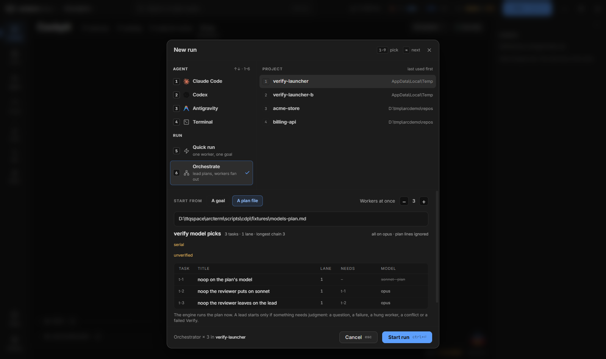

# Định dạng plan file

Một **plan file** là file Markdown mô tả công việc đã được chia sẵn thành các task. Engine của arcterm đọc nó, dựng DAG, cho nhiều worker chạy song song trong các worktree riêng, merge kết quả về một branch rồi chạy Verify và final stage. Trang này là đặc tả của định dạng đó: dòng nào nằm ở đâu, engine làm gì với từng dòng, lỗi nào bị từ chối ngay khi submit.

Plan file đi vào engine bằng ba đường (xem [Chạy một plan](#chạy-một-plan)): **New → Orchestrate → A plan file**, `wsh runs start --plan`, hoặc lead của một run tự submit bằng `wsh jarvis dag submit --plan`. Cách theo dõi và xử lý run sau khi plan đã vào nằm ở [Orchestrator](orchestrator.md).

> Nguồn sự thật của định dạng là bộ parser `ParsePlan` trong `pkg/jarvis/plan.go`. Chuỗi `jarvis.PlanFormat` (in ra bởi `wsh jarvis dag submit --help` và đưa cho lead) được test cùng với parser nên hai thứ không lệch nhau. Nếu trang này và `--help` khác nhau, `--help` đúng.

## Khung của một plan

```markdown
# <tiêu đề plan>

**Effort:** effort:<oid>
**Spec:** `<đường dẫn tới spec>`
**Verify:** `<lệnh chạy test>`
**Setup:** `<lệnh chuẩn bị worktree mới>`
**Check:** `<lệnh kiểm tra tĩnh nhanh>`
**Final:** `<lệnh kiểm tra kết quả đã merge>`
**Prototype:** <đường dẫn tới design canvas>

(văn xuôi dùng chung cho mọi task, nếu có)

### Task 1: <tiêu đề>
**Depends on:** none
**Model:** <model-id hoặc harness:model>
**Chunk:** <nhãn chunk>
**Files:** `<path>`, `<path khác>`
<việc cần làm, và các test chứng minh nó>

### Task 2: <tiêu đề>
**Files:** `<path>`
<không có dòng Depends: chạy sau Task 1>

### Task 3: <tiêu đề>
**Depends on:** Task 1
**Files:** `<path mà Task 2 không liệt kê>`
<chạy song song với Task 2>
```

Phần trước `### Task 1` là **header**; phần còn lại là các **task**. Mọi dòng của header đều tùy chọn, nhưng plan phải có ít nhất một task.

## Header

| Dòng | Nội dung | Ghi chú |
|---|---|---|
| `# <tiêu đề>` | Tiêu đề plan | Dòng `# ` đầu tiên trước task đầu. Không có thì tên file làm tiêu đề. |
| `**Effort:**` | `effort:<oid>` hoặc `<oid>` trần, **không** để trong backtick | Tối đa một dòng. Initiative mà các dòng `**Chunk:**` thuộc về. |
| `**Spec:**` | Đường dẫn tới spec mà plan hiện thực, **trong backtick**; sau đó được viết thêm chữ | Xem [Spec](#spec). |
| `**Verify:**` | Một lệnh trong backtick | Test chạy sau mỗi lần merge, và một lần nữa ở final stage. |
| `**Setup:**` | Một lệnh trong backtick | Chuẩn bị mỗi worktree mới. |
| `**Check:**` | Một lệnh trong backtick | Kiểm tra tĩnh toàn project, nhanh. |
| `**Final:**` | Một lệnh trong backtick | Kiểm tra kết quả đã merge từ đầu tới cuối (ví dụ chạy app thật). |
| `**Prototype:**` | Đường dẫn tới design canvas, **không** backtick | Tối đa một dòng. Verifier cuối so kết quả với canvas này. |

Quy tắc chung của các dòng lệnh (`Verify`, `Setup`, `Check`, `Final`):

- Mỗi dòng chứa **đúng một lệnh trong backtick**, không có chữ nào khác trên dòng. Nối nhiều bước bằng `&&` bên trong backtick. Viết lệnh không có backtick, hoặc hai lệnh trên một dòng, là lỗi parse.
- Mỗi loại tối đa một dòng.
- Lệnh chạy trong **shell POSIX**: `sh` trên macOS/Linux, **Git Bash** trên Windows. Trên Windows mà không tìm thấy Git Bash thì lệnh thất bại với thông báo cài Git for Windows hoặc đặt `term:gitbashpath` trong Settings.
- Khi lệnh quá hạn, engine giết cả cây tiến trình của nó (trên Windows qua job object), không chỉ shell khởi chạy.

Các dòng `Effort`, `Verify`, `Setup`, `Check`, `Final`, `Prototype` và tiêu đề được engine tiêu thụ. **Mọi dòng khác của header** (kể cả dòng `**Spec:**`) được giữ nguyên và đưa cho mọi worker, xem [Văn xuôi ở header](#văn-xuôi-ở-header-đến-mọi-worker).

### Setup

- Chạy trong **mỗi worktree lane mới**, trước khi worker đầu tiên của lane bắt đầu. Giới hạn **2 phút**; nó giữ khóa của dag trong lúc chạy, nên chỉ dùng để chuẩn bị worktree (junction thư mục, một file cấu hình), **không** để cài dependency.
- Chạy một lần trong cây branch của run (`wave/<runId>`) lúc submit, khi run đáp xuống branch riêng. Nó cũng chạy trong các cây phụ mà engine tự dựng: cây kiểm tra Check nền, cây bisect, và cây của final stage khi run đáp xuống checkout.
- Plan không có dòng Setup thì engine dùng file **`.arc/setup`** đã check in trong project: file chứa **đúng một lệnh** (dòng trống bị bỏ qua). File có hơn một dòng lệnh làm submit lỗi: `.arc/setup must hold one command, found N lines`. Không có file thì không có Setup.
- Với repo arcterm, `.arc/setup` là `node scripts/worktree-junctions.mjs prepare`: nó nối `node_modules`, `src-tauri/target` và `dist/bin` từ checkout chính vào worktree để test chạy được.
- Plan start (từ **A plan file** hoặc `wsh runs start --plan`) mà Setup thất bại trong cây của run thì **không** bị từ chối: engine mở một lead với thông báo lỗi Setup, giữ nguyên run và cây, để lead sửa dòng Setup rồi submit lại.

### Verify

- Chạy ở nơi các lane đáp xuống (cây branch của run, hoặc checkout project nếu `--landing checkout`), **sau mỗi đợt merge**. Giới hạn **20 phút**.
- Biến `ARC_VERIFY_CHANGED` là đường dẫn một file liệt kê các path (tương đối với repo, mỗi dòng một path) mà đợt merge vừa đổi, tính từ cha của commit squash cũ nhất trong đợt tới `HEAD`. Verify nên đọc nó và **chỉ test những gì các path đó có thể làm hỏng**, để hàng đợi merge không phải đợi cả bộ test. Không đọc được file thì chạy đầy đủ.
- **Final stage** chạy Verify thêm một lần trên kết quả đã merge, với `ARC_VERIFY_CHANGED` **để trống**: ở đó nó phải chạy mọi thứ.
- **Merge cuối cùng** của một plan, khi đứng một mình trong đợt, bỏ Verify riêng của nó: final stage chạy Verify đầy đủ trên cùng cây ngay sau đó. Điều kiện chi tiết ở [Orchestrator](orchestrator.md#merge-cuối-bỏ-verify-của-nó).
- **Test flaky.** Cả ở merge lẫn ở final stage, `ARC_VERIFY_FLAKY` là đường dẫn một file rỗng. Verify nào chạy lại một test lỗi và thấy nó qua thì thoát `0` và **ghi tên test vào file đó**, mỗi dòng một tên. Verify vẫn qua, nhưng mỗi tên trở thành một lý do *unverified* của run (`Verify reported flaky: <test> (failed, then passed on a rerun, in the Verify after merging t-2)`), nên một race "qua khi chạy lại" tới được tay bạn thay vì hiện như một lần qua sạch. Tối đa 20 tên được giữ, phần còn lại gộp thành "N more tests". File của một Verify thất bại không được đọc. Engine không biết gì khác về lệnh của bạn.
- Verify của repo này là `node scripts/verify.mjs <go package patterns>`. Có `ARC_VERIFY_CHANGED` thì nó chỉ chạy test Go của các package mà path đổi chạm tới (theo đồ thị import), vitest của các file liên quan, và `tsc` khi có file TS đổi. Test Go hoặc vitest lỗi mà chạy lại riêng thì qua được ghi vào `ARC_VERIFY_FLAKY` (`<package> <test>`, `<file> > <test>`); một file vitest không load được (lỗi collection) không bao giờ được chạy lại và làm Verify thất bại.

### Check

- Kiểm tra tĩnh **nhanh** trên cả project (ví dụ typecheck cộng `go vet`).
- **Mỗi worker tự chạy Check** trước khi báo xong, thay cho Verify: hợp đồng của worker dặn không chạy Verify đầy đủ, vì engine chạy nó sau khi task merge và lần nữa trên kết quả đã merge.
- Final stage chạy Check một lần trên kết quả đã merge (giới hạn 20 phút).
- Engine còn chạy Check **một lần lúc submit**, trong một cây tách rời ở commit mà các lane xuất phát (`<project>/.waveterm/worktrees/<run>-base`). Nếu nó đã thất bại ở đó thì lead được đánh thức, mọi worker được báo các lỗi ấy không phải của họ, và final stage cùng bước land chỉ ghi Check thất bại là *unverified* chứ không coi là thất bại. Nếu cây nền hoặc Setup của nó không dựng được thì bước này bị bỏ qua và không ai được đánh thức.

### Final

- Một lệnh duy nhất, chạy **một lần** trên kết quả đã merge sau khi mọi task đã land và Check đã qua. Giới hạn **30 phút**.
- Engine đặt `ARC_FINAL_OUT` là một thư mục mới (`<data dir>/final-shots/<dag>/<round>`, nằm ngoài mọi cây) để lệnh ghi ảnh chụp và báo cáo vào.
- Mã thoát:

  | Mã | Ý nghĩa |
  |---|---|
  | `0` | Qua. |
  | `3` | **Không kiểm chứng được.** Dòng cuối cùng của output trở thành lý do *unverified*. Không có lý do thì run ghi "exited 3, could not verify, and gave no reason". |
  | khác, hoặc quá 30 phút ("timed out") | Final stage **thất bại**, kèm phần đuôi output. |

- Lệnh có thể ghi `ARC_FINAL_OUT/shots.json`: một mảng `{ "name": string, "files": string[], "steps": [{ "step": string, "state": "pass"|"fail"|"skip", "detail"?: string }] }`, mỗi phần tử một scenario, đường dẫn file tương đối với `ARC_FINAL_OUT` và dùng `/`. Cockpit hiện chúng thành ảnh chụp của run. Không có manifest (hoặc manifest quá 1 MiB, không parse được, hoặc có `state` khác ba giá trị trên) thì mỗi file `*.png` dưới `ARC_FINAL_OUT` thành một mục riêng, xếp theo path, không có step. Đường dẫn tuyệt đối, có ổ đĩa hoặc có `..` bị bỏ.
- **Final là kiểm tra duy nhất với app đang chạy**, và không ai trong một run thực hiện bước kiểm tra thủ công. Vì vậy mỗi task thêm hoặc đổi một view, một trạng thái hiển thị (loading, empty, error, đã mất) hay một tương tác phải nêu trong tiêu chí chấp nhận **bước của scenario** cho thấy view hay thực hiện tương tác đó, thêm bước nếu chưa có, và dòng Final phải chạy scenario ấy. Một scenario chỉ mở surface hay panel chứa view thì không tính. Có `**Prototype:**` thì mỗi board trong thư mục của canvas cần một bước như vậy.
- Worker của task nào đổi scenario mà Final chạy (hoặc view/tương tác của một bước) được dặn tự chạy đúng scenario đó trước khi báo xong.
- Với repo này, Final là `node scripts/cdp/final-verify.mjs [scenario...]`: dựng một dev app riêng từ cây cuối, chạy các scenario `verify:ui` được nêu và viết `cdp-shots/`, `shots.json` và log vào `ARC_FINAL_OUT`. Mã thoát: `0` qua, `1` có scenario lỗi, `2` tên scenario không tồn tại, `3` không kiểm chứng được (không đặt `ARC_FINAL_OUT`, app không lên trong `ARC_FINAL_BOOT_MS` mặc định 10 phút, hoặc đợi khóa build quá `ARC_FINAL_LOCK_WAIT_MS`). Các final stage chạy **lần lượt** vì dùng chung thư mục `target` của cargo.

### Prototype

Đường dẫn tới design canvas (`.dc.html`) mà kết quả phải khớp. Không dùng backtick, tối đa một dòng. Dùng đường dẫn **tuyệt đối**: thư mục `.superpowers/` bị gitignore nên worktree của run không có bản sao. Verifier cuối đọc canvas như spec khi plan không có spec, và so ảnh chụp với các board theo cấu trúc (phần tử nào, thứ tự, chữ, control ở độ rộng đó), không so theo pixel. `wsh runs start --prototype <đường dẫn>` (chỉ cho orchestrator) thắng dòng này.

### Spec

- Dòng `**Spec:** \`docs/specs/ngay-chu-de-design.md\`` có thể viết thêm chữ sau đường dẫn (kỹ năng `superpowers:writing-plans` ghi dòng này vào header của mọi plan). Đường dẫn là span backtick đầu tiên, hoặc cả giá trị nếu nó là một token trần.
- Khi submit **không** kèm `--spec` (mọi lần bắt đầu từ **A plan file** và `wsh runs start --plan`), engine lấy spec từ dòng này: đường dẫn tuyệt đối dùng nguyên; đường dẫn tương đối được tìm từ thư mục của plan rồi lên từng thư mục cha, gần nhất trước, nên đường dẫn tính từ gốc repo vẫn đúng với một plan nằm sâu trong repo.
- Spec được commit cùng plan, và plan reviewer, reviewer của từng task, final verifier và mọi worker đều được chỉ tới nó.
- Dòng `Spec` không trỏ tới file thật thì được coi là chữ thường và plan chạy không spec (chỉ ghi một dòng log).
- `--spec` của `wsh jarvis dag submit` thắng dòng này; nó phải đi cùng `--plan` và là đường dẫn tuyệt đối tới file có thật. Fix round không nhận spec.

### Effort và Chunk

`**Effort:**` gắn plan với một initiative (`wsh effort list` cho id). Với dòng này, mỗi task được liệt kê một hoặc nhiều dòng `**Chunk:** <nhãn chunk chính xác>` (mỗi dòng một chunk): khi merge của task qua Verify, engine đánh dấu các chunk đó là xong, ghi commit đã land. Với merge cuối được hoãn Verify cho final stage, chunk đóng khi Verify của final stage qua.

- Dòng `**Chunk:**` mà plan không có `**Effort:**` bị từ chối.
- Nhãn rỗng, hoặc lặp trong một task, bị từ chối.
- Lúc submit, engine kiểm tra effort có tồn tại và nhãn khớp **đúng** một chunk (một con số trần không được chấp nhận làm nhãn, vì thứ tự chunk có thể đổi).

## Task

### Tiêu đề

`## Task N: <tiêu đề>` hoặc `### Task N: <tiêu đề>`, đánh số **1, 2, 3…** liên tục theo thứ tự. Task đánh số lệch bị từ chối (`plan heading "…" is out of order: tasks are numbered 1, 2, 3..., want Task N`). Tiêu đề sau dấu hai chấm là tùy chọn; thiếu thì nhãn là `Task N`. Trong engine, task N có id `t-N`.

Không có giới hạn số task.

Nội dung bên trong **code fence** (``` hoặc ~~~) chỉ là chữ của task, kể cả khi nó trông như tiêu đề task hay dòng `**Depends on:**`; nhờ vậy một plan có thể trích một plan mẫu mà không sinh thêm task.

### Các dòng đầu task

Ngay dưới tiêu đề là **khối đầu**: các dòng `**Depends on:**`, `**Model:**`, `**Chunk:**`, `**Files:**` (dòng trống giữa chúng được bỏ qua). Khối đầu kết thúc ở dòng đầu tiên không phải một trong bốn loại này; từ đó các dòng trông giống thế chỉ là chữ của task.

> `**Depends on:**` phải là dòng **đầu tiên** dưới tiêu đề. Đặt nó sau `Model`, `Chunk` hay `Files` thì nó không phải khối đầu nữa: parser coi nó là chữ của task và **không báo lỗi**, task cứ chạy theo mặc định (sau task trước).

| Dòng | Ý nghĩa |
|---|---|
| `**Depends on:** none` | Task độc lập, chạy được ngay. |
| `**Depends on:** Task 1, Task 3` | Chạy sau khi các task đó xong. |
| (không có dòng Depends) | Chạy sau task ngay trước nó. |
| `**Model:** <model>` | Model của worker cho task này; có thể nêu cả harness (`codex:gpt-5.5`, `agy`). |
| `**Chunk:** <nhãn>` | Chunk của initiative mà task đóng khi land (cần `**Effort:**`). |
| ``**Files:** `a.go`, `b.go` `` | Mọi path task tạo, sửa hoặc xóa. |

**Depends on**

- Chỉ tham chiếu ngược (task có số nhỏ hơn). Viết `Task` + số: `Task 1, Task 3`.
- `none` (không phân biệt hoa thường) là không phụ thuộc. Giá trị rỗng, tham chiếu sai dạng, tham chiếu tới task sau (hoặc chính nó), hoặc liệt kê một task hai lần đều bị từ chối.
- **Plan không có dòng Depends nào là một chuỗi tuần tự**: mỗi task chờ task trước. Độ rộng thực của plan hoàn toàn do các dòng Depends quyết định, xem [Độ rộng và lane](#độ-rộng-và-lane).

**Model**

- Một token, **không** trong backtick, không có khoảng trắng. Một dòng cho mỗi task; rỗng hay chứa khoảng trắng/backtick thì bị từ chối. Giá trị được đọc theo thứ tự này:

  | Giá trị | Harness | Model | Ví dụ |
  |---|---|---|---|
  | `<harness>:<model>`, với `<harness>` là tên một harness arcterm biết (`claude`, `pi`, `agy`, `codex`, …) | `<harness>` | `<model>` | `codex:gpt-5.5`, `agy:gemini-3-pro`, `pi:openrouter/x:free` |
  | chỉ một tên harness | harness đó | mặc định của nó | `codex`, `agy` |
  | còn lại | của lead (như trước) | giá trị đó | `sonnet`, `claude-opus-5-5`, `openrouter/qwen/qwen3:free` |

  Dấu `:` chỉ tách ở chỗ đầu tiên và chỉ khi phần trước nó là tên một harness mà arcterm biết, nên model id của pi có dấu hai chấm (`openrouter/qwen/qwen3:free`) vẫn là một model. `nosuch:model` cũng được đọc là một model (tên lạ), và bị kiểm tra lúc submit như mọi model.
- Chỉ có tác dụng khi run đặt *workers setting* là **Reviewer picks**; ở các chế độ khác nó bị bỏ qua (nhưng vẫn bị kiểm tra: harness hay model mà máy này không chạy được làm submit thất bại, nêu tên task; ví dụ dòng `codex:…` trên máy không có codex, hoặc `opencode:…` vì OpenCode không làm worker). Muốn một task chạy trên Codex thì viết dòng đó trong plan rồi bắt đầu run ở Reviewer picks. Plan reviewer chỉ chọn `sonnet` hoặc `lead` cho task không có dòng Model; nó không bao giờ chuyển task sang Codex hay agy. Cách engine chọn model cho từng task nằm ở [Orchestrator](orchestrator.md#chọn-route-và-model).

**Files**

- Mỗi path tương đối với gốc repo, trong backtick, cách nhau bằng dấu phẩy; dòng `Files` thứ hai nối tiếp danh sách. Path được chuẩn hóa (`\` thành `/`); path tuyệt đối, chứa `..` hoặc ổ đĩa bị từ chối. Mục đích là liệt kê **file**, không phải thư mục hay glob (parser không ép điều này, nhưng so khớp là so khớp đúng path).
- Liệt kê cả file sinh ra (generated files).
- Dòng này **vẫn nằm trong chữ của task**: worker và reviewer của nó đọc được task sở hữu file nào.
- **Submit từ chối plan mà hai task cùng liệt kê một path nhưng không task nào phụ thuộc task kia** (trực tiếp hay qua các task khác), vì engine sẽ chạy chúng cùng lúc và hai bản sửa của một file va nhau lúc merge. Lỗi nêu tên cả hai task và path: `tasks A (…) and B (…) can run at the same time and both list <path> in **Files:**; give the file to one task, or add a **Depends on:** line so one waits for the other`. Task không có dòng `Files` không tham gia phép kiểm tra này; vì vậy hãy liệt kê file của **mọi** task, nếu không chỉ còn plan reviewer bắt các chỗ trùng.

### Nội dung task

Phần chữ dưới khối đầu là việc cần làm. Nên viết:

- các quyết định thiết kế mà task đưa ra, file nó sở hữu, interface hay chữ ký mà task khác dựa vào;
- tiêu chí chấp nhận, kèm các **test tập trung** chứng minh chúng: với Go là `go test ./pkg/x -run '<tên>'`, **không** phải cả package hay cả bộ test. Verify chạy các bộ lớn ở mỗi merge và ở final stage;
- không dán nguyên mã triển khai: worker viết mã. Lead cũng được dặn viết plan theo hướng này, vì mã dán sẵn từng làm giai đoạn viết plan thành khúc lâu nhất của một run nhỏ.

### Văn xuôi ở header đến mọi worker

Prompt của mỗi worker gồm hợp đồng của engine, rồi mục *The plan's header applies to every task* (phần header ngoài các dòng engine đã tiêu thụ, giữ nguyên), rồi phần task của chính nó, rồi (nếu có) ghi chú lead thêm sau khi các task trước land, góp ý của reviewer vòng trước, và bản tóm tắt những gì các task tiền nhiệm đã làm. Vì vậy:

- Luật chung của mọi task ("không sửa `docs/`", "định vị theo symbol chứ không theo số dòng") đặt ở **header**.
- Luật chỉ của một task đặt ở **task đó**.

Trước đây worker chỉ nhận phần task của mình, nên một dòng "Không sửa `docs/`; Task 13 viết toàn bộ docs" ở header không tới được ai và năm lane vẫn sửa cùng một file. Nay header tới mọi worker; hãy dùng nó cho đúng việc đó.

## Độ rộng và lane

Engine chạy cùng lúc mọi task không phải chờ nhau. Số worker chạy cùng lúc bị chặn bởi **Workers at once** (1–8). Điều quyết định plan có thật sự chạy song song hay không là các dòng `Depends on`.

- Các task nối thành chuỗi (mỗi task chỉ có một dependency, và là dependent duy nhất của dependency đó) thuộc cùng một **lane**: một worktree, một branch, mỗi task một worker mới commit chồng lên task trước, và cả lane land như **một** squash merge. Task độc lập, và task sau một chỗ rẽ nhánh hay hội tụ, mở lane riêng.
- Preview trong launcher in `N tasks · M lanes · longest chain K`. **Lane** là thứ "Workers at once" đếm; **longest chain** quyết định khúc đuôi của run: khi các task độc lập đã xong mà còn một chuỗi dài, run chạy từng task một dù còn nhiều chỗ trống. Muốn rút ngắn thì bỏ bớt dòng `Depends on`; tăng số worker không giúp ích gì.
- Chia plan theo những gì thực sự có thể tiến hành độc lập. Một task chỉ nên chờ task khác khi nó dựa trên **output** của task đó.
- Một file chỉ nên có **một chủ** trong số các task có thể chạy cùng lúc, kể cả file sinh ra. Nếu mọi task phải sửa cùng một file (một bảng theo dõi, một changelog), đừng bắt chúng cùng làm: để một task cuối cùng phụ thuộc vào tất cả các task kia và cập nhật file đó. Nếu không, các task dính vào nhau tại một file hàng liền kề và chỉ còn chạy tuần tự.
- Một run giữ **đúng một dag** suốt đời. Plan nào quá lớn cho một dag thì không thể chia thành "hai pha" trong một run: hãy tách thành hai run. Ngoại lệ là *fix round* sau một final stage thất bại, nó nối thêm task vào chính dag đó.
- Khi submit mà không ghim độ rộng, engine lấy số task không có dependency (tối đa 8, tối thiểu 1). Launcher thì luôn gửi giá trị bạn chọn (mặc định 3, hoặc độ rộng của profile).

## Plan mẫu đầy đủ

Một plan bốn task: một chuỗi hai task (gói Go rồi route), một task frontend độc lập, và một task cuối cập nhật changelog sau cả hai.

```markdown
# Thêm endpoint /health và trang trạng thái

**Spec:** `docs/superpowers/specs/2026-10-health-design.md`
**Verify:** `node scripts/verify.mjs ./pkg/... ./cmd/...`
**Setup:** `node scripts/worktree-junctions.mjs prepare`
**Check:** `go vet ./... && node --stack-size=4000 node_modules/typescript/lib/tsc.js --noEmit`
**Final:** `node scripts/cdp/final-verify.mjs health-page`
**Prototype:** D:/code/arcterm/.superpowers/design/health/health.dc.html

Mọi task: không sửa `docs/` và không sửa `CHANGELOG.md`; Task 4 viết dòng changelog.
Định vị code theo tên symbol, không theo số dòng.

### Task 1: Gói health
**Depends on:** none
**Files:** `pkg/health/health.go`, `pkg/health/health_test.go`
Thêm `health.Snapshot()` trả về `Status{OK bool, Checks []Check}`: kiểm tra
được store và kiểm tra ghi được thư mục data. Test: `go test ./pkg/health -run
'^TestSnapshot'`, gồm một ca store hỏng trả `OK=false`.

### Task 2: Route /health
**Files:** `cmd/server/health_route.go`, `cmd/server/health_route_test.go`
Đăng ký `GET /health` trả JSON của `health.Snapshot()`; trả 503 khi `OK=false`.
Không có dòng Depends nên chạy sau Task 1 (cùng lane). Test: `go test
./cmd/server -run '^TestHealthRoute'`.

### Task 3: Trang trạng thái
**Depends on:** none
**Files:** `frontend/app/view/health/healthpage.tsx`, `frontend/app/view/health/health.ts`
Trang liệt kê các check của `/health`, màu theo `OK`. Logic thuần đặt trong
`health.ts` kèm `health.test.ts`. Scenario `health-page` phải có bước mở trang
và bước thấy một check lỗi (chỉ mở surface thì không đủ).

### Task 4: Dòng changelog
**Depends on:** Task 2, Task 3
**Model:** sonnet
**Files:** `CHANGELOG.md`
Thêm một dòng dưới `Added` của mục Unreleased, viết cho người dùng.
```

Plan này có `4 tasks · 3 lanes · longest chain 3`: lane 1 là Task 1 → Task 2, lane 2 là Task 3, lane 3 là Task 4 (hai dependency nên mở lane riêng). Task 4 có dòng `Model` nhưng nó chỉ có tác dụng khi workers setting là **Reviewer picks**. Dòng đó cũng có thể nêu harness: đổi thành `**Model:** codex:gpt-5.5` thì Task 4 chạy trên Codex (vẫn chỉ ở Reviewer picks, và máy phải có codex).



<!-- shot: plan-launcher-error.png | Cùng hộp New nhưng parser từ chối plan: thông báo lỗi màu đỏ thay cho bảng task và nút Start run bị khóa | Như trên, trỏ vào một plan có `### Task 3` đứng trước `### Task 2` hoặc một dòng `**Verify:**` không có backtick; selector `[data-jarvis-plan-preview="error"]` -->

## Kiểm tra trước khi chạy

Hộp **New** parse plan ngay khi bạn gõ đường dẫn (có độ trễ ngắn) và không cho **Start run** cho tới khi parse được. Nó hiện:

- tiêu đề và dòng hình dạng `N tasks · M lanes · longest chain K`;
- các cảnh báo: **serial** (chỉ một lane mà có hơn một task: plan không có Depends nào) và **unverified** (plan không có dòng Verify, nên không có gì được test ở chỗ các lane merge);
- bảng task: `task`, `title`, `lane`, `needs` (các dependency), `model`. Cột model đi theo ô **Workers**. Với *Reviewer picks*, task có dòng Model hiện `<model> · plan` (dòng nêu harness hiện nguyên như đã viết: `codex:gpt-5.5 · plan`, `codex · plan`), task không có hiện `at review`, và dòng tổng kết là `N set by the plan · M picked at review`. Với các cài đặt workers khác, task không có dòng Model hiện model của workers, dòng Model bị gạch ngang, và dòng tổng kết là `all on <model>`, thêm ` · plan lines ignored` nếu plan có dòng Model.

Đường dẫn plan trong hộp **New** có thể là tuyệt đối hoặc tương đối với project. `wsh runs start --plan` đổi đường dẫn tương đối (tính từ thư mục hiện tại của shell) thành tuyệt đối trước khi gửi, vì `wavesrv` không dùng chung thư mục làm việc.

Những lỗi parse hay gặp (engine in nguyên văn, bằng tiếng Anh):

| Thông báo | Nguyên nhân |
|---|---|
| `plan has no tasks: expected headings like "### Task 1: <title>"` | Không có tiêu đề `## Task N` hay `### Task N` nào (hoặc tất cả nằm trong code fence). |
| `plan heading "…" is out of order: tasks are numbered 1, 2, 3..., want Task N` | Đánh số task không liền. |
| `plan **Verify:** line must hold one command in backticks, got …` | Dòng lệnh thiếu backtick hoặc có thêm chữ. |
| `plan has more than one **Verify:** line` | Hai dòng cùng loại (áp dụng cho Setup, Check, Final, Effort, Prototype). |
| `task N depends on Task M, which is not an earlier task` | `Depends on` trỏ tới task sau hoặc chính nó. |
| `task N: **Depends on:** is empty; write none, or list earlier tasks like "Task 1, Task 2"` | Dòng Depends để trống. |
| `task N: **Model:** must be one model id, not in backticks, got …` | Model có backtick hoặc khoảng trắng; hoặc hai dòng Model. Dạng `harness:model` hay tên harness trần không phải lỗi parse. |
| `task N: **Files:** must list paths in backticks separated by commas, …` | Dòng Files sai dạng. |
| `task N (…) names a chunk but the plan has no **Effort:** line …` | Có `Chunk` mà không có `Effort`. |
| `tasks A (…) and B (…) can run at the same time and both list <path> in **Files:** …` | Hai task cùng sở hữu một path, không task nào chờ task kia. |

Sau parse, lúc submit thật còn có các phép kiểm tra cần trạng thái: effort/chunk phải tồn tại, `--spec` phải là file có thật, Model (và harness của nó, nếu dòng Model nêu: `codex:…` cần codex trên máy này, `opencode:…` luôn bị từ chối) phải chạy được trên máy này, và `.arc/setup` phải đúng một lệnh.

## Chạy một plan

Ba đường, cùng một engine. Chi tiết theo dõi run ở [Orchestrator](orchestrator.md).

1. **Từ giao diện.** Nhấn `Ctrl+Shift+R` (hoặc **+ New**), chọn **Orchestrate**, **Start from → A plan file**, dán đường dẫn plan, kiểm tra preview, rồi **Start run** (`Ctrl+Enter`). Không có bước duyệt nào của bạn và không có lead: plan reviewer của engine đọc plan trước, worker đầu tiên chạy khi nó qua.
2. **Từ dòng lệnh**, trong một terminal của project:

   ```bash
   wsh runs start --plan docs/plans/health.md
   wsh runs start --plan docs/plans/health.md --parallelism 4 --landing checkout
   ```

   `--plan` ngầm hiểu orchestrator. Mục goal là tùy chọn (mặc định là tên plan). Các cờ thường dùng: `--parallelism`, `--landing branch|checkout`, `--runtime`/`--model` (lead), `--worker-runtime`/`--worker-model` hoặc `--reviewer-picks`, `--reviewer-runtime`/`--reviewer-model`, `--prototype`, `--effort`/`--chunk`. Lệnh in id của run; theo dõi bằng `wsh runs show <run-id>`. Nếu báo không có phản hồi (`EC-TIME`) thì run có thể vẫn đã chạy: kiểm tra `wsh runs list` trước khi chạy lại.
3. **Từ lead của một run** (khi nó brainstorm một goal cùng bạn và viết plan): trong terminal của lead,

   ```bash
   wsh jarvis dag submit --plan <plan.md> --spec <spec.md>
   ```

   đường dẫn tuyệt đối; run được suy ra từ terminal, nơi khác thì thêm `--channel <id> --runid <id>`. Sau lần submit đầu tiên, engine review plan; nếu review không qua, lead sửa plan rồi chạy lại đúng lệnh này. Lệnh in `dag <id> submitted (N tasks, M lanes, longest chain K, parallelism P)`.

   Sau một final stage thất bại, lead viết **fix plan** theo cùng định dạng và nộp bằng `wsh jarvis dag submit --round --plan <fix plan>`: các task của nó được nối vào dag. Fix plan chỉ mang task; các dòng Verify/Setup/Check/Final (nếu có) phải **trùng** với của run, khác thì bị từ chối. Fix round không qua plan review nhưng từng task vẫn được review.

`wsh jarvis dag submit --help` in đầy đủ định dạng này, kèm lời nhắc một run chỉ giữ một dag.

## Xem thêm

- [Orchestrator](orchestrator.md) — chạy, theo dõi, xử lý, land.
- [Jarvis](jarvis.md) — run sheet, câu hỏi, review.
- [Phím tắt](../keyboard-shortcuts.md)
