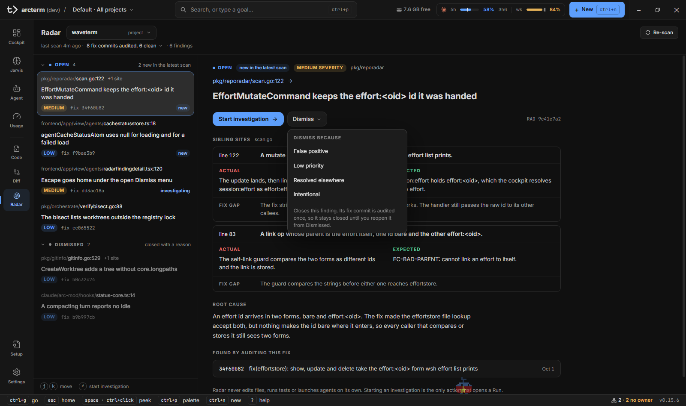
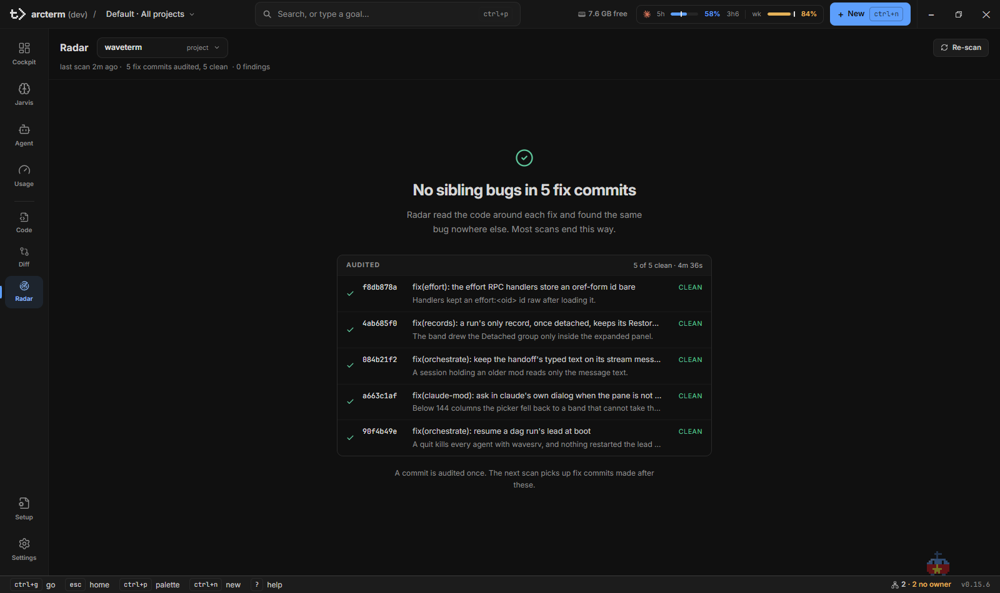

# Radar

**Radar** tìm lỗi anh em của những lỗi bạn vừa sửa. Mỗi lần quét, nó chọn vài commit `fix:` gần đây của một repository, và với mỗi commit chạy một phiên agent chỉ-đọc: đọc quanh chỗ đã sửa, tìm xem cùng một lỗi có còn ở nơi khác không (các chỗ gọi cùng hàm, các nhánh code song song, các handler cùng họ). Một commit chỉ được audit một lần. Phần lớn lần quét kết thúc bằng "không có lỗi anh em nào", và đó là kết quả bình thường.

Radar không bao giờ tự sửa file, tự chạy test hay tự khởi động agent. Quét chỉ chạy khi bạn bấm. Hành động duy nhất mở một Run là **Start investigation** trên một finding, và bạn xem lại mục tiêu trước khi chạy.

Các trang liên quan: [Jarvis](jarvis.md) (nơi run điều tra được khởi chạy), [Orchestrator](orchestrator.md), [Code](code.md) (mở chỗ lỗi), [Settings](settings.md) (chọn model audit).

## Mở Radar

| Cách | Kết quả |
|---|---|
| Nav rail → **Radar** | Mục cuối của nhóm công cụ (Code, Diff, Radar) |
| `Ctrl+7` (`Cmd+7` trên Mac) | Nhảy theo vị trí trong nav rail |
| `Ctrl+G` rồi `r` | Chuỗi "go to" |
| `[` / `]` | Chuyển sang surface trước / sau |
| `wsh ui reveal radarreport:<id> --anchor <findingId>` | Một agent đưa bạn tới đúng một finding |

Một con số trên mục **Radar** của nav rail đếm số project mà bản quét đã xong gần nhất còn finding mới (`new`) hoặc lặp lại (`recurring`) chưa được dismiss. Mỗi project chỉ tính một lần, dù có hàng chục finding. Con số xuống khi bạn dismiss hết chúng.

Radar có project riêng của nó, chọn ở ô **project** bên cạnh tiêu đề. Khi mở, nó lấy project Radar đã chọn lần trước (được nhớ qua các lần khởi động); nếu chưa có thì lấy project đang chọn ở app bar; nếu cũng chưa có thì mở bản quét gần nhất của bất kỳ project nào, để bạn có kết quả thật thay vì màn trống. Khi project của Radar khác project ở app bar, một dải `Showing <project của Radar> · project is <project ở app bar>` hiện ra với nút **Show the project**.

## Quét một repository

1. Chọn project ở ô **project**.
2. Lần đầu: bấm **Scan repository** trên màn "`<project>` hasn't been scanned". Các lần sau: **Re-scan** ở góc phải thanh tiêu đề.
3. Theo dõi danh sách commit đang audit. Mỗi dòng đi qua các trạng thái: chờ (`queued`), `auditing`, `clean`, `N hits`, hoặc `failed`; dưới có tổng "N of M audited · K hits · 2m 05s elapsed".
4. Bấm **Cancel scan** nếu muốn dừng. Các audit đã xong trước lúc hủy bị bỏ ("Audits that finished before you cancelled were discarded").

Một lần quét hoạt động thế này:

- **Chọn commit**: lấy các commit không phải merge trong 30 ngày qua có subject theo kiểu conventional `fix:`, `fix(scope):` (có thể kèm `!`) và có đụng vào file code (bỏ commit chỉ sửa docs, `.md`, `.txt`, `.rst`, hay test). Commit đã được audit thành công ở lần quét trước thì loại ra. Còn lại xếp theo file nào bị sửa lỗi nhiều nhất, rồi theo thời gian, và lấy **tối đa 8 commit** cho mỗi lần quét.
- **Audit**: mỗi commit một phiên chỉ-đọc (chỉ được đọc, grep và liệt kê file; không có shell), ba phiên chạy cùng lúc, mỗi phiên tối đa 10 phút. Phiên báo về lỗi gốc đã được sửa và các chỗ anh em còn mắc lỗi đó.
- **Kiểm tra**: một chỗ nghi ngờ chỉ được giữ khi file nằm trong project và tồn tại, số dòng nằm trong file, và có mô tả điều kiện kích hoạt. Phiên audit được dặn rằng "không có chỗ anh em nào" là một câu trả lời hợp lệ và báo nhầm còn tệ hơn không báo.

Route của phiên audit chọn ở **Settings → Background AI → Radar → Radar audit**: chạy bằng `claude` (mặc định, model `sonnet`) hoặc `pi`. OpenRouter không dùng được vì nó không có công cụ đọc file. Thiếu binary hoặc runtime sai thì cả lần quét báo lỗi, không lặng lẽ chuyển sang runtime khác.

## Đọc kết quả

Dưới tiêu đề là một dòng tóm tắt, ví dụ `last scan 3h ago · 5 fix commits audited, 4 clean, 1 failed · 2 findings`. Bấm phần tóm tắt audit để mở bảng "Audited in the last scan": mỗi commit với hash, subject và trạng thái, và lý do nếu nó lỗi hay lỗi gốc nếu nó sạch.

Nội dung bên dưới phụ thuộc vào bản quét mới nhất của project:

| Bạn thấy | Nghĩa |
|---|---|
| "`<project>` hasn't been scanned" | Chưa quét lần nào |
| "Auditing fix commits" | Đang quét |
| Danh sách finding bên trái, chi tiết bên phải | Có finding |
| "No sibling bugs in N fix commits" | Quét xong, mọi audit sạch |
| "No sibling bugs found" kèm audit lỗi | Có audit lỗi: "không có lỗi anh em" chỉ đúng với các commit đã đọc được |
| "No new fix commits to audit" | Không còn commit nào chưa audit trong 30 ngày qua |
| "The scan failed" | Lỗi cả lần quét, kèm thông báo lỗi; nút **Scan again** |
| "Scan cancelled" | Bạn đã hủy |
| "This report was written by an older Radar" | Bản quét từ định dạng cũ, không hiển thị được; **Re-scan** để thay thế |

Khi một số audit lỗi, một dải cảnh báo hiện dưới tiêu đề: "The audit of `abc12345` failed. Sibling bugs of that fix may be missing." Nút **Retry failed audits** chạy lại đúng các commit lỗi, không chọn lại commit khác; finding tìm được thêm xuất hiện như finding mới, còn phần còn lại của bản quét giữ nguyên.

### Danh sách finding

Bên trái, hai nhóm gập được: **Open** (kèm "N new in the latest scan") và **Dismissed** (mờ; gồm cả finding bị chặn bằng lý do "Intentional"). Mỗi dòng gồm:

- đường dẫn `thư-mục/file:dòng` của chỗ nghi ngờ, kèm `+N site` nếu còn chỗ khác trong cùng file;
- câu mô tả rủi ro (hai dòng);
- nhãn mức độ `HIGH` / `MEDIUM` / `LOW`, `fix <8 ký tự hash>` của commit đã dẫn tới finding, trạng thái điều tra (xem dưới), và nhãn `new` nếu mới xuất hiện ở lần quét gần nhất.

Cuối danh sách có gợi ý phím: `j` `k` di chuyển, `Enter` thực hiện hành động chính của finding đang chọn (tên hành động hiện ngay cạnh).

### Chi tiết một finding

- Hàng nhãn: nhóm (Open / Dismissed), "new in the latest scan", mức độ, và subsystem suy ra từ file.
- **Đường dẫn `file:dòng`**: bấm để mở chỗ đó trong [Code](code.md), tại đúng dòng.
- **Tiêu đề** là câu mô tả rủi ro.
- **Sibling site(s)**: với mỗi chỗ nghi ngờ có `line N` cùng điều kiện kích hoạt (trigger), ô **Actual** (hành vi thực tế), ô **Expected** (hành vi đáng ra), và **Fix gap**: vì sao bản sửa không phủ tới đây.
- **Root cause**: lỗi gốc mà commit đã sửa.
- **Found by auditing this fix**: hash, subject và ngày của commit nguồn (ở cột phải khi pane rộng từ 1300 px, nếu không thì nằm dưới).
- Mã nhận dạng `RAD-…` ở góc phải hàng nút. Nó được tính từ project, commit nguồn và file, không tính từ số dòng, nên dòng code xê dịch không làm finding mất danh tính.
- Nếu finding đã từng được điều tra bằng một run, các mục **Relevant past decisions** liên quan tới run đó (nếu có) hiện thêm.

Khi một commit cho ra nhiều chỗ nghi ngờ trong cùng một file, chúng gộp thành một finding với nhiều site.

## Biến finding thành việc

### Start investigation

1. Chọn một finding.
2. Bấm **Start investigation**, hoặc nhấn `Enter` với finding đang chọn.
3. Radar chuyển sang [Jarvis](jarvis.md), mở run launcher của channel thuộc project này (nếu project chưa có channel, một channel được tạo). Ô mục tiêu đã điền sẵn nội dung "Fix commit … fixed a bug; root cause: … The same bug may remain at: …", mỗi chỗ kèm trigger, actual và expected.
4. Sửa mục tiêu nếu muốn, chọn kiểu run và route như mọi run khác, rồi chạy. Chi tiết về launcher ở [Jarvis](jarvis.md) và [Orchestrator](orchestrator.md).

Run mang theo nguồn gốc Radar của nó, nên kết quả được ghi ngược vào finding khi run kết thúc. Thẻ trạng thái điều tra trong chi tiết và nhãn nhỏ trên dòng danh sách cho thấy:

| Nhãn | Nghĩa |
|---|---|
| `investigating` (chấm nhấp nháy) | Run đang chạy. Nút chính đổi thành **Open run `<id>`**, vì lúc này cần theo dõi chứ không phải bắt đầu một run thứ hai |
| `investigated` | Run xong. Thẻ ghi số file, `+thêm −xóa` và số bước kiểm tra pass / fail, kèm bản tóm tắt của run |
| `still detected` | Run xong nhưng lần quét gần nhất vẫn thấy chỗ đó: "Investigated — still detected" |
| `cancelled`, `failed` | Run đã bị hủy hoặc lỗi; có thể mở lại để xem |
| `run gone` | Run không còn tồn tại |

Khi đã từng điều tra, nút chính là **Investigate again**. Nút **Open run `<id>`** trên thẻ mở run ở Jarvis; giữ `Ctrl` (`Cmd` trên Mac) khi bấm thì xem nhanh run trong cửa sổ peek của avatar mà không rời Radar.

### Dismiss: đóng một finding

Bấm **Dismiss**, chọn một lý do:

| Lý do | Hiệu ứng |
|---|---|
| **Addressed by `<run>`** | Chỉ có khi đã có điều tra xong; đứng đầu danh sách vì đó thường là lý do nhất |
| **False positive** | Đóng |
| **Low priority** | Đóng |
| **Resolved elsewhere** | Đóng |
| **Intentional** | Đóng và chặn: đây là quyết định chứ không phải phân loại |

Finding bị đóng chuyển sang nhóm **Dismissed** và hàng nút ghi `Dismissed: <lý do>` (rê chuột để thấy ghi chú). Vì commit nguồn chỉ được audit một lần, finding đóng sẽ ở yên đóng cho đến khi chính bạn bấm **Reopen finding**; thời gian trôi qua không tự mở lại nó.

### Giữa các lần quét

Một commit đã audit thì không audit lại, nên lần quét sau không dùng model để kiểm lại finding cũ: nó chỉ kiểm bằng cây hiện tại xem file còn đó và số dòng còn hợp lệ hay không. Finding còn hợp lệ thì chuyển thành lặp lại (recurring); finding mà file hoặc dòng đã biến mất thì sau hai lần quét liên tiếp bị coi là "no longer detected" và rồi bị bỏ ở lần sau nữa. "No longer detected" không có nghĩa là đã sửa, chỉ có nghĩa là chỗ đó không còn. Một chỗ anh em đã được sửa tại chỗ vẫn qua được bước kiểm tra này, nên nó vẫn là recurring cho tới khi bạn dismiss nó hoặc điều tra xong. Finding đã dismiss, finding bị chặn và trạng thái điều tra được giữ qua các lần quét.

## Phím tắt

Các phím này hoạt động trong danh sách finding khi bạn không gõ trong ô nhập. `Ctrl` là `Cmd` trên Mac. Danh sách đầy đủ: [keyboard-shortcuts](../keyboard-shortcuts.md).

| Phím | Việc |
|---|---|
| `j` / `k`, `↓` / `↑` | Finding kế / trước; di chuyển là chọn. Chỉ đi qua các nhóm đang mở |
| `Enter` | Hành động chính: **Start investigation** / **Investigate again**, hoặc **Open run** khi run đang chạy |
| `Space` | Xem nhanh finding trong cửa sổ peek của avatar, không rời Radar |
| `Esc` | Về Cockpit |

## Giới hạn

- Quét chỉ chạy khi bạn bấm; Radar không có lịch tự quét.
- Mỗi lần quét audit tối đa 8 commit, chỉ trong 30 ngày qua, và chỉ commit có subject `fix…:`. Nó không phải trình lint toàn repo và không đọc lịch sử cũ hơn.
- Radar không sửa gì. Mọi thay đổi code đều đi qua một run mà bạn tự bắt đầu.
- Một project có thể có nhiều bản quét cũ; surface luôn hiện bản mới nhất.
