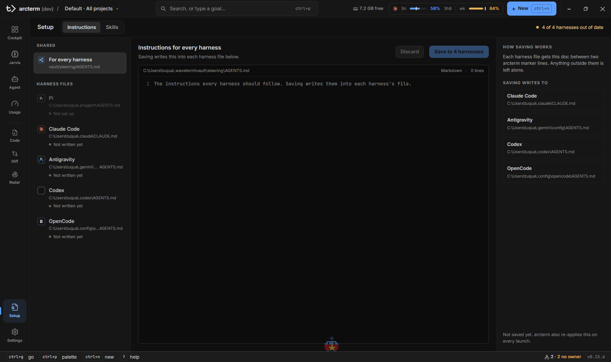

# Setup: instructions và skills dùng chung

Mỗi harness đọc chỉ dẫn và skill ở một chỗ khác nhau (`~/.claude/CLAUDE.md`, `~/.pi/agent/AGENTS.md`, `~/.codex/AGENTS.md`…). Nếu bạn muốn mọi agent tuân theo cùng một bộ quy tắc, việc tự chép tay ra từng nơi rất dễ lệch. Surface **Setup** giữ **một bản duy nhất** trong vault của arcterm rồi ghi nó vào mọi harness đã cài.

Setup có hai tab:

- **Instructions**: một tài liệu Markdown chung, được chiếu vào file chỉ dẫn của từng harness.
- **Skills**: xem skill của mọi harness cạnh nhau và đưa chúng vào vault để arcterm giữ đồng bộ.

Mở bằng nav rail (nút **Setup** ở đáy) hoặc `Ctrl+G` rồi `.`. Setup không lọc theo project. Mỗi lần mở surface, nó đọc lại từ đĩa, nên file bạn sửa ngoài arcterm không bị hiện cũ.



## Vault là gì

Vault là một thư mục arcterm quản lý, mặc định `~/.waveterm/vault` (đổi ở **Settings → General → Vault & sync → Vault path**, xem [Settings](settings.md#general)). Setup dùng hai phần của nó:

| Đường dẫn trong vault | Nội dung |
|---|---|
| `steering/AGENTS.md` | Tài liệu chỉ dẫn chung (tab **Instructions**) |
| `skills/<tên-skill>/` | Mỗi thư mục con là một skill dùng chung (tab **Skills**) |

Chiều đồng bộ là một chiều: vault → harness. arcterm không đọc ngược từ harness về vault, ngoài thao tác **Manage … in arcterm** mà bạn chủ động bấm. Nó cũng không bật hay tắt skill trong cấu hình riêng của harness.

arcterm chỉ đồng bộ vào harness mà bạn **đã dùng**: thư mục cấu hình của harness (ví dụ `~/.claude`, `~/.codex`) phải đã tồn tại. Harness chưa chạy lần nào hiện là **Not set up** và bị bỏ qua; arcterm không tự tạo cấu hình cho nó.

Việc đồng bộ chạy khi bạn bấm **Save** ở tab Instructions, khi bạn bấm **Manage … in arcterm** ở tab Skills, và mỗi lần bạn khởi chạy một agent (một harness không bao giờ khởi động với vùng chỉ dẫn cũ). Có thể chạy tay: `wsh agent-sync status` (xem từng harness phản ánh gì), `wsh agent-sync sync [--dry-run]` và `wsh agent-sync adopt [--apply]`.

## Sửa instructions dùng chung

1. Mở tab **Instructions**. Mục **For every harness** (đường dẫn `vault/steering/AGENTS.md`) đã được chọn sẵn ở cột trái.
2. Sửa nội dung trong trình soạn thảo ở giữa. Khi có thay đổi chưa lưu, cột trái hiện một chấm accent, và đầu trang ghi `N lines changed`.
3. Bấm **Save to N harnesses**. N là số harness đang có mặt trên máy. Lệnh lưu ghi tài liệu vào vault rồi chiếu ngay vào từng harness.
4. Muốn bỏ thay đổi thì bấm **Discard**.

Đầu trang bên phải ghi tình hình chung: `3 harnesses in sync`, hoặc `1 of 3 harnesses out of date`, hoặc `No harnesses set up`.

### Mỗi harness nhận gì

Cột **Harness files** liệt kê file chỉ dẫn của từng harness, đường dẫn đầy đủ (rê chuột để xem) và trạng thái:

| Harness | File chỉ dẫn |
|---|---|
| pi | `~/.pi/agent/AGENTS.md` |
| Claude Code | `~/.claude/CLAUDE.md` |
| Antigravity | `~/.gemini/config/AGENTS.md` |
| Codex | `~/.codex/AGENTS.md` |
| OpenCode | `~/.config/opencode/AGENTS.md` |

| Trạng thái | Nghĩa là |
|---|---|
| **In sync** | Vùng của arcterm trong file khớp với tài liệu chung. |
| **Out of date** | File có vùng của arcterm nhưng nội dung đã khác tài liệu chung trong vault (vùng bị sửa tay, hoặc tài liệu chung vừa đổi ngoài arcterm). Bản nháp chưa lưu không tính. Lưu lại sẽ làm mới. |
| **Not written yet** | File chưa có, chưa có vùng của arcterm, hoặc tài liệu chung đang trống. |
| **Not set up** | Harness chưa có thư mục cấu hình; mờ đi và bị bỏ qua. |

arcterm chỉ ghi trong **vùng của nó**, giữa hai dòng đánh dấu:

```
<!-- ARC-STEERING:BEGIN (generated — do not edit; managed by Arc) -->
…tài liệu chung…
<!-- ARC-STEERING:END -->
```

Mọi thứ bạn viết ngoài hai dòng này được giữ nguyên. File chưa có vùng thì vùng được thêm vào cuối. Đừng sửa bên trong vùng: lần đồng bộ sau ghi đè.

### Khi file bị đổi trong lúc bạn đang sửa

Nếu tài liệu chung trong vault bị sửa ngoài arcterm kể từ lúc bạn mở nó (chẳng hạn bởi một agent hoặc bởi đồng bộ vault giữa các máy), lúc lưu bạn thấy thông báo **Changed on disk since you opened it** cùng hai nút:

- **Reload**: lấy bản hiện có trên đĩa và bỏ phần bạn đã gõ.
- **Overwrite**: ghi đè bằng bản của bạn.

Chưa chọn thì bản nháp của bạn được giữ nguyên, không mất.

## Quản lý skills

Tab **Skills** là một ma trận: mỗi hàng là một skill, mỗi cột là một harness có thư mục skill cố định (Claude Code, Antigravity, Codex, OpenCode). Cột của harness chưa dùng có nhãn **not set up**. pi không có cột: nó đọc skill từ danh sách đường dẫn trong `settings.json` của chính nó; `wsh agent-sync status` cho biết cấu hình đó có trỏ vào skill đã đồng bộ hay không.

Dòng đầu trang ghi tình hình (`19 skills · 3 managed by arcterm`) và nút **Manage N skills in arcterm**.

<!-- shot: setup-skills.png | Tab Skills: ma trận skill × harness chia nhóm (Needs a decision, Differs between harnesses, Same copy in N harnesses, Only in …, Managed by arcterm), một hàng được chọn và cột phải hiện "Where it lives" | Mở Setup, bấm tab **Skills** (`#setup-tab-skills`); hàng là `[role="row"]` trong `[aria-label="Skills by harness"]`. Cần vài skill nằm trong `~/.claude/skills` và `~/.codex/skills` để có nhóm khác nhau; năm skill của arcterm luôn có mặt ở nhóm "Managed by arcterm" -->

### Đọc ma trận

Các hàng chia nhóm, theo thứ tự:

| Nhóm | Ý nghĩa |
|---|---|
| **Needs a decision** | Cùng tên nhưng phần thân `SKILL.md` khác nhau giữa các harness; arcterm không tự chọn bản nào. |
| **Differs between harnesses** | Khác nhau ở phần đầu (frontmatter) hoặc file đi kèm; arcterm giữ một bản dùng chung và ghi lại điểm khác của từng harness. |
| **Same copy in N harnesses** | Cùng một skill bạn đã chép tay vào nhiều harness. |
| **Only in <Harness>** | Skill chỉ có ở một harness. |
| **Managed by arcterm** | Skill đã nằm trong vault, được ghi vào mọi harness. |

Ô trong ma trận:

| Ô | Nghĩa |
|---|---|
| **Synced** | Harness có đúng bản arcterm sẽ ghi. |
| **Not synced** | Bản trong harness khác bản arcterm sẽ ghi (sẽ được sửa ở lần đồng bộ kế tiếp). |
| **Own copy** | Thư mục cùng tên do bạn tự tạo (không có dấu của arcterm). arcterm không đọc, ghi hay xóa nó. |
| **Only here** / **Differs** / **Body differs** / **Overrides …** | Tình trạng của skill chưa được quản lý, so với bản gốc. |
| **Kept** / **Replaced** | Sau khi bạn chọn giữ bản của một harness: bản được giữ, và bản sẽ bị thay (cất đi, xem dưới). |
| — | Harness này không có skill đó. |

Bấm một hàng để xem chi tiết ở cột phải: mô tả của skill, nơi nó nằm (đường dẫn từng bản), và điểm khác. Nút **Open SKILL.md** mở file đó trong [Code](code.md).

### Đưa skill vào vault

1. Với hàng ở nhóm **Needs a decision**, chọn trong mục **When arcterm manages it** ở cột phải: **Keep <Harness>'s copy** (mọi harness sẽ nhận bản đó; các bản khác được cất đi) hoặc **Leave these copies alone** (arcterm bỏ qua skill này).
2. Bấm **Manage N skills in arcterm** ở đầu trang. N đếm các skill sẽ được chuyển; skill ở nhóm "Needs a decision" mà chưa có lựa chọn thì bị bỏ qua và nằm yên.
3. arcterm chuyển mỗi skill vào `<vault>/skills/<tên>/`, biến bản của các harness khác thành phần ghi đè riêng của từng harness, xóa các bản chép tay đó, rồi ghi lại skill vào mọi harness.

Chi tiết cần biết:

- Bản bị bỏ khi bạn chọn **Keep** không bị xóa: nó được cất ở `<vault>/skills-replaced/<harness>/<tên>/` để khôi phục bằng tay.
- Phần khác biệt của từng harness nằm trong thư mục `.arc/` của skill, không bao giờ chép sang harness: `.arc/<harness>.yaml` là các dòng frontmatter ghi đè, `.arc/<harness>/…` là file đi kèm chỉ dành cho harness đó. Thư mục `.arc/` được giữ nguyên qua các lần đồng bộ.
- Mỗi thư mục skill arcterm ghi vào harness có file dấu `.arc-managed`. Thư mục không có dấu này là của bạn và không bao giờ bị ghi hay xóa. Skill rời khỏi vault thì bản đã ghi (có dấu) bị gỡ khỏi các harness.
- Setup **không tạo và không sửa nội dung skill**. Muốn sửa, mở `SKILL.md` bằng **Open SKILL.md** (hoặc bất kỳ trình soạn thảo nào); muốn thêm skill mới dùng chung, tạo thư mục `<vault>/skills/<tên>/SKILL.md`. Lần đồng bộ kế tiếp ghi nó vào mọi harness.

### Skills đi kèm arcterm

arcterm mang theo năm skill, được đưa vào `<vault>/skills/` ở mỗi lần đồng bộ (nên chúng luôn nằm ở nhóm **Managed by arcterm**) và từ đó chiếu vào mọi harness:

| Skill | Dùng khi |
|---|---|
| `cockpit-runs` | Agent cần bắt đầu, xem hoặc hủy một run (`wsh runs`), hoặc nhắn một agent khác (`wsh agents`). |
| `cockpit-ui` | Agent cần cho bạn xem một thứ trong cockpit hoặc điều khiển cockpit (`wsh ui`). |
| `effort-tracking` | Việc quá lớn cho một run; theo dõi initiative nhiều chunk (`wsh effort`). |
| `doc-review` | Agent vừa sửa xong một bài báo `.tex` hoặc ghi chú Markdown và cần bạn duyệt. |
| `design-local` | Làm bản mock UI nhiều artboard (`.dc.html`) trong thư mục tạm không commit. |

Chúng dạy agent cách dùng `wsh` và các quy ước của cockpit; xem [Tích hợp agent](agent-integration.md#skills-đi-kèm).

> Mỗi lần đồng bộ, arcterm ghi đè lại các skill đi kèm bằng bản của app. Đừng sửa chúng trong vault; chỉ thư mục `.arc/` của skill được giữ. Muốn một harness thấy bản khác, đặt phần khác biệt vào `.arc/<harness>.yaml`.
