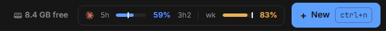
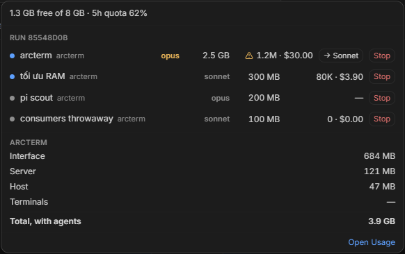

# Usage: quota, token và RAM

Trang này nói về những chỗ arcterm cho bạn thấy agent đang tiêu gì:

- surface **Usage**: giới hạn 5 giờ và theo tuần của từng provider, lịch sử token, chi phí ước tính, và nút **Analyze** để Claude chỉ ra quota của bạn đi đâu;
- **thanh meter quota** và **chip RAM** trên app bar, và bảng **Consumers** mở ra từ chúng;
- chip **Jobs**: các lệnh nặng (build, typecheck, cả bộ test) của mọi agent và run chờ đến lượt trong một hàng đợi chung, và popover của nó cho thấy cái gì đang chạy, cái gì đang chờ.

Các trang liên quan: [Cockpit và khung ứng dụng](cockpit.md) (app bar, footer), [Agent](agent.md) (thanh context và chi phí của từng agent), [Settings](settings.md) (tài khoản Claude), [Tích hợp agent](agent-integration.md) (agent báo usage về cockpit thế nào).

## Mở Usage

Bấm **Usage** trên nav rail, hoặc `Ctrl+4`, hoặc `Ctrl+G` rồi `u`. `Esc` (khi không đang gõ) về Cockpit. Surface không lọc theo project: app bar hiện `Default · <project>` chỉ để nhắc đây là project mặc định cho nơi khác, còn số liệu là của cả máy.

Surface tải lại mỗi 60 giây và bộ đếm "resets in …" chạy từng giây. Nếu một lần đọc thất bại, nó giữ số liệu cũ và hiện "Couldn’t refresh — showing the last loaded usage."

## Đọc màn Usage

<!-- shot: usage-claude-tab.png | Surface Usage ở tab Claude: dải tab nhà cung cấp, Live limits (5-hour, Weekly), bốn ô Historical, rồi hàng ba thẻ Daily / Where it goes / Models | Chạy dev app, `npm run cockpit:fixtures -- mixed` không cần; dùng scenario CDP `usage-charts` (nó nạp bucket giả vào localStorage `wave:dev-usage-buckets` và một snapshot quota `wave:ratelimits`), mở surface Usage (`Ctrl+4`) và chọn tab `[data-usage-harness="claude"]` -->

Từ trên xuống dưới:

1. **Tiêu đề** có nút chọn khoảng thời gian **7 days** / **All time** (mặc định 7 ngày; lựa chọn được giữ khi bạn đổi surface), và nhãn "N reporting" (số provider đang có số quota) khi có nhiều hơn một harness.
2. **Dải tab nhà cung cấp.**
3. Hàng **Live limits** và **Historical**.
4. Chỉ trên tab Claude: thẻ **Insights** và bảng **By session**.
5. Hàng ba thẻ: **Daily**, **Where it goes**, **Models**.

### Tab nhà cung cấp

Mỗi harness có số liệu hoặc có đọc được quota thì có một tab, sắp theo lượng token trong khoảng đang chọn (nhiều nhất đứng đầu), và tab **All** (ký hiệu Σ) ở cuối bên phải. Lúc đầu arcterm chọn tab nhiều token nhất; khi bạn bấm hoặc dùng `←`/`→` thì nó giữ lựa chọn của bạn. Nếu chỉ có một harness thì không có dải tab.

Mỗi tab ghi tên, một nhãn trạng thái và một dòng phụ:

| Thành phần | Ý nghĩa |
|---|---|
| **Live** | Một agent đang chạy báo quota ngay lúc này. |
| **Saved** | Chưa có agent nào báo; đây là lần đọc cuối được lưu, và dòng "Live limits" ghi `as of 12m ago`. |
| (không nhãn) | Provider này chưa từng báo cửa sổ quota nào (ví dụ pi, OpenCode, Antigravity). |
| Dòng phụ `5h 41% · wk 72%` | Phần trăm hai cửa sổ; nếu provider không báo cửa sổ nào thì thay bằng `1.2M tok`. |

Chọn tab nào thì mọi thứ bên dưới (ô số, biểu đồ, thẻ model) thu về harness đó. Tab **All** gộp tất cả. Vì mỗi tài khoản có quota riêng, ở tab **All** ô Live limits không lấy trung bình mà hiện cửa sổ đang gần chạm trần nhất và ghi tên provider của nó.

### Live limits

Hai ô: **5-hour** và **Weekly**. Mỗi ô có phần trăm đã dùng, thanh, và `resets in …`. Màu theo mức dùng: xanh lá đến 60%, vàng từ trên 60%, đỏ từ trên 85%.

- Trên tab Claude, ô **Weekly** có thể kèm dòng vàng `~100% by Thu 3pm`: dự đoán lúc cửa sổ tuần chạm 100% nếu bạn giữ nhịp dùng hiện tại. Dự đoán dựa trên hình dạng dùng theo thứ trong tuần từ lịch sử token đã tải, nên chỉ hiện khi nhịp hiện tại thật sự chạm trần trước lúc reset.
- Nút làm mới tròn bên phải tiêu đề **Live limits** (**Refresh usage**) đọc quota của Claude ngay, bỏ qua chu kỳ thăm dò. Nếu Anthropic đang giới hạn tần suất, nút cho biết `retry at HH:MM`.
- Nếu chưa có số nào, ô được thay bằng ghi chú "No quota reading".

Quota Claude chỉ có với gói thuê bao (Pro/Max); phiên dùng API key không báo cửa sổ nào. Các cửa sổ thuộc về **tài khoản Claude đang chọn** ([Settings → Agents](settings.md#agents)): đổi tài khoản thì Usage đổi theo. Khi không có session nào chạy, `wavesrv` tự đọc quota của tài khoản Default từ phiên đăng nhập của Claude Code, tối đa 5 phút một lần; tài khoản thêm bằng token thì chỉ có số khi một session của nó đã báo. Lần đọc cuối được lưu theo từng provider và về trống khi cửa sổ của nó đã qua.

### Historical

Bốn ô số, theo khoảng đang chọn. Đây là lịch sử bền: `wavesrv` quét transcript của các agent trên đĩa, nên số liệu có cả những session arcterm không chạy.

| Ô (7 days) | Ô (All time) | Ý nghĩa |
|---|---|---|
| **Tokens · today** | **Tokens · all time** | Ở tab **All** có dòng phụ tách theo harness. |
| **Tokens · 7 days** | **Daily avg** | Trung bình trên các ngày có hoạt động (`over N active days`). |
| **Reported cost · 7 days** | **Reported cost · all time** | Chỉ hiện khi có nguồn nào đó tự ghi chi phí; dòng phụ ghi nguồn. |
| **API-equivalent · 7 days** | **API-equivalent · all time** | `≈ $…`, kèm `N% of tokens priced`. |

> **Chi phí là ước tính, không phải hóa đơn.** "API-equivalent" nhân token với bảng giá theo triệu token được đóng gói sẵn trong app (không gọi mạng). Gói thuê bao không tính tiền theo token; con số cho bạn biết phần việc đó đáng giá bao nhiêu nếu trả theo API. "Reported cost" là con số mà chính nguồn ghi, khi nguồn có ghi.

Transcript được đọc ở: Claude `~/.claude/projects`, Codex `~/.codex/sessions`, OpenCode `~/.local/share/opencode/storage/message`, pi `~/.pi/agent/sessions`, Antigravity `~/.gemini/antigravity-cli/brain`. Các lần gọi nền của chính arcterm (tóm tắt, **Analyze**…) chạy ở chế độ print nên không bị tính vào số liệu.

### Daily, Where it goes, Models

- **Daily**: cột chồng theo ngày, mỗi harness một màu, chuyển giữa **Tokens** và **Spend**. Rê chuột lên cột để xem chi tiết; dòng cuối ghi ngày đỉnh (`peak 10-06 · 4.2M`). Ở **All time** với hơn 14 ngày có dải chọn khoảng bên dưới để thu hẹp.
- **Where it goes**: chia token và chi phí ước tính theo loại: **Cache read**, **Reasoning**, **Output**, **Cache write**, **Input** (loại nào không có thì ẩn). Dòng chú thích cho biết bao nhiêu phần trăm token là cache read, loại được tính giá rẻ hơn nhiều so với input.
- **Models**: tối đa 4 dòng cho mỗi nhà cung cấp upstream (ví dụ `anthropic`, `openai`): 3 model nhiều token nhất và một dòng `Other` gộp phần còn lại khi có hơn 4 model. Tooltip của tên model có đủ `provider/model`.

## Phân tích quota Claude bằng Analyze

Tab Claude có thêm mục **Insights**. Nó nhờ Claude đọc một bản tóm tắt chỉ chứa **con số theo từng tab** (không phải nội dung hội thoại) và nói quota đi đâu và nên đổi gì.

1. Mở tab **Claude** của Usage và chọn khoảng thời gian cần phân tích (7 days hoặc All time).
2. Bấm **Analyze** (hoặc `a`). Mất khoảng 30 giây; trong lúc đó thẻ ghi "Analysing…".
3. Đọc kết quả. Phần lớn nằm ở cột trái; mục `##` cuối cùng (thường là "What to change") nằm ở ô riêng bên phải. Dòng phụ đề ghi giờ phân tích, khoảng thời gian và model (`analysed 14:30 · 7 days · sonnet`).
4. Muốn phân tích lại thì bấm **Re-analyze**. Nếu lần chạy lỗi, nút đổi thành **Try again** và kết quả trước (nếu có) vẫn nằm bên dưới thông báo lỗi.

<!-- shot: usage-insights-sessions.png | Tab Claude với thẻ Insights đã có kết quả (cột chính và ô "What to change") và bảng By session bên dưới, vài hàng có chip | Dùng scenario CDP `usage-insights` (nó nạp session giả và một kết quả Insights đã lưu); Usage → tab Claude, selector `[data-usage-insights="done"]` và `[data-usage-sessions]` -->

Cần biết:

- Đây là một lần gọi `claude -p --model sonnet` và tốn quota Claude của bạn.
- Kết quả được lưu trên đĩa, chỉ giữ lần mới nhất. Nó bị đánh dấu cũ khi quá 24 giờ, hoặc khi khoảng thời gian đang xem khác khoảng đã phân tích ("This analysis covers 7 days; the window shown is all time…"). Thẻ vẫn hiện kết quả cũ cùng lời nhắc phân tích lại.
- **Analyze bị giữ khi cửa sổ 5 giờ hoặc tuần của Claude đạt 95% trở lên**, để phân tích không ăn nốt phần quota cuối. Tooltip nói rõ: `Claude quota is at 96%, resets in 44m`. Bảng **By session** vẫn dùng được.
- Không có tab Claude nào trong khoảng đang chọn thì thẻ ghi "No Claude tabs yet, so there is nothing to analyse".
- Hai lần phân tích không chạy cùng lúc.

## Bảng By session

Một hàng cho mỗi tab Claude trong khoảng đang chọn, đắt nhất đứng đầu. Bảng cho thấy cái gì làm một tab tốn quota:

| Cột | Nội dung |
|---|---|
| **Tab** | Tên session (ai-title; `Untitled · <id>` nếu chưa có), chấm xanh `open` nếu tab còn mở, project, model, và các chip cảnh báo. Việc do engine chạy trong worktree hiện project là `engine run`. |
| **Share of window** | Phần chi phí của tab trong tổng chi phí Claude của khoảng đó. |
| **Spend** | Chi phí ước tính. |
| **Context avg / peak** | Kích thước context trung bình và lớn nhất của các lượt chính. |
| **Cold** | Số lần *cold resume*: quay lại tab sau hơn 60 phút (cache 1 giờ đã hết) và phải ghi lại hơn 50k token cache. |
| **Subagents** | Phần chi phí đến từ subagent. |
| **Lived** | Tuổi thọ của session (`40m`, `1.5h`, `57h`). |

Các chip là phép kiểm xác định, không do model đoán:

| Chip | Điều kiện |
|---|---|
| `large context` | Context trung bình trên 200k |
| `cold resumes` | Từ 3 lần cold resume trở lên |
| `heavy subagents` | Subagent chiếm trên 50% chi phí của tab |
| `long-lived` | Sống hơn 24 giờ |

Bảng hiện 25 hàng đầu (`Top 25 of 314 · 61% of the window`); **Show all N** mở hết, **Show top 25** thu lại. Bấm một hàng (hoặc `Enter` khi con trỏ đang ở hàng đó) để mở: tab còn mở thì nhảy tới nó trong **Agent**, tab đã đóng thì mở transcript của nó.

## Thanh meter quota trên app bar

Khi có ít nhất một cửa sổ quota đọc được, app bar có một nút meter cạnh nút **+ New**. Mỗi provider có logo, rồi hai thanh nhỏ **5h** và **wk**, kèm phần trăm; thanh 5 giờ có thêm đếm ngược tới lúc reset (`1h55`).

- Màu thanh theo mức đã dùng: màu accent đến 60%, vàng từ trên 60%, đỏ từ trên 85%.
- Vạch sáng nhỏ trên mỗi thanh là phần cửa sổ đã trôi qua. Thanh còn ngắn hơn vạch nghĩa là bạn sẽ dùng đủ đến lúc reset; thanh vượt vạch nghĩa là đang dùng nhanh hơn thời gian trôi.
- Rê chuột để xem token đã dùng trong cửa sổ (Claude) và giờ reset của cửa sổ tuần.
- Bấm vào mở **Consumers** ở view **Tokens**.

Nút làm mới quota chỉ có ở surface Usage; thanh trên app bar tự cập nhật, và đổi sang tài khoản Default sẽ đọc quota ngay.

Jarvis (con vật ở footer) cũng phản ánh quota: nó có dáng mệt khi cửa sổ vượt 60%. Ngoài việc giữ **Analyze** ở 95%, arcterm không có cơ chế tự giữ run hay chặn agent khi quota gần cạn: các con số để bạn tự quyết.

## Chip RAM và Consumers

Chip RAM (biểu tượng thanh RAM và `1.3 GB free`) nằm bên trái thanh meter. Nó biến mất cho đến khi có số đọc đầu tiên. Khi RAM trống dưới 512 MB chip chuyển vàng kèm dấu ⚠. Tooltip cho biết: RAM trống trên tổng, RAM ước tính mỗi worker và mỗi tác vụ nặng (đo thực hoặc mặc định), số agent đang chạy và còn chỗ cho khoảng bao nhiêu worker nữa.

Bấm chip (view **RAM**) hoặc thanh meter (view **Tokens**) để mở **Consumers**: bảng thả xuống ngay dưới nút bạn bấm, liệt kê mọi agent đang chạy. `Esc` hoặc bấm ra ngoài để đóng. Bảng tự đọc lại mỗi 5 giây khi đang mở; nếu một lần đọc thất bại, nó mờ đi và ghi `Couldn't read usage · last at 14:02`.

| | View **RAM** | View **Tokens** |
|---|---|---|
| Tiêu đề | `1.3 GB free of 16 GB` | `Tokens, last 10 min · 5h quota 62%` |
| Mỗi hàng | RAM của agent | Token và chi phí ước tính trong 10 phút gần nhất, cache read không tính |
| Cuối bảng | Phần **arcterm**: **Interface**, **Server**, **Host**, **Terminals**, và **Total, with agents** (mọi thứ arcterm chạy, kể cả mọi agent) | — |
| Dấu ⚠ | — | Agent đốt nhiều nhất, khi quá 500.000 token trong 10 phút ("Spending fastest") |

Hai view là hai cách nhìn cùng một danh sách. Thứ tự hàng được chốt lúc bảng mở và giữ nguyên trong khi bảng còn mở, nên đổi view hoặc có số đọc mới không làm hàng nhảy. Worker của một run nằm dưới nhãn `Run <8 ký tự đầu>`; các agent bạn tự mở nằm ở nhóm đầu, không nhãn.

Mỗi hàng có:

- **tên agent**: bấm để đóng bảng và mở agent đó;
- **→ Sonnet** (chỉ với agent Claude đang chạy Opus): chuyển session sang Sonnet bằng `/model sonnet`. Nếu agent đang giữa một lượt, toast ghi rằng nó đổi từ lượt kế tiếp;
- **Stop**: kết thúc session của agent, có hỏi xác nhận (hộp thoại **Close agent** như khi bạn đóng agent thường). Với worker của run, **Stop** hỏi "Stop worker": task dừng và không được thử lại, các task phía sau chờ cho đến khi bạn **Retry** hoặc **Skip** nó trong run.

**Open Usage** ở chân bảng đưa bạn về surface Usage.

<!-- shot: usage-consumers-tokens.png | Bảng Consumers ở view Tokens: tiêu đề kèm "5h quota", cột "tokens · $", một hàng có dấu cảnh báo "Spending fastest", nút → Sonnet ở hàng Opus | Scenario CDP `consumers-popover`; bấm `[data-usage-meters]`, bảng là `[data-consumers-panel][data-sort="tokens"]`, dấu cảnh báo `[data-consumer-burn]` -->

## Hàng đợi lệnh nặng

`go build`, `cargo`, `tsc` và cả bộ test đều ngốn RAM, nên vài run chạy chung là máy swap rồi đứng. Vì vậy mọi lệnh **nặng** xếp vào **một hàng đợi chung**, và mặc định máy tự điều phối: lệnh chạy ngay khi còn đủ RAM, chỉ phải chờ khi chạy nó sẽ đẩy máy sát mức lag. Hàng đợi nhận:

- **lệnh shell của agent** khi nó nặng. Trước mỗi lệnh, mod Claude, extension pi và hook Antigravity hỏi `wsh jobslot`: lệnh thường chạy ngay, lệnh nặng chờ đến lượt rồi giữ chỗ trong lúc chạy;
- **Verify** và **Final** của một run (luôn luôn), cùng **Setup** và **Check** khi lệnh của chúng nặng. Chúng xếp chung hàng với lệnh của agent.

"RAM đủ" nghĩa là RAM trống đủ cho đỉnh RAM của lệnh cộng 512 MB chừa cho phần còn lại của máy. Đến trước chạy trước. Lệnh thiếu RAM chờ ở đầu hàng và tự chạy khi RAM trống lại; bạn cũng có thể duyệt cho nó chạy ngay (**Run now**) hoặc bỏ nó (**Skip**) trong popover. Một lệnh chờ bao lâu cũng được; không có hạn.

Bộ chọn **Slots** ở đầu popover bên dưới đặt cách hàng đợi cho lệnh chạy, có tác dụng ngay:

| Chọn | Lệnh đứng đầu hàng bắt đầu khi | Ghi vào |
|---|---|---|
| **Auto** (mặc định) | RAM đủ, chạy cùng lúc bao nhiêu cũng được | `jobs:mode` = `auto` |
| **1–4** | số lệnh đang chạy ít hơn số đã chọn, và RAM đủ | `jobs:slots`, cùng `jobs:mode` = `slots` |
| **Off** | ngay lập tức: không lệnh nào phải chờ, kể cả khi thiếu RAM | `jobs:mode` = `off` |

Ở **Auto**, lệnh vừa bắt đầu vẫn tính đủ đỉnh RAM của nó trong 60 giây đầu, nên hai build lớn không cùng lúc lấy hết chỗ RAM còn trống. Auto chỉ canh RAM, không canh CPU và đĩa: khi vài build cùng chạy làm máy chậm dù RAM còn đủ, chọn **1** hoặc **2**. Ở **Off**, các lệnh vẫn hiện trên chip và trong popover để bạn thấy cái gì đang chạy.

Khi lệnh nặng của một agent đang chờ, hàng của agent đó trong cây agent và header của nó ghi `queued #2` thay cho working; rê chuột lên để xem lệnh và lý do chờ, bấm để mở popover.

### Chip Jobs và popover

Chip **Jobs** nằm trên app bar, bên trái chip RAM. Nó chỉ hiện khi có lệnh đang chạy hoặc đang chờ: `1 running`, hoặc `1 · 2 queued`. Khi có lệnh đã chờ quá 5 phút, chip chuyển vàng kèm ⚠: thường là thứ đang giữ chỗ bị kẹt. Bấm chip mở popover **Heavy jobs**; `Esc` hoặc bấm ra ngoài để đóng.

<!-- shot: usage-job-queue.png | Popover Heavy jobs mở từ chip Jobs: bộ chọn Slots ở đầu, một lệnh đang chạy (`task check:ts`, chấm accent) và ba lệnh đang chờ (`npm install`, `go test ./...`, `cargo build`) đánh số 2–4, mỗi hàng có RAM đỉnh, thời gian chờ, nguồn và lý do `slot busy`, nút Run now / Skip | Scenario CDP `jobqueue-chip` (`task verify:ui -- jobqueue-chip`); ảnh `cdp-shots/jobqueue-chip-panel.png`, chip là `[data-job-queue-chip]`, popover là `[data-job-queue-panel]` -->

Popover xếp lệnh đang chạy lên trước (lệnh chạy lâu nhất ở trên cùng), rồi hàng đợi theo thứ tự sẽ được phục vụ. Mỗi hàng có hai dòng:

| Thành phần | Ý nghĩa |
|---|---|
| Dòng đầu | Chấm accent (đang chạy) hoặc số thứ tự trong hàng; tên lệnh (`task check:ts`); đỉnh RAM ước tính; thời gian đã chạy, hoặc `waiting 20s` với lệnh đang chờ. |
| Dòng thứ hai | Nguồn của lệnh: tên agent (`an agent` khi chưa biết tên), hoặc `Run 700db4 · Verify` cho một bước của run. Lệnh đang chờ có thêm lý do: `slot busy` (mọi chỗ đang bận) hoặc `needs 3 GB, 1.1 GB free` (chưa đủ RAM). |
| ↗ | Mở agent hoặc run đó. |
| **Run now** | Bắt đầu ngay, bỏ qua cả số chỗ lẫn RAM. Máy có thể swap và chậm đi. |
| **Skip** | Bỏ lệnh khỏi hàng; agent của nó nhận "Not run: …" (xem dưới). Hàng của run (Verify, Final, Setup) không có **Skip**: bỏ Verify là làm hỏng bước merge. |

Khi hàng đã trống mà popover còn mở, nó ghi "No heavy jobs running."

### Trong terminal của agent

Trong lúc chờ, transcript của agent ghi chỗ của nó:

> Queued #2 — waiting behind task check:ts (run 700db4)

Claude ghi dòng này trong transcript, pi ghi ở dòng trạng thái. Phần trong ngoặc chỉ có khi lệnh đứng trước thuộc về một run.

Nếu bạn **Skip** một lệnh, agent nhận lời nhắn "Not run: …" dặn không thử lại và ghi rõ trong báo cáo là đã bỏ qua. Vì vậy Skip là quyết định của bạn: đừng ép agent chạy lại.

### Chỗ thuộc về một tiến trình còn sống

Lệnh chạy xong, agent sập hoặc tab đóng thì chỗ được trả lại. Phòng khi một tiến trình bị bỏ quên, chỗ của một agent giữ quá 60 phút bị lấy lại; chỗ của run sống đúng bằng bước của run.

Antigravity và lệnh Claude chạy nền (`run_in_background`) không báo lúc lệnh xong, nên chúng chờ đến lượt rồi trả chỗ ngay: hàng đợi chỉ xếp thứ tự lúc chúng **bắt đầu**.

### Không xếp hàng, và khi hàng đợi hỏng

- Dev server (`task dev`, `tauri dev`) chạy đến khi bạn dừng nó, nên không bao giờ xếp hàng.
- Lệnh bạn gõ trong một terminal không đi qua hàng đợi (không hook nào thấy chúng). Codex và OpenCode cũng không.
- Hàng đợi hỏng thì lệnh vẫn chạy: nếu `wsh jobslot` gặp lỗi (wavesrv cũ, mất kết nối), agent cứ chạy lệnh của nó. Khởi động lại wavesrv làm trống hàng và các lệnh đang chờ chạy luôn. Hàng đợi không bao giờ chặn một agent chỉ vì nó hỏng.

### Lệnh nào là nặng

Lệnh được coi là nặng (ước lượng đỉnh RAM tính trên Mac Apple silicon 8 GB; đây cũng là RAM mà hàng đợi tính cho từng lệnh):

| Lệnh | RAM ước tính |
|---|---|
| `task tauri:build` (và `npm run build`) | 3,5 GB |
| `cargo tauri build`, `task dev`, `vite build`, `task check:ts` (và `tsc`) | 3 GB |
| `go test ./...`, `node scripts/verify.mjs` | 2,5 GB |
| `cargo build`, `cargo test`, `vitest` chạy toàn bộ, `go test pkg/orchestrate` | 2 GB |
| `task build:backend` | 1,5 GB |
| `npm install` (và `task init`) | 1 GB |

Một file test đơn lẻ hoặc lọc theo tên (`-run`, `-t`) là nhẹ và không bao giờ xếp hàng. Bảng lệnh nằm trong `pkg/memgate/memgate.go`.

Ngoài hàng đợi, arcterm cảnh báo sớm hơn: hộp thoại **New** ghi rõ khi RAM trống không đủ cho thêm một agent hay worker (vẫn cho chạy), và các bộ chỉnh số worker của run cảnh báo khi bạn chọn nhiều hơn số RAM chứa được.

## Phím tắt của Usage

| Phím | Tác dụng |
|---|---|
| `←` / `→` | Tab nhà cung cấp trước / sau (tab nhiều token nhất đứng đầu, **All** ở cuối) |
| `j` / `k` hoặc `↓` / `↑` | Trên tab Claude: di chuyển trong bảng **By session** |
| `Enter` | Trên tab Claude: mở hàng đang chọn |
| `a` | Trên tab Claude: **Analyze**. Không làm gì khi đang phân tích, không có tab Claude nào, hoặc quota ở mức 95% trở lên |
| `Esc` | Về Cockpit |

Danh sách đầy đủ ở [Phím tắt](../keyboard-shortcuts.md).
